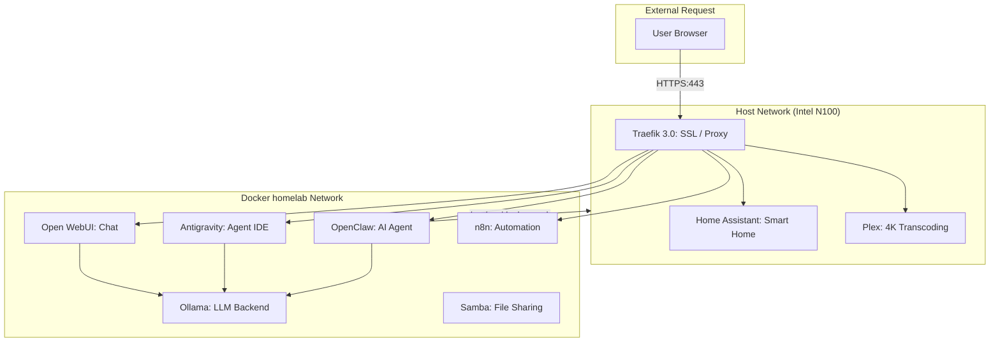

# 🏠 N100 Homelab: The Ultimate Private AI & Media Stack 🚀

[](https://opensource.org/licenses/GPL-3.0)
[](https://nextjs.org/)
[](https://www.docker.com/)
[](https://tailwindcss.com/)

A premium, fully-automated homelab configuration optimized for Intel N100 hardware. This project provides a production-grade self-hosting environment with a focus on **Local AI**, **Media Excellence**, and **Privacy**.

---

## 🏗️ Architecture Overview

The system uses a mixed networking model to balance secure reverse proxying with high-performance direct hardware access.



---

## 🧩 Featured Services

### 🧠 Core AI Stack
*   **Ollama**: High-performance local LLM engine for running models like Llama 3 and Mistral.
*   **Open WebUI**: A beautiful, ChatGPT-like interface for interacting with your local models.
*   **Antigravity**: An agentic, AI-first code editor designed for local development.
*   **OpenClaw**: An autonomous AI coding agent capable of executing commands in sandboxed environments.

### 🎬 Home & Media
*   **Home Assistant**: The center of your private smart home, supporting thousands of devices.
*   **Plex**: Secure your personal media collection with hardware-accelerated 4K transcoding.
*   **Samba**: Robust network file sharing for seamless media management across your home network.

### 🛠️ Infrastructure & Automation
*   **Traefik 3.0**: Automated SSL termination and routing for all services via secure HTTPS.
*   **n8n**: Workflow automation tool to connect your services and AI with external APIs.
*   **Watchtower**: Automatically keeps your Docker containers updated with zero manual intervention.

---

## 🚀 Quick Start

### 1. The Automated "Fancy" Setup (Recommended)
Our `setup.sh` script provides a premium terminal experience with Braille spinners and automated system tuning:

```bash
git clone https://github.com/oweibor/homelab.git ~/homelab && cd ~/homelab && sudo ./setup.sh
```

### 2. Manual Adoption
1.  **Clone**: `git clone https://github.com/oweibor/homelab.git`
2.  **Configure**: Copy `config.env.template` to `.env` and adjust your TZ and PUID.
3.  **Deploy**: `docker compose up -d`

---

## 🌐 Post-Install Access

| Service | Secure URL (HTTPS) | Internal Fallback |
| :--- | :--- | :--- |
| **Traefik Dashboard** | `https://traefik.homelab.local` | `N/A` |
| **Home Assistant** | `https://ha.homelab.local` | `http://<IP>:8123` |
| **Plex** | `https://plex.homelab.local` | `http://<IP>:32400/web` |
| **n8n** | `https://n8n.homelab.local` | `http://<IP>:5678` |
| **Open WebUI** | `https://chat.homelab.local` | `http://<IP>:3000` |
| **Antigravity Editor** | `https://antigravity.homelab.local` | `http://<IP>:6080` |
| **OpenClaw Agent** | `https://openclaw.homelab.local` | `http://<IP>:3005` |

> [!IMPORTANT]
> To use the `.homelab.local` domains, you must add them to your client machine's `hosts` file pointing to your server's IP address.

---

## 🔒 Security & Maintenance

### 🔑 Credential Management
*   **Traefik Dashboard**: Secure with basic auth in `traefik/dynamic.yaml`.
*   **Samba & n8n**: Passwords are automatically generated and stored in their respective `.env` files within the `~/homelab/` subdirectories.

### 🛠️ Maintenance Tools
*   **Update All Services**: Run `./update.sh` to pull latest images and restart.
*   **SSL Monitoring**: Run `./check-ssl-expiry.sh` to track self-signed certificate health.

---

## 🩺 Troubleshooting

| Issue | Resolution |
| :--- | :--- |
| **Container Failure** | Run `docker compose ps` to check status and `docker compose logs -f <service>` for details. |
| **No 4K Transcoding** | Ensure your user is in the `render` group. The `setup.sh` script handles this automatically on N100. |
| **Bluetooth Missing** | Verify `dbus` status on the host and ensure the Bluetooth service is shared with Home Assistant. |
| **AI is Slow** | Ensure your models aren't exceeding system RAM. N100 is best with 7B-8B parameter models. |

---

## 📜 License

This project is licensed under the **GNU General Public License v3.0**. See the [LICENSE](LICENSE) file for the full text.

---
*Built with ❤️ for the self-hosting community.*

