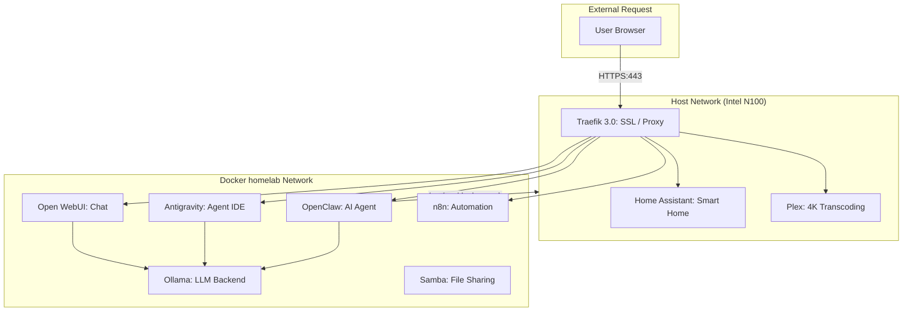

# 🏠 N100 Homelab: The Ultimate Private AI & Media Stack 🚀

[](https://opensource.org/licenses/GPL-3.0)
[](https://nextjs.org/)
[](https://www.docker.com/)
[](https://tailwindcss.com/)

A premium, fully-automated homelab configuration optimized for Intel N100 hardware. This project provides a production-grade self-hosting environment with a focus on **Local AI**, **Media Excellence**, and **Privacy**.

---

## 🏗️ Architecture Overview

The system uses a mixed networking model to balance secure reverse proxying with high-performance direct hardware access.



---

## 🧩 Featured Services

### 🧠 Core AI Stack
*   **Ollama**: High-performance local LLM engine for running models like Llama 3 and Mistral.
*   **Open WebUI**: A beautiful, ChatGPT-like interface for interacting with your local models.
*   **Antigravity**: An agentic, AI-first code editor designed for local development.
*   **OpenClaw**: An autonomous AI coding agent capable of executing commands in sandboxed environments.

### 🎬 Home & Media
*   **Home Assistant**: The center of your private smart home, supporting thousands of devices.
*   **Plex**: Secure your personal media collection with hardware-accelerated 4K transcoding.
*   **Samba**: Robust network file sharing for seamless media management across your home network.

### 🛠️ Infrastructure & Automation
*   **Traefik 3.0**: Automated SSL termination and routing for all services via secure HTTPS.
*   **n8n**: Workflow automation tool to connect your services and AI with external APIs.
*   **Watchtower**: Automatically keeps your Docker containers updated with zero manual intervention.

---

## 🚀 Installation Scenarios

Choose the scenario that matches your current environment:

### Scenario A: Fresh Standard Install (Recommended)
*Ideal for a new Intel N100 Mini PC or any fresh Ubuntu Server 24.04+ install.*

1.  **Preparation**: Ensure your server is connected to the internet.
2.  **Execution**: Run our premium automated setup script. This will configure your static IP, system optimizations, Docker, and the entire stack:
    ```bash
    git clone https://github.com/oweibor/homelab.git ~/homelab && cd ~/homelab && sudo ./setup.sh
    ```
3.  **Completion**: Reboot if the script prompts you (required for CPU C-state optimizations).

### Scenario B: Migration from Existing Docker Setup
*Use this if you already have a running server and just want to adopt this stack/UI.*

> [!WARNING]
> Do NOT run `setup.sh` on an existing server as it modifies system networking (Netplan) and GRUB.

1.  **Clone the Stack**: `git clone https://github.com/oweibor/homelab.git ~/homelab-new`
2.  **Prepare Environment**:
    *   Find your UID/GID: `id $USER` (usually 1000/1000).
    *   Create a `.env` file in the new directory using `config.env.template`.
    *   Set `PUID`, `PGID`, `TZ`, and generate strong passwords for Samba/n8n.
3.  **Merge Configs**: Move the `traefik/` directory to your permanent homelab root.
4.  **Deploy**:
    ```bash
    docker compose up -d
    ```

### Scenario C: Modular / Manual Setup
*For users who only want specific services (e.g., just the AI stack).*

1.  **Partial Compose**: Copy only the services you need from `docker-compose.yml`.
2.  **Networking**: If you skip Traefik, ensure you manually map ports and handle SSL at the application level.
3.  **AI Dependencies**: If using Antigravity or OpenClaw, ensure the `ollama` service is also included in your compose file.

---

## 🌐 Post-Install Access

| Service | Secure URL (HTTPS) | Internal Fallback |
| :--- | :--- | :--- |
| **Traefik Dashboard** | `https://traefik.homelab.local` | `N/A` |
| **Home Assistant** | `https://ha.homelab.local` | `http://<IP>:8123` |
| **Plex** | `https://plex.homelab.local` | `http://<IP>:32400/web` |
| **n8n** | `https://n8n.homelab.local` | `http://<IP>:5678` |
| **Open WebUI** | `https://chat.homelab.local` | `http://<IP>:3000` |
| **Antigravity Editor** | `https://antigravity.homelab.local` | `http://<IP>:6080` |
| **OpenClaw Agent** | `https://openclaw.homelab.local` | `http://<IP>:3005` |

> [!IMPORTANT]
> To use the `.homelab.local` domains, you must add them to your client machine's `hosts` file pointing to your server's IP address.

---

## 🔒 Security & Maintenance

### 🔑 Credential Management
*   **Traefik Dashboard**: Secure with basic auth in `traefik/dynamic.yaml`.
*   **Samba & n8n**: Passwords are automatically generated and stored in their respective `.env` files within the `~/homelab/` subdirectories.

### 🛠️ Maintenance Tools
*   **Update All Services**: Run `./update.sh` to pull latest images and restart.
*   **SSL Monitoring**: Run `./check-ssl-expiry.sh` to track self-signed certificate health.

---

## 🛡️ Homelab Pro-Tips (Avoid Common Errors)

### 1. The PUID/PGID Golden Rule
Always ensure the `PUID` and `PGID` in your `.env` match the owner of the physical directories on your host. If you see "Permission Denied" in Plex or Samba logs, run:
```bash
sudo chown -R $USER:$USER ~/homelab
```

### 2. Port Conflict Prevention
By default, this stack uses ports `80`, `443`, `8123` (HA), and `32400` (Plex). Before installing, check if these are in use:
```bash
sudo lsof -i -P -n | grep LISTEN
```

### 3. Disk Space Management
AI models and Plex transcoding can eat storage fast.
*   **Log Limiting**: We use `json-file` logging with a 10MB limit (already configured in our `docker-compose.yml`).
*   **Cleanup**: Periodically run `./update.sh` which includes an image prune command.

### 4. Intel QuickSync Stability
If Plex hardware transcoding fails after a kernel update, you may need to re-verify the `render` group GID:
```bash
getent group render | cut -d: -f3 
```
Ensure this matches the `RENDER_GID` in your `.env`.

---

## 📜 License

This project is licensed under the **GNU General Public License v3.0**. See the [LICENSE](LICENSE) file for the full text.

---
*Built with ❤️ for the self-hosting community.*
