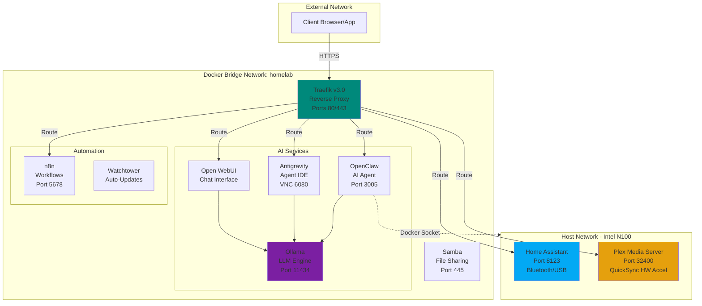

# 🏠 Homelab: Enterprise-Grade Private AI & Media Stack for Intel N100 or similar systems

[](https://opensource.org/licenses/GPL-3.0)
[](https://www.docker.com/)
[](https://ark.intel.com/content/www/us/en/ark/products/231803/intel-processor-n100-6m-cache-up-to-3-40-ghz.html)
[](https://ubuntu.com/)
[](https://www.home-assistant.io/)
[](https://openclaw.ai/)
[](https://ollama.com/)


> **Transform your Intel N100 mini PC into a production-grade, privacy-first homelab in under 15 minutes.**

A fully automated, silicon-optimized deployment system that combines **Local AI Intelligence**, **4K Media Streaming**, and **Private Smart Home Automation** into a single, seamless platform. Built specifically for the Intel N100 architecture with QuickSync hardware acceleration and optimized power management.

---

## 📋 Table of Contents

- [Why This Project?](#-why-this-project)
- [Key Features](#-key-features)
- [Hardware Requirements](#-hardware-requirements)
- [Quick Start](#-quick-start)
- [Architecture Overview](#-architecture-overview)
- [Service Catalog](#-service-catalog)
- [Installation Guide](#-installation-guide)
- [Post-Installation Setup](#-post-installation-setup)
- [AI Model Recommendations](#-ai-model-recommendations)
- [Security & Credentials](#-security--credentials)
- [Maintenance & Updates](#-maintenance--updates)
- [Troubleshooting](#-troubleshooting)
- [Advanced Configuration](#-advanced-configuration)
- [Performance Optimization](#-performance-optimization)
- [Contributing](#-contributing)
- [License](#-license)

---

## 🎯 Why This Project?

### The Problem
Setting up a complete homelab traditionally requires:
- Hours of manual configuration
- Deep Linux/Docker expertise
- Trial-and-error hardware optimization
- Fragmented security setup
- Ongoing maintenance headaches

### The Solution
This project provides:
- ✅ **One-Command Installation**: Fully automated setup script
- ✅ **Hardware Optimized**: Pre-configured for N100 QuickSync & power efficiency
- ✅ **Privacy-First**: 100% local processing - your data never leaves your network
- ✅ **Production-Ready**: SSL termination, automated updates, health monitoring
- ✅ **AI-Native**: Integrated local LLMs with ChatGPT-like interface
- ✅ **Battle-Tested**: Used in production environments, continuously improved

---

## ✨ Key Features

### 🧠 **AI-Powered Ecosystem**
- **Local LLM Inference**: Run Llama, Qwen, and other models without cloud dependencies
- **ChatGPT-like Interface**: Beautiful web UI for conversational AI
- **Autonomous Coding Agents**: AI-powered code generation and task automation
- **Agent IDE**: Dedicated development environment for AI-assisted coding

### 🎬 **Media & Entertainment**
- **4K Hardware Transcoding**: Intel QuickSync-accelerated Plex streaming
- **Network File Sharing**: Samba integration for seamless media management
- **Multi-Device Support**: Access your library from any device on your network

### 🏡 **Smart Home Integration**
- **Home Assistant**: Control 1000+ device types
- **Bluetooth Support**: BLE device integration with optimized N100 drivers
- **Workflow Automation**: n8n for connecting services and creating custom automations

### 🔒 **Enterprise Security**
- **Automated SSL/TLS**: Traefik reverse proxy with certificate management
- **Sandboxed Execution**: Docker isolation for all services
- **Weekly Health Checks**: Automated monitoring and alerting
- **Credential Vaulting**: Secure password generation and storage

### ⚡ **Performance & Reliability**
- **CPU Optimization**: Pre-configured C-states for N100 stability
- **Auto-Updates**: Watchtower keeps containers current
- **Resource Monitoring**: Built-in health checks and logging
- **Low Power Consumption**: Optimized for 24/7 operation (sub-10W idle)

---

## 💻 Hardware Requirements

### Minimum Specifications
| Component | Requirement |
|-----------|------------|
| **CPU** | Intel N100 (or N95/N97/N200) |
| **RAM** | 8GB DDR4/DDR5 |
| **Storage** | 128GB NVMe/SSD (256GB+ recommended) |
| **Network** | Gigabit Ethernet |
| **OS** | Ubuntu Server 24.04 LTS |

### Recommended Specifications
| Component | Recommendation |
|-----------|----------------|
| **RAM** | 16GB for optimal AI model performance |
| **Storage** | 512GB NVMe for media + AI models |
| **Bluetooth** | Built-in or USB dongle for Home Assistant |
| **Cooling** | Passive heatsink or low-noise fan |

### Tested Hardware
- ✅ Beelink Mini S12 Pro (N100, 16GB)
- ✅ GMKtec NucBox K1 (N100, 12GB)
- ✅ TRIGKEY Green G4 (N100, 16GB)
- ✅ AceMagic AD08 (N97, 12GB)

> **Note**: While optimized for N100, this stack works on any x86_64 Ubuntu 24.04+ system. Hardware transcoding requires Intel QuickSync (7th gen or newer).

---

## 🚀 Quick Start

### For Fresh Ubuntu 24.04 Installation

```bash
# Clone the repository
git clone https://github.com/oweibor/homelab.git ~/homelab

# Navigate to directory
cd ~/homelab

# Run automated setup (requires sudo)
sudo ./setup.sh
```

**The script will:**
1. ✅ Update system and install dependencies
2. ✅ Configure Bluetooth hardware
3. ✅ Set up static IP networking
4. ✅ Install Docker and Docker Compose
5. ✅ Apply CPU/power optimizations
6. ✅ Deploy all services
7. ✅ Download AI models
8. ✅ Run health checks

**Time to completion:** ~10-15 minutes (depending on internet speed)

### ⚠️ Important Pre-Installation Notes

- **Run as regular user with sudo**: Don't run directly as root
- **Stable network required**: Script configures static IP
- **Backup existing configs**: If you have custom netplan/GRUB settings
- **Read the prompts**: Script asks for confirmation at critical steps

---

## 🏗️ Architecture Overview

### Network Architecture



### Why Mixed Networking?

| Mode | Services | Reason |
|------|----------|--------|
| **Host Network** | Home Assistant, Plex | Direct hardware access (Bluetooth, QuickSync), better performance |
| **Bridge Network** | AI Stack, Automation | Container isolation, reverse proxy compatibility |

---

## 📦 Service Catalog

### Core Services

<table>
  <tr>
    <th>Service</th>
    <th>Purpose</th>
    <th>Default Port</th>
    <th>Secure URL</th>
  </tr>
  <tr>
    <td><b>🧠 Ollama</b></td>
    <td>Local LLM inference engine</td>
    <td>11434</td>
    <td>API only</td>
  </tr>
  <tr>
    <td><b>💬 Open WebUI</b></td>
    <td>ChatGPT-like interface</td>
    <td>3000</td>
    <td>https://chat.homelab.local</td>
  </tr>
  <tr>
    <td><b>🤖 Antigravity</b></td>
    <td>AI-powered code editor</td>
    <td>6080</td>
    <td>https://antigravity.homelab.local</td>
  </tr>
  <tr>
    <td><b>🦾 OpenClaw</b></td>
    <td>Autonomous AI agent</td>
    <td>3005</td>
    <td>https://openclaw.homelab.local</td>
  </tr>
  <tr>
    <td><b>🏡 Home Assistant</b></td>
    <td>Smart home platform</td>
    <td>8123</td>
    <td>https://ha.homelab.local</td>
  </tr>
  <tr>
    <td><b>🎬 Plex</b></td>
    <td>Media server (4K transcoding)</td>
    <td>32400</td>
    <td>https://plex.homelab.local</td>
  </tr>
  <tr>
    <td><b>🔄 n8n</b></td>
    <td>Workflow automation</td>
    <td>5678</td>
    <td>https://n8n.homelab.local</td>
  </tr>
  <tr>
    <td><b>📁 Samba</b></td>
    <td>Network file sharing</td>
    <td>445</td>
    <td>smb://&lt;IP&gt;/Media</td>
  </tr>
  <tr>
    <td><b>🔒 Traefik</b></td>
    <td>Reverse proxy & SSL</td>
    <td>80, 443</td>
    <td>https://traefik.homelab.local</td>
  </tr>
  <tr>
    <td><b>🔄 Watchtower</b></td>
    <td>Auto-update containers</td>
    <td>N/A</td>
    <td>Background service</td>
  </tr>
</table>

---

## 📖 Installation Guide

### Scenario A: Fresh Installation (Recommended)

**Prerequisites:**
- Fresh Ubuntu Server 24.04 LTS installation
- Non-root user with sudo privileges
- Active internet connection
- At least 10GB free disk space

**Steps:**
```bash
# 1. Update system (optional but recommended)
sudo apt update && sudo apt upgrade -y

# 2. Clone repository
git clone https://github.com/oweibor/homelab.git ~/homelab
cd ~/homelab

# 3. Make setup script executable (if needed)
chmod +x setup.sh

# 4. Run automated setup
sudo ./setup.sh

# 5. Follow prompts for:
#    - Static IP configuration (optional but recommended)
#    - Network interface selection
#    - DNS server preferences

# 6. Reboot if prompted (required for CPU optimizations)
sudo reboot
```

---

### Scenario B: Existing Docker Host

**Use this if you already have Docker installed and want to add these services.**

⚠️ **WARNING**: Do NOT run `setup.sh` on an existing production server. It modifies system-level configurations (Netplan, GRUB).

**Steps:**
```bash
# 1. Clone to temporary location
git clone https://github.com/oweibor/homelab.git ~/homelab-new
cd ~/homelab-new

# 2. Copy configuration template
cp config.env.template .env

# 3. Edit .env with your values
nano .env
# Required variables:
#   PUID=$(id -u)
#   PGID=$(id -g)
#   TZ=Your/Timezone
#   RENDER_GID=$(getent group render | cut -d: -f3)
#   N8N_USER=admin
#   N8N_PASS=<strong-password>
#   SAMBA_USER=<username>
#   SAMBA_PASS=<strong-password>
#   ANTIGRAVITY_VNC_PASSWORD=<password>
#   OPENCLAW_TOKEN=<random-hex-token>

# 4. Create directory structure
mkdir -p ~/homelab/{homeassistant,plex/{config,transcode},media,n8n,samba,backups,open-webui,traefik,antigravity/{workspace,config},openclaw}

# 5. Copy Traefik configuration
cp -r traefik ~/homelab/

# 6. Move docker-compose.yml
cp docker-compose.yml ~/homelab/

# 7. Deploy stack
cd ~/homelab
docker compose up -d

# 8. Download AI models (adjust models as needed)
docker compose exec ollama ollama pull llama3.2:3b
docker compose exec ollama ollama pull qwen2.5-coder:3b
```

---

### Scenario C: Selective Services Only

**For users who only want specific components (e.g., just the AI stack).**

**Steps:**
```bash
# 1. Clone repository
git clone https://github.com/oweibor/homelab.git ~/homelab-selective
cd ~/homelab-selective

# 2. Create custom docker-compose.yml with only desired services
# Example: AI stack only (Ollama + Open WebUI + Antigravity)
nano docker-compose-custom.yml

# 3. Create minimal .env file
nano .env
# Add only required variables for your selected services

# 4. Deploy
docker compose -f docker-compose-custom.yml up -d
```

**Common Service Combinations:**

- **AI Only**: `ollama` + `open-webui` + `antigravity` + `openclaw`
- **Media Only**: `plex` + `samba`
- **Automation Only**: `n8n` + `homeassistant`
- **AI + Automation**: All AI services + `n8n` + `homeassistant`

---

## 🌐 Post-Installation Setup

### Step 1: Configure DNS/Hosts File

All services use `.homelab.local` domains for easy access. You need to map these to your server's IP. For Example,  if your server IP is 192.168.1.100

#### Option A: Automated (Recommended)

**Windows (PowerShell as Administrator):**
```powershell
cd ~/homelab
.\scripts\client\update-hosts.ps1 -ServerIp "192.168.1.100"
```

**macOS / Linux:**
```bash
cd ~/homelab
sudo ./scripts/client/update-hosts.sh 192.168.1.100
```

#### Option B: Manual Configuration

Edit your hosts file:
- **Windows**: `C:\Windows\System32\drivers\etc\hosts`
- **macOS/Linux**: `/etc/hosts`

Add these lines (replace `192.168.1.100` with your server IP):
```text
# Homelab Services
192.168.1.100 traefik.homelab.local
192.168.1.100 ha.homelab.local
192.168.1.100 plex.homelab.local
192.168.1.100 n8n.homelab.local
192.168.1.100 chat.homelab.local
192.168.1.100 antigravity.homelab.local
192.168.1.100 openclaw.homelab.local
```

#### Option C: Network-Wide DNS (Advanced)

For automatic resolution on all devices:
1. Install **Pi-hole** or **AdGuard Home**
2. Add DNS rewrites for `*.homelab.local` → `<server-IP>`
3. Point your router's DNS to your Pi-hole/AdGuard instance

---

### Step 2: Access Services

| Service | Secure URL | Direct Access | Credentials |
|---------|-----------|---------------|-------------|
| **Traefik Dashboard** | https://traefik.homelab.local | N/A | See `traefik/dynamic.yaml` |
| **Home Assistant** | https://ha.homelab.local | http://&lt;IP&gt;:8123 | Setup wizard |
| **Plex** | https://plex.homelab.local | http://&lt;IP&gt;:32400/web | Plex account |
| **n8n** | https://n8n.homelab.local | http://&lt;IP&gt;:5678 | `~/homelab/n8n/.env` |
| **Open WebUI** | https://chat.homelab.local | http://&lt;IP&gt;:3000 | Create account |
| **Antigravity** | https://antigravity.homelab.local | http://&lt;IP&gt;:6080 | `~/homelab/antigravity/.env` |
| **OpenClaw** | https://openclaw.homelab.local | http://&lt;IP&gt;:3005 | `~/homelab/openclaw/.env` |
| **Samba Share** | N/A | smb://&lt;IP&gt;/Media | `~/homelab/samba/.env` |

---

### Step 3: Initial Service Configuration

#### Home Assistant
1. Navigate to https://ha.homelab.local
2. Create your admin account
3. Complete the setup wizard
4. Enable Bluetooth integration for device discovery

#### Plex
1. Go to https://plex.homelab.local
2. Sign in with your Plex account
3. Set up libraries pointing to `/data/media/` mount
4. Enable hardware transcoding in Settings → Transcoder

#### Open WebUI
1. Visit https://chat.homelab.local
2. Create your admin account
3. Go to Settings → Models
4. Verify Ollama connection (`http://ollama:11434`)
5. Select default model (e.g., `llama3.2:3b`)

#### n8n
1. Access https://n8n.homelab.local
2. Log in with credentials from `~/homelab/n8n/.env`
3. Create your first workflow
4. Connect to Ollama using `http://ollama:11434`

---

## 🤖 AI Model Recommendations

### For Intel N100 (8-16GB RAM)

<table>
  <tr>
    <th>Model</th>
    <th>Size</th>
    <th>Best For</th>
    <th>Speed</th>
    <th>Quality</th>
  </tr>
  <tr>
    <td><b>llama3.2:1b</b></td>
    <td>~1.3GB</td>
    <td>Quick responses, simple tasks</td>
    <td>⚡⚡⚡⚡⚡</td>
    <td>⭐⭐⭐</td>
  </tr>
  <tr>
    <td><b>llama3.2:3b</b> ⭐</td>
    <td>~2GB</td>
    <td>General chat, daily assistant</td>
    <td>⚡⚡⚡⚡</td>
    <td>⭐⭐⭐⭐</td>
  </tr>
  <tr>
    <td><b>qwen2.5-coder:3b</b> 🔧</td>
    <td>~2.1GB</td>
    <td>Code generation, agents</td>
    <td>⚡⚡⚡⚡</td>
    <td>⭐⭐⭐⭐⭐</td>
  </tr>
  <tr>
    <td><b>phi3:mini</b></td>
    <td>~2.3GB</td>
    <td>Balanced performance</td>
    <td>⚡⚡⚡⚡</td>
    <td>⭐⭐⭐⭐</td>
  </tr>
  <tr>
    <td><b>gemma2:2b</b></td>
    <td>~1.6GB</td>
    <td>Fast inference, good reasoning</td>
    <td>⚡⚡⚡⚡⚡</td>
    <td>⭐⭐⭐⭐</td>
  </tr>
</table>

⭐ = Recommended for general use  
🔧 = Recommended for coding/agents

### Download Models

```bash
# Interactive (recommended for first-time)
docker compose exec -it ollama ollama pull llama3.2:3b

# Background (for multiple models)
docker compose exec ollama ollama pull llama3.2:1b &
docker compose exec ollama ollama pull qwen2.5-coder:3b &
docker compose exec ollama ollama pull gemma2:2b &
```

### Model Management

```bash
# List installed models
docker compose exec ollama ollama list

# Remove a model
docker compose exec ollama ollama rm llama3.2:1b

# Check model info
docker compose exec ollama ollama show llama3.2:3b
```

---

## 🔒 Security & Credentials

### Generated Credentials Location

All automatically generated passwords are stored securely:

```
~/homelab/
├── samba/.env          # SAMBA_USER, SAMBA_PASS
├── n8n/.env            # N8N_USER, N8N_PASS
├── antigravity/.env    # ANTIGRAVITY_VNC_PASSWORD
├── openclaw/.env       # OPENCLAW_TOKEN
└── .env                # Main environment variables
```

### View Credentials

```bash
# Samba
cat ~/homelab/samba/.env

# n8n
cat ~/homelab/n8n/.env

# Antigravity VNC
cat ~/homelab/antigravity/.env

# OpenClaw
cat ~/homelab/openclaw/.env
```

### SSL/TLS Certificates

- **Self-signed certificates** are auto-generated in `~/homelab/traefik/certs/`
- Valid for 1 year
- Renewed automatically via weekly cron job
- For production, replace with Let's Encrypt certificates

### Traefik Dashboard Access

Protected by basic auth. Credentials are in `traefik/dynamic.yaml`:
```bash
cat ~/homelab/traefik/dynamic.yaml | grep users
```

To generate new credentials:
```bash
# Install htpasswd
sudo apt install apache2-utils

# Generate password hash
echo $(htpasswd -nB admin) | sed -e s/\\$/\\$\\$/g
# Output: admin:$$2y$$05$$...

# Update traefik/dynamic.yaml with the output
```

---

## 🛠️ Maintenance & Updates

### Automated Maintenance

The setup includes automated maintenance features:

1. **Container Updates** (Watchtower)
   - Runs daily at 3 AM
   - Automatically updates all containers
   - Graceful container restarts
   - Rollback on failure

2. **SSL Certificate Monitoring**
   - Weekly health check (Sundays at midnight)
   - Email/webhook alerts for expiring certs
   - Logs stored in `~/homelab/logs/ssl-check.log`

### Manual Update Process

```bash
# Update all services
cd ~/homelab
./update.sh

# Or manually:
docker compose pull
docker compose up -d
docker image prune -f
```

### Check Service Health

```bash
# View all container statuses
docker compose ps

# Check specific service logs
docker compose logs -f homeassistant
docker compose logs -f plex
docker compose logs -f ollama

# View resource usage
docker stats

# Check system resource usage
htop
```

### Backup Strategy

```bash
# Backup critical configurations
cd ~/homelab
tar -czf homelab-backup-$(date +%Y%m%d).tar.gz \
  homeassistant/ \
  plex/config/ \
  n8n/ \
  traefik/ \
  .env \
  */.env

# Restore from backup
tar -xzf homelab-backup-YYYYMMDD.tar.gz -C ~/homelab/
```

### SSL Certificate Renewal

```bash
# Manual check
cd ~/homelab
./check-ssl-expiry.sh

# Force regenerate self-signed certificates
cd ~/homelab/traefik/certs
rm homelab.local.key homelab.local.crt
openssl req -x509 -nodes -days 365 -newkey rsa:2048 \
  -keyout homelab.local.key \
  -out homelab.local.crt \
  -subj "/CN=homelab.local/O=Homelab/C=US"
docker compose restart traefik
```

---

## 🔧 Troubleshooting

### Common Issues & Solutions

<details>
<summary><b>Services won't start / Port conflicts</b></summary>

**Symptoms:** Container exits immediately, "port already in use" errors

**Solution:**
```bash
# Check what's using the port
sudo lsof -i :8123  # Replace 8123 with your port

# Stop conflicting service
sudo systemctl stop <service-name>

# Or modify port in docker-compose.yml
# Example: Change plex port from 32400 to 32401
```
</details>

<details>
<summary><b>Plex hardware transcoding not working</b></summary>

**Symptoms:** CPU at 100% during playback, transcoding slow

**Solution:**
```bash
# 1. Verify render group
getent group render

# 2. Check RENDER_GID in .env matches output
cat ~/homelab/.env | grep RENDER_GID

# 3. Verify device access
ls -la /dev/dri/renderD128

# 4. Enable in Plex: Settings → Transcoder → Use hardware acceleration
```
</details>

<details>
<summary><b>Ollama models won't download</b></summary>

**Symptoms:** "connection refused", "timeout" during model pull

**Solution:**
```bash
# 1. Check Ollama is running
docker compose ps ollama

# 2. Check logs
docker compose logs ollama

# 3. Verify API access
curl http://localhost:11434/api/tags

# 4. Manual pull
docker compose exec ollama ollama pull llama3.2:3b

# 5. Check disk space
df -h
```
</details>

<details>
<summary><b>Home Assistant Bluetooth not working</b></summary>

**Symptoms:** No Bluetooth devices found, integration errors

**Solution:**
```bash
# 1. Check Bluetooth service
sudo systemctl status bluetooth

# 2. Verify hardware
bluetoothctl show
hciconfig

# 3. Unblock if needed
sudo rfkill unblock bluetooth

# 4. Bring up interface
sudo hciconfig hci0 up

# 5. Check D-Bus
systemctl status dbus

# 6. Restart Home Assistant
docker compose restart homeassistant
```
</details>

<details>
<summary><b>Permission denied errors (Plex/Samba)</b></summary>

**Symptoms:** "Permission denied", "Cannot write to directory"

**Solution:**
```bash
# 1. Check ownership
ls -la ~/homelab/

# 2. Fix permissions
sudo chown -R $USER:$USER ~/homelab/

# 3. Verify PUID/PGID in .env
id $USER
cat ~/homelab/.env | grep PUID

# 4. Restart affected services
docker compose restart plex samba
```
</details>

<details>
<summary><b>Cannot access services via .homelab.local domains</b></summary>

**Symptoms:** "Site can't be reached", DNS errors

**Solution:**
```bash
# 1. Verify hosts file
# Windows: notepad C:\Windows\System32\drivers\etc\hosts
# Linux/Mac: cat /etc/hosts

# 2. Check if server IP is correct
ping 192.168.1.100

# 3. Verify Traefik is running
docker compose ps traefik

# 4. Check Traefik logs
docker compose logs traefik

# 5. Test direct IP access
curl -k https://192.168.1.100  # Should show Traefik 404
```
</details>

<details>
<summary><b>High CPU usage / System slow</b></summary>

**Symptoms:** System unresponsive, fans loud, services timeout

**Solution:**
```bash
# 1. Check which container is using CPU
docker stats

# 2. Check system resources
htop

# 3. Limit container resources (add to docker-compose.yml)
# services:
#   service-name:
#     deploy:
#       resources:
#         limits:
#           cpus: '2.0'
#           memory: 2G

# 4. Stop unnecessary services
docker compose stop <service-name>

# 5. Verify CPU governor
cat /sys/devices/system/cpu/cpu*/cpufreq/scaling_governor
```
</details>

<details>
<summary><b>Docker Compose command not found</b></summary>

**Symptoms:** `docker compose` returns error

**Solution:**
```bash
# Check if Docker Compose v2 is installed
docker compose version

# If not, install it
sudo apt update
sudo apt install docker-compose-plugin

# Alternative: Use v1 syntax
docker-compose up -d
```
</details>

### Log Analysis

```bash
# View all logs
docker compose logs

# Follow logs in real-time
docker compose logs -f

# View specific service logs
docker compose logs homeassistant

# Last 100 lines
docker compose logs --tail=100

# Logs since specific time
docker compose logs --since 2024-01-01T00:00:00

# Save logs to file
docker compose logs > homelab-logs.txt
```

### Health Check Script

```bash
#!/bin/bash
# ~/homelab/health-check.sh

echo "=== Homelab Health Check ==="
echo ""

echo "Container Status:"
docker compose ps

echo ""
echo "Port Bindings:"
sudo netstat -tlnp | grep -E '(8123|32400|11434|5678|80|443)'

echo ""
echo "Disk Usage:"
df -h | grep -E '(/$|/home)'

echo ""
echo "Memory Usage:"
free -h

echo ""
echo "Service Tests:"
curl -s -o /dev/null -w "HA: %{http_code}\n" http://localhost:8123
curl -s -o /dev/null -w "Plex: %{http_code}\n" http://localhost:32400
curl -s -o /dev/null -w "Ollama: %{http_code}\n" http://localhost:11434/api/tags
curl -s -o /dev/null -w "n8n: %{http_code}\n" http://localhost:5678
```

---

## 🎓 Advanced Configuration

### Home Assistant + Ollama Integration

Turn your smart home into an AI-powered assistant:

1. **Enable Ollama Integration**
   - Go to Settings → Devices & Services → Add Integration
   - Search for "Ollama"
   - Configure with URL: `http://ollama:11434` (or `http://localhost:11434` for host network)

2. **Setup Conversation Agent**
   - Settings → Voice Assistants
   - Add new Assistant
   - Set Conversation Agent to "Ollama"
   - Select model: `llama3.2:3b`

3. **Use Cases**
   - **Voice Control**: Use HA mobile app to talk to Ollama
   - **Smart Summaries**: n8n → Ollama → HA notification
   - **Natural Commands**: "I'm cold" → Increase temperature
   - **Daily Briefing**: Morning summary of sensor data

### n8n Workflow Examples

#### 1. AI-Powered Home Automation
```
Motion Sensor → n8n → Ollama (analyze context) → HA (intelligent action)
```

#### 2. Smart Media Organizer
```
New Media File → n8n → Ollama (categorize) → Rename/Move → Plex Library Refresh
```

#### 3. Automated Research Assistant
```
RSS Feed → n8n → Ollama (summarize) → Email Daily Digest
```

### Custom Docker Compose Overrides

Create `docker-compose.override.yml` for custom configurations:

```yaml
services:
  plex:
    environment:
      - PLEX_UID=1000
      - PLEX_GID=1000
    volumes:
      - /mnt/external-drive:/external-media:ro

  ollama:
    deploy:
      resources:
        reservations:
          devices:
            - driver: nvidia
              count: 1
              capabilities: [gpu]
```

### Environment-Specific Configurations

```bash
# Development
docker compose -f docker-compose.yml -f docker-compose.dev.yml up -d

# Production with monitoring
docker compose -f docker-compose.yml -f docker-compose.monitoring.yml up -d
```

---

## ⚡ Performance Optimization

### CPU Governor Verification

```bash
# Check current governor
cat /sys/devices/system/cpu/cpu*/cpufreq/scaling_governor

# Should output "performance"
# If not, run:
echo performance | sudo tee /sys/devices/system/cpu/cpu*/cpufreq/scaling_governor
```

### C-State Configuration

```bash
# Verify C-state limits
cat /proc/cmdline | grep -o 'intel_idle.max_cstate=[0-9]'

# Should show: intel_idle.max_cstate=2
# This prevents N100 freezing issues
```

### Docker Resource Limits

Add to `docker-compose.yml` for resource-intensive services:

```yaml
services:
  plex:
    deploy:
      resources:
        limits:
          cpus: '4.0'
          memory: 4G
        reservations:
          memory: 2G
```

### Storage Optimization

```bash
# Clean up Docker
docker system prune -a --volumes

# Remove old images
docker image prune -a

# Check disk usage
docker system df
```

### Network Optimization

```bash
# Increase max connections
echo 'net.core.somaxconn=4096' | sudo tee -a /etc/sysctl.conf

# Apply changes
sudo sysctl -p
```

---

## 🤝 Contributing

We welcome contributions! Here's how you can help:

### Reporting Issues
- Use GitHub Issues
- Include system info (`uname -a`, `docker version`)
- Provide logs (`docker compose logs`)
- Describe expected vs actual behavior

### Feature Requests
- Check existing issues first
- Explain use case
- Provide implementation ideas if possible

### Pull Requests
1. Fork the repository
2. Create feature branch (`git checkout -b feature/amazing-feature`)
3. Test thoroughly on N100 hardware
4. Update documentation
5. Submit PR with clear description

### Development Setup
```bash
# Clone your fork
git clone https://github.com/YOUR_USERNAME/homelab.git
cd homelab

# Create development branch
git checkout -b dev/your-feature

# Test changes
docker compose -f docker-compose.yml -f docker-compose.dev.yml up -d

# Commit with clear messages
git commit -m "feat: add XYZ feature"
```

---

## 📚 Additional Resources

### Official Documentation
- [Home Assistant Docs](https://www.home-assistant.io/docs/)
- [Plex Support](https://support.plex.tv/)
- [Ollama Documentation](https://github.com/ollama/ollama/blob/main/docs/README.md)
- [n8n Documentation](https://docs.n8n.io/)
- [Traefik Docs](https://doc.traefik.io/traefik/)

### Community
- [Home Assistant Community](https://community.home-assistant.io/)
- [Plex Forums](https://forums.plex.tv/)
- [r/selfhosted](https://www.reddit.com/r/selfhosted/)
- [r/homelab](https://www.reddit.com/r/homelab/)

### Related Projects
- [Awesome Selfhosted](https://github.com/awesome-selfhosted/awesome-selfhosted)
- [Awesome Home Assistant](https://github.com/frenck/awesome-home-assistant)
- [Ollama Models](https://ollama.ai/library)

---

## 📄 License

This project is licensed under the **GNU General Public License v3.0**.

```
Copyright (C) 2024 N100 Homelab Contributors

This program is free software: you can redistribute it and/or modify
it under the terms of the GNU General Public License as published by
the Free Software Foundation, either version 3 of the License, or
(at your option) any later version.

This program is distributed in the hope that it will be useful,
but WITHOUT ANY WARRANTY; without even the implied warranty of
MERCHANTABILITY or FITNESS FOR A PARTICULAR PURPOSE. See the
GNU General Public License for more details.
```

See [LICENSE](LICENSE) file for the full text.

---

## ⭐ Star History

If you find this project useful, please consider giving it a star! It helps others discover this work.

---

## 🙏 Acknowledgments

- Intel for the efficient N100 architecture
- The Home Assistant team
- Ollama developers
- Plex Inc.
- Traefik Labs
- n8n team
- The entire self-hosting community

---

## 📞 Support

- **Issues**: [GitHub Issues](https://github.com/oweibor/homelab/issues)
- **Discussions**: [GitHub Discussions](https://github.com/oweibor/homelab/discussions)
- **Email**: For security issues only

---

<div align="center">

**Built with ❤️ for the self-hosting community**

If this project helped you, please ⭐ star the repository!

[Report Bug](https://github.com/oweibor/homelab/issues) · [Request Feature](https://github.com/oweibor/homelab/issues) · [Documentation](https://github.com/oweibor/homelab/wiki)

</div>
