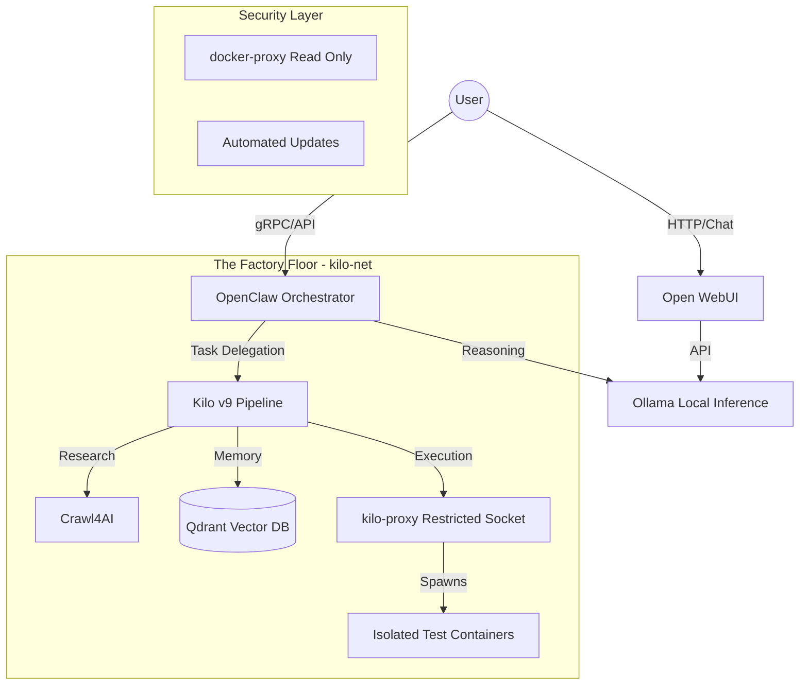

# 🤖 Autonomous Agent Factory: Enterprise-Grade Private AI Stack

[](https://opensource.org/licenses/GPL-3.0)
[](https://www.docker.com/)
[](https://ark.intel.com/content/www/us/en/ark/products/231803/intel-processor-n100-6m-cache-up-to-3-40-ghz.html)
[](https://ubuntu.com/)

> A persistent, local-first "Digital Worker" platform. It doesn't just answer questions—it executes complex, multi-step engineering tasks from start to finish.

A fully automated, hardware-optimized deployment system that sets up a true **Autonomous Agent Platform**. Built for low-power x86 processors (Intel N-series, Celeron, AMD Athlon), this stack provides everything you need to run intelligent, multi-agent workflows completely locally and privately.

---

## 📋 Table of Contents

* [Why This Project](#why-this-project)
* [Key Features](#key-features)
* [Hardware Requirements](#hardware-requirements)
* [Quick Start](#quick-start)
* [Architecture Overview](#architecture-overview)
* [The Kilo Pipeline](#the-kilo-pipeline)
* [Service Catalog](#service-catalog)
* [AI Model Recommendations](#ai-model-recommendations)
* [Security & Sandboxing](#security--sandboxing)
* [License](#license)

---

## Why This Project

### The Problem

Running autonomous AI agents typically requires piecing together brittle Python scripts, relying heavily on expensive cloud APIs, and manually managing complex execution environments and vector databases.

### The Solution

This project provides a **production-ready, single-command deployment** for a complete agentic ecosystem:
* ✅ **One-Command Installation**: Fully automated setup script (`setup.sh`)
* ✅ **Zero Cloud Dependency**: 100% local processing via Ollama—your code and data never leave your network.
* ✅ **Deep Sandboxing**: AI code execution is restricted to isolated, short-lived Docker containers via the `kilo-proxy`.
* ✅ **Persistent Memory**: Qdrant vector database integrated for cross-session context and learning.
* ✅ **Hardware-Aware**: Automatically tunes thread counts, GPU layers, and memory limits for your specific CPU.

---

## Key Features

### 🧠 **The Agentic Core**

*   **OpenClaw**: The primary "brain" and orchestrator that interacts with you, plans tasks, and delegates execution.
*   **Kilo Pipeline**: A 9-stage autonomous coding loop (Architect → Code → Debug → Review) with LangGraph orchestration.
*   **Crawl4AI**: Deep research capabilities allowing the agent to read documentation and gather context from the web.
*   **Qdrant**: Long-term semantic memory, ensuring the agent learns from past tasks and maintains project context over time.

### 🔒 **Enterprise-Grade Sandboxing**

*   **Zero-Trust Docker Socket**: The agent *never* has access to the host Docker socket.
*   **Isolated Execution**: Code generation and testing happen inside restricted `kilo-net` containers.
*   **Proxy Governance**: Traefik and Kilo use heavily restricted, read-only/execute-only socket proxies.

---

## Hardware Requirements

### Minimum Specifications

| Component | Requirement |
| :--- | :--- |
| **CPU** | Intel N-series (N95/N97/N100/N200), Celeron, or similar low-power x86 |
| **RAM** | 8GB DDR4/DDR5 |
| **Storage** | 128GB NVMe/SSD |
| **OS** | Ubuntu Server 24.04 LTS |

### Recommended Specifications (For faster inference)

*   **RAM**: 16GB+
*   **Storage**: 512GB+ NVMe

---

## Quick Start

### Automated Onboarding Wizard (Recommended)

```bash
# Clone the repository
git clone https://github.com/oweibor/homelab.git ~/agent-factory

# Navigate to directory
cd ~/agent-factory

# Run the setup script (auto-detects hardware, selects models, configures everything)
sudo ./setup.sh
```

**The setup script will:**
1. Detect hardware (RAM, CPU, GPU)
2. Select optimal Ollama models based on resources (`llama3.2:3b` + `qwen2.5-coder:3b` default)
3. Set up the isolated Docker networks and proxies
4. Download the necessary LLM models securely
5. Register the `openclaw-agent.service` for 24/7 autonomous persistence.

---

## Architecture Overview

This platform strips away "lifestyle" homelab bloat to focus entirely on machine intelligence.


```mermaid
graph TB
    User((User)) -->|HTTP/Chat| WebUI[Open WebUI]
    WebUI -->|API| Ollama[Ollama Local Inference]
    
    User -->|gRPC/API| OpenClaw[OpenClaw Orchestrator]
    OpenClaw -->|Reasoning| Ollama
    
    subgraph Agentic Factory [The Factory Floor - kilo-net]
        OpenClaw -->|Task Delegation| Kilo[Kilo v9 Pipeline]
        Kilo -->|Research| Crawl[Crawl4AI]
        Kilo -->|Memory| Qdrant[(Qdrant Vector DB)]
        
        Kilo -->|Execution| KProxy[kilo-proxy Restricted Socket]
        KProxy -->|Spawns| Sandboxes[Isolated Test Containers]
    end
    
    subgraph Security Layer
        DProxy[docker-proxy Read Only]
        Watchtower[Automated Updates]
    end
```

---

## The Kilo Pipeline

Kilo is a rigorous engineering lifecycle. It transitions from creative architecture to battle-tested code via an automated, gate-protected loop.

*   **9-Stage Orchestration**: Architect → Orchestrator → Code → Debug → Review → Ask
*   **11 Semantic Gates**: Static, deterministic, semantic, ADR, and context checks. Code does not promote unless tests pass.
*   **5-Store Memory System**: Queue, history, reasoning, rejected, staging.

### Trust Modes (`TRUST_MODE` in `.env`)

*   `supervised` **(Default)**: Every semantic change blocks for manual user approval.
*   `graduated`: Deterministic hits and low-risk refactors promote automatically.
*   `autonomous`: Full loop promotion. The agent operates entirely independently (Experimental).

---

## Service Catalog

| Service | Purpose | Default Port |
| :--- | :--- | :--- |
| **Ollama** | Local LLM inference engine | 11434 |
| **Open WebUI** | ChatGPT-like interface | 3000 |
| **OpenClaw** | Autonomous orchestration brain | 18789 |
| **Kilo Pipeline** | 9-stage autonomous CI/CD engine | 3100 |
| **Crawl4AI** | Web scraping and research service | 8000 |
| **Qdrant** | Vector database for long-term memory | 6333 |

---

## AI Model Recommendations

The setup automatically configuring these based on your RAM:

| Role | Default Model | Purpose |
| :--- | :--- | :--- |
| **General/Chat** | `llama3.2:3b` | Fast, general reasoning, summarization |
| **Coding/Engineering** | `qwen2.5-coder:3b` | Code generation, complex pipeline logic |
| **Quick Ops** | `llama3.2:1b` | Ultrafast gate checks, syntax validation |

*(You can override these in `config.env`)*

---

## Security & Sandboxing

1.  **NO Raw Docker Socket**: `setup.sh` ensures no agent container mounts `/var/run/docker.sock`.
2.  **Kilo-Proxy**: Code execution is sandboxed using a restricted Docker proxy that only permits container creation within the `kilo-net` isolated network, with no network egress to the host.
3.  **Role Separation**: OpenClaw (the brain) has no execution privileges. Kilo (the worker) has restricted execution privileges.

---

## License

This project is licensed under the **GPL-3.0 License** - see the [LICENSE](LICENSE) file for details.
