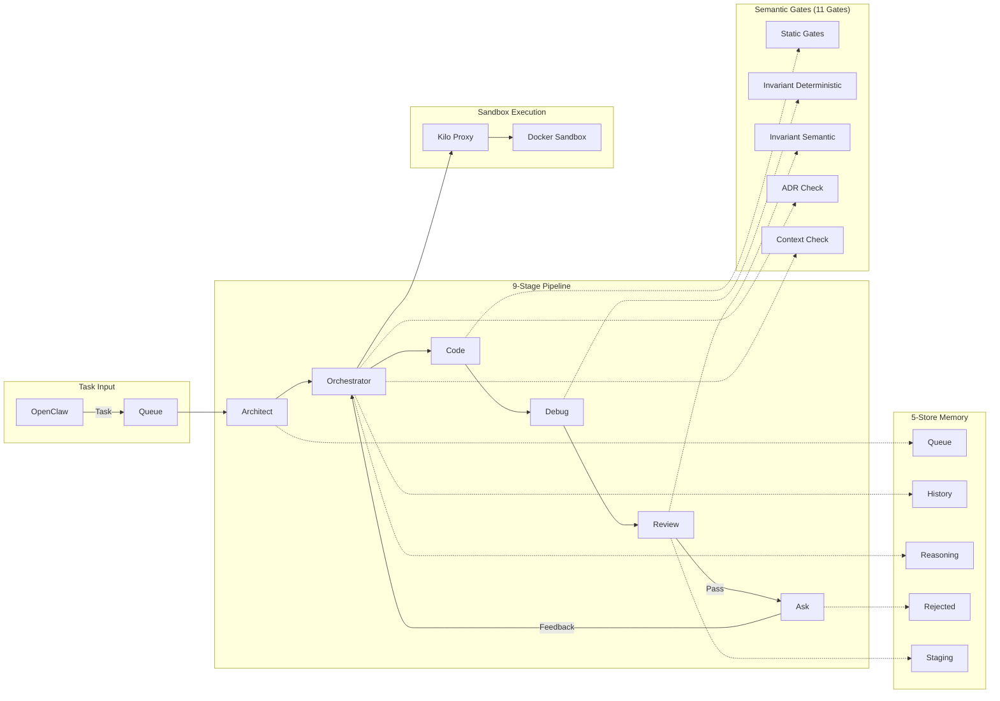

# 🏠 Homelab: Enterprise-Grade Private AI & Media Stack for Low-Power x86 Systems

[](https://opensource.org/licenses/GPL-3.0)
[](https://www.docker.com/)
[](https://ark.intel.com/content/www/us/en/ark/products/231803/intel-processor-n100-6m-cache-up-to-3-40-ghz.html)
[](https://ubuntu.com/)
[](https://www.home-assistant.io/)
[](https://openclaw.ai/)
[](https://ollama.com/)
[](https://nextcloud.com/)
[](https://onlyoffice.com/)
[](https://jellyfin.org/)

> A complete, private, and secure homelab stack — from autonomous AI agents to media servers — all on a $150 mini PC. If it runs this smooth on budget hardware, imagine what it can do on yours.

A fully automated, hardware-optimized deployment system that combines **Local AI Intelligence**, **4K Media Streaming**, **Autonomous Coding**, and **Private Smart Home Automation** into a single, seamless platform. Built for low-power x86 processors (Intel N-series, Celeron, AMD Athlon) with QuickSync hardware acceleration and optimized power management.

---

## 📋 Table of Contents

- [Why This Project?](#-why-this-project)
- [Key Features](#-key-features)
- [Hardware Requirements](#-hardware-requirements)
- [Quick Start](#-quick-start)
- [Architecture Overview](#-architecture-overview)
- [Service Catalog](#-service-catalog)
- [Installation Guide](#-installation-guide)
- [Post-Installation Setup](#-post-installation-setup)
- [AI Model Recommendations](#-ai-model-recommendations)
- [Security \& Credentials](#-security--credentials)
- [Maintenance \& Updates](#-maintenance--updates)
- [Troubleshooting](#-troubleshooting)
- [Advanced Configuration](#-advanced-configuration)
- [Performance Optimization](#-performance-optimization)
- [Contributing](#-contributing)
- [License](#-license)

---

## 🎯 Why This Project?

### The Problem

Setting up a complete homelab traditionally requires:

- Hours of manual configuration
- Deep Linux/Docker expertise
- Trial-and-error hardware optimization
- Fragmented security setup
- Ongoing maintenance headaches

### The Solution

This project provides:

- ✅ **One-Command Installation**: Fully automated setup script with hardware detection
- ✅ **Hardware-Agnostic Architecture**: Pre-configured for low-power x86 with QuickSync & power efficiency, supporting Intel N-series (N95/N97/N100/N200), Celeron, Core i3/i5/i7, AMD Athlon/Ryzen, and ARM64
- ✅ **Privacy-First**: 100% local processing - your data never leaves your network
- ✅ **Production-Ready**: SSL termination, automated updates, health monitoring
- ✅ **AI-Native**: Integrated local LLMs with autonomous agents and the Kilo Pipeline
- ✅ **Battle-Tested**: Used in production environments, continuously improved

---

## ✨ Key Features

### 🧠 **AI-Powered Ecosystem**

- **Local LLM Inference**: Run Llama, Qwen, Phi, Gemma and other models without cloud dependencies
- **ChatGPT-like Interface**: Beautiful web UI for conversational AI (Open WebUI)
- **Autonomous Coding Agents**: AI-powered code generation through OpenClaw
- **Agent IDE**: Dedicated development environment (Antigravity) with VNC access
- **Kilo Pipeline**: 9-stage autonomous coding pipeline with LangGraph orchestration, sandbox execution, semantic gates, and 5-store memory system
- **Web Scraping**: Crawl4ai integration for intelligent data gathering

### 🎬 **Media \& Entertainment**

- **4K Hardware Transcoding**: Intel QuickSync-accelerated Plex and Jellyfin streaming
- **Network File Sharing**: Samba integration for seamless media management
- **Multi-Device Support**: Access your library from any device on your network

### 🏡 **Productivity \& Workspace Workflow**

- **Productivity Suite**: Nextcloud (File Sync, Calendar, Contacts, Mail)
- **Document Editing**: ONLYOFFICE collaborative document editor integrated with Nextcloud
- **Note Taking**: Obsidian (Web-based Note Editor) with Nextcloud sync
- **RAG Knowledge Engine**: AnythingLLM for AI-powered search over your personal notes
- **Workflow Automation**: n8n for connecting services and creating custom automations
- **Home Automation**: Home Assistant, MQTT support

### 🔒 Enterprise Security

- **100% Zero-Trust Docker API**: All containers are isolated from the host's raw Docker socket.
  - **Read-Only Proxy**: Traefik and OpenClaw use restricted gateway (`docker-proxy`).
  - **Write-Capable Proxy**: Watchtower uses dedicated isolated gateway (`docker-proxy-watchtower`).
  - **Kilo Proxy**: Sandbox execution uses `kilo-proxy` with restricted capabilities.
- **Locally-Trusted SSL**: `mkcert` generates wildcard `*.homelab.local` certs trusted by your OS — zero browser warnings.
- **OWASP Security Headers**: Global HSTS, NoSniff, X-Frame-Options, Referrer-Policy, Permissions-Policy on all routes.
- **Network Isolation**: Segmented Docker networks (homelab, proxy, watchtower-net, kilo-net)
- **Authentication**: Traefik dashboard, service-specific auth middleware

### 🌐 Remote Access \& Networking

- **Self-Hosted NetBird**: 100% local mesh VPN stack with embedded IdP (No cloud dependency).
- **Traefik Reverse Proxy**: Intelligent routing with SSL termination and health-based load balancing.
- **Dedicated Port (33071)**: NetBird Management API & Dashboard endpoint to avoid 443 conflicts.
- **gRPC Coordination (Signal)**: Signal messaging securely routed via Traefik gRPC (`h2c`).

> **Warning**: Remote access from outside your home requires Port Forwarding & Public Domain.

### 📊 **Full Observability**

- **Prometheus**: Metrics collection with 30-day retention
- **Grafana Dashboards**: Three pre-built dashboards:
  - **Homelab Overview**: Host status, CPU, memory, containers, network, Traefik metrics
  - **Kilo Pipeline**: Task queue, writer performance, quarantine metrics, gate pass/fail rates
  - **Scraper**: Crawl4ai metrics, vector storage stats, success rates
- **cAdvisor + Node Exporter**: Per-container and host-level resource monitoring

### ⚡ **Performance \& Reliability**

- **Hardware Detection**: Automatic CPU family detection (Intel N-series, Celeron, Core, AMD, ARM64)
- **Smart Resource Allocation**: Memory limits based on detected hardware profile
- **Auto-Updates**: Watchtower keeps containers current via zero-trust proxy
- **Advanced Healthchecks**: Real-time Docker & Traefik monitoring to prevent "Bad Gateway" errors
- **Low Power Consumption**: Optimized for 24/7 operation (sub-10W idle)

---

## 💻 Hardware Requirements

### Minimum Specifications

| Component | Requirement |
|-----------|-------------|
| **CPU** | Intel N-series (N95/N97/N100/N200), Celeron, or similar low-power x86 |
| **RAM** | 8GB DDR4/DDR5 |
| **Storage** | 128GB NVMe/SSD (256GB+ recommended) |
| **Network** | Gigabit Ethernet |
| **OS** | Ubuntu Server 24.04 LTS |

### Recommended Specifications

| Component | Recommendation |
|-----------|----------------|
| **RAM** | 16GB for optimal AI model performance |
| **Storage** | 512GB NVMe for media + AI models |
| **Bluetooth** | Built-in or USB dongle for Home Assistant |
| **Cooling** | Passive heatsink or low-noise fan |

### Hardware-Agnostic Support

The system automatically detects and optimizes for:

| CPU Family | Profile | TDP | Use Case |
|------------|---------|-----|----------|
| Intel N-series (N95/N100/N200) | `n100_like` | 6W | Budget AI/Media |
| Intel Celeron/Pentium | `celeron` | 15W | Light workloads |
| Intel Core i3 | `core_i3` | 28W | Standard AI |
| Intel Core i5 | `core_i5` | 35W | Heavy AI |
| Intel Core i7+ | `core_i7` | 65W | Maximum performance |
| AMD Athlon | `amd_low` | 15W | Budget workloads |
| AMD Ryzen 3/5 | `amd_mid` | 35W | Mid-range AI |
| AMD Ryzen 7/9 | `amd_high` | 65W | High-performance AI |
| ARM64 (RPi 5) | `arm64_rpi5` | 5W | ARM development |
| Apple Silicon | `apple_silicon` | N/A | Unified memory |

### Tested Hardware

- ✅ Beelink Mini S12 Pro (N100, 16GB)
- ✅ GMKtec NucBox K1 (N100, 12GB)
- ✅ TRIGKEY Green G4 (N100, 16GB)
- ✅ AceMagic AD08 (N97, 12GB)

> **Note**: While optimized for low-power x86 processors, this stack works on any x86_64 Ubuntu 24.04+ system. Hardware transcoding requires Intel QuickSync (7th gen or newer).

---

## 🚀 Quick Start

### Option 1: Automated Onboarding Wizard (Recommended)

```bash
# Clone the repository
git clone https://github.com/oweibor/homelab.git ~/homelab

# Navigate to directory
cd ~/homelab

# Run the onboarding wizard (auto-detects hardware, selects models, configures everything)
sudo ./onboard.sh
```

**The wizard will:**

1. ✅ Detect hardware (RAM, CPU cores, GPU type) using [`scripts/hardware-detect.sh`](scripts/hardware-detect.sh)
2. ✅ Classify into performance tier (MINIMAL → ULTRA)
3. ✅ Select optimal Ollama models based on resources
4. ✅ Calculate performance settings (threads, GPU layers)
5. ✅ Generate optimized `config.env`
6. ✅ Run the full setup automatically

**Time to completion:** ~10-15 minutes

### Option 2: Manual Setup

```bash
# Clone the repository
git clone https://github.com/oweibor/homelab.git ~/homelab

# Navigate to directory
cd ~/homelab

# Copy and edit config (optional - wizard generates this automatically)
cp config.env.template config.env

# Run manual setup (requires sudo)
sudo ./setup.sh
```

**The script will:**

1. ✅ Update system and install dependencies
2. ✅ Configure Bluetooth hardware
3. ✅ Set up static IP networking
4. ✅ Install Docker and Docker Compose
5. ✅ Apply CPU/power optimizations (C-state configuration)
6. ✅ Deploy all services
7. ✅ Download AI models (based on hardware tier)
8. ✅ Run health checks

**Time to completion:** ~10-15 minutes (depending on internet speed)

### ⚠️ Important Pre-Installation Notes

- **Run as regular user with sudo**: Don't run directly as root
- **Stable network required**: Script configures static IP
- **Backup existing configs**: If you have custom netplan/GRUB settings
- **Read the prompts**: Script asks for confirmation at critical steps

---

## 🏗️ Architecture Overview

### Network Architecture


```mermaid
graph TB
    subgraph Internet[External Network]
        User[Client Browser/App]
    end

    subgraph HostNet[Host Network - Low-Power x86]
        direction TB
        HA[Home Assistant<br/>Port 8123<br/>Bluetooth/USB]
        Plex[Plex Media Server<br/>Port 32400<br/>QuickSync HW Accel]
        DockerSock[("/var/run/docker.sock")]
        MediaData[("/media/media")]
    end

    subgraph DockerBridge[Docker Bridge Network: homelab]
        Traefik[Traefik v3.0<br/>Reverse Proxy<br/>Ports 80/443]
        
        subgraph AIStack[AI Services]
            Ollama[Ollama<br/>LLM Engine<br/>Port 11434]
            WebUI[Open WebUI<br/>Chat Interface]
            Antigravity[Antigravity<br/>Agent IDE<br/>VNC 6080]
            OpenClaw[OpenClaw<br/>AI Agent<br/>Port 18789]
            Kilo[Kilo Pipeline<br/>Autonomous Loop]
            Crawl4AI[Crawl4AI<br/>Web Scraper<br/>Port 8000]
            Qdrant[Qdrant<br/>Vector DB<br/>Port 6333]
            OnlyOffice[ONLYOFFICE Docs<br/>Editor Engine]
            Nextcloud[Nextcloud<br/>File Hub / AI Asst]
            Obsidian[Obsidian<br/>Web Editor]
            AnythingLLM[AnythingLLM<br/>RAG Engine]
        end
        
        subgraph MediaStack[Media & Entertainment]
            Plex[Plex Media Server<br/>Port 32400]
            Jellyfin[Jellyfin Media Server<br/>Port 8096]
            Samba[Samba<br/>File Sharing]
        end
        
        subgraph Observability[Monitoring]
            Prometheus[Prometheus<br/>Port 9090]
            Grafana[Grafana<br/>Port 3001]
            NodeExp[Node Exporter<br/>Host Metrics]
            Cadvisor[cAdvisor<br/>Container Metrics]
        end
    end

    subgraph DockerSecurity[Security Layer - Zero Trust]
        ProxyRO[Docker Proxy<br/>Read-Only<br/>CONTAINERS=1]
        ProxyRW[Docker Proxy<br/>Write-Access<br/>POST=1]
        KiloProxy[Kilo Proxy<br/>Sandbox<br/>kilo-net Only]
    end

    subgraph VPN[Self-Hosted VPN]
        NetBird[NetBird<br/>Port 33071]
        Coturn[Coturn<br/>STUN/TURN]
    end

    User -->|HTTPS| Traefik
    Traefik -->|Route| WebUI
    Traefik -->|Route| HA
    Traefik -->|Route| Plex
    Traefik -->|Route| n8n
    Traefik -->|Route| Antigravity
    Traefik -->|Route| OpenClaw
    Traefik -->|Route| Kilo
    Traefik -->|Route| Crawl4AI
    Traefik -->|Route| Nextcloud
    Traefik -->|Route| Grafana

    WebUI --> Ollama
    Antigravity --> Ollama
    OpenClaw --> Ollama
    OpenClaw --> Kilo
    OpenClaw --> Crawl4AI
    Kilo --> Qdrant
    Kilo --> Ollama
    Kilo -->|Sandbox| KiloProxy
    Crawl4AI --> Qdrant
    Nextcloud -->|API| Ollama
    Nextcloud -->|Nextcloud Sync| Obsidian
    Obsidian -->|Edit| Nextcloud
    Nextcloud --> OnlyOffice
    AnythingLLM --> Ollama
    AnythingLLM --> Qdrant
    
    %% System Integrations
    OpenClaw -->|TCP| ProxyRO
    Traefik -->|TCP| ProxyRO
    ProxyRO -->|Socket| DockerSock
    
    %% Watchtower Zero-Trust
    Watchtower[Watchtower] --> ProxyRW
    ProxyRW -->|Socket| DockerSock
    
    %% Remote Access
    NetBird -.->|API/Dash| Traefik
    Traefik -->|gRPC| Signal[Signal]
    NetBird -- Peer --> Signal
    NetBird -- NAT --> Coturn
    
    %% Observability
    Prometheus --> cAdvisor
    Prometheus --> NodeExp
    Prometheus --> Traefik
    Grafana --> Prometheus
    
    Plex ---|Mount| MediaData
    Samba ---|Share| MediaData
    Jellyfin ---|Mount| MediaData

    style Traefik fill:#3ff4ad
    style Ollama fill:#e5a8ff
    style HA fill:#03A9F4
    style Plex fill:#E5A00D
    style Qdrant fill:#6C5CE7
    style Kilo fill:#FD79A8
    style OpenClaw fill:#FDCB6E
    style Prometheus fill:#E74C3C
    style Grafana fill:#F39C12
    style MediaData fill:#546E7A,color:#fff
    style DockerSock fill:#F4511E,color:#fff
```

### Why Mixed Networking?

| Mode | Services | Reason |
|------|----------|--------|
| **Host Network** | Home Assistant, Plex, Coturn | Direct hardware access (Bluetooth, QuickSync), better performance |
| **Bridge Network** | AI Stack, Automation | Container isolation, reverse proxy compatibility |

---

## 📦 Service Catalog

### Core Infrastructure

| Service | Purpose | Default Port | Secure URL |
|---------|---------|--------------|------------|
| **🛡️ Traefik v3.0** | Reverse proxy & SSL | 80, 443 | <https://traefik.homelab.local> |
| **📡 Prometheus** | Metrics engine | 9090 | <https://prometheus.homelab.local> |
| **📈 Grafana** | Metrics dashboards | 3001 | <https://grafana.homelab.local> |
| **🔬 cAdvisor** | Container metrics | Internal | Internal Only |
| **💻 Node Exporter** | Host system metrics | 9100 (Host) | Internal Only |
| **🏠 Homepage** | Service Dashboard | 3002 | <https://home.homelab.local> |

### AI Services

| Service | Purpose | Default Port | Secure URL |
|---------|---------|--------------|------------|
| **🧠 Ollama** | Local LLM inference engine | 11434 | API only |
| **💬 Open WebUI** | ChatGPT-like interface | 3000 | <https://chat.homelab.local> |
| **🤖 OpenClaw** | Autonomous AI agent | 18789 | <https://openclaw.homelab.local> |
| **🦾 Antigravity** | AI-powered code editor | 6080, 5900 | <https://antigravity.homelab.local> |
| **🦾 Kilo Pipeline** | Autonomous coding engine | 3100 | <https://kilo.homelab.local> |
| **🕷️ Crawl4AI** | Web scraping service | 8000 | <https://crawl4ai.homelab.local> |
| **🗄️ Qdrant** | Vector database | 6333 | Internal Only |

### Media Services

| Service | Purpose | Default Port | Secure URL |
|---------|---------|--------------|------------|
| **🎬 Plex** | Media server (4K transcoding) | 32400 | <https://plex.homelab.local> |
| **🍿 Jellyfin** | Open-source media server | 8096 | <https://jellyfin.homelab.local> |
| **📁 Samba** | Network file sharing | 139, 445 | smb://\<IP\>/Media |

### Productivity Services

| Service | Purpose | Default Port | Secure URL |
|---------|---------|--------------|------------|
| **☁️ Nextcloud** | File hub & Productivity Suite | 8080 | <https://nextcloud.homelab.local> |
| **📄 ONLYOFFICE** | Document editor engine | 9980 | <https://office.homelab.local> |
| **📓 Obsidian** | Web-based note editor | 3000 | <https://obsidian.homelab.local> |
| **🧠 AnythingLLM** | RAG Knowledge Engine | 3000 | <https://rag.homelab.local> |
| **🔄 n8n** | Workflow automation | 5678 | <https://n8n.homelab.local> |

### Home Automation

| Service | Purpose | Default Port | Secure URL |
|---------|---------|--------------|------------|
| **🏡 Home Assistant** | Smart home platform | 8123 | <https://ha.homelab.local> |

### Security Services

| Service | Purpose | Default Port | Secure URL |
|---------|---------|--------------|------------|
| **🔒 Docker Proxy** | Read-Only API gateway | 2375 (Internal) | Internal Only |
| **🔒 Docker Proxy (Watchtower)** | Write-Access proxy | Internal | Internal Only |
| **🔒 Kilo Proxy** | Sandbox Docker proxy | 2376 (Internal) | Internal Only |
| **🦅 NetBird** | Self-hosted VPN Stack | 33071, 33073 | <https://netbird.homelab.local:33071> |
| **📡 Signal** | Peer Discovery | Traefik-Proxied | Internal Only |
| **🔄 Watchtower** | Auto-update containers | Proxy-Gated | Background service |

---

## 🤖 Kilo Pipeline: Autonomous Coding System

The Kilo Pipeline is a sophisticated 9-stage autonomous coding pipeline that enables OpenClaw to delegate complex engineering tasks to a sandboxed environment.

### Architecture


```mermaid
graph LR
    subgraph Input["Task Input"]
        OC[OpenClaw]
        Queue[Queue]
    end
    
    subgraph Pipeline["9-Stage Pipeline"]
        A[Architect]
        O[Orchestrator]
        C[Code]
        D[Debug]
        R[Review]
        A2[Ask]
    end
    
    subgraph Gates["Semantic Gates (11 Gates)"]
        SG[Static Gates]
        ID[Invariant Deterministic]
        IS[Invariant Semantic]
        ADR[ADR Check]
        CC[Context Check]
    end
    
    subgraph Memory["5-Store Memory"]
        Q[Queue]
        H[History]
        Reas[Reasoning]
        Rej[Rejected]
        Staging[Staging]
    end
    
    subgraph Execution["Sandbox Execution"]
        KPr[Kilo Proxy]
        Sandbox[Docker Sandbox]
    end
    
    OC -->|Task| Queue
    Queue --> A
    A --> O
    O --> C
    C --> D
    D --> R
    R -->|Pass| A2
    A2 -->|Feedback| O
    
    C -.-> SG
    D -.-> ID
    R -.-> IS
    O -.-> ADR
    O -.-> CC
    
    A -.-> Q
    O -.-> H
    O -.-> Reas
    A2 -.-> Rej
    R -.-> Staging
    
    O --> KPr
    KPr --> Sandbox
```

### Features

- **9-Stage Orchestration**: Architect → Orchestrator → Code → Debug → Review → Ask loop
- **LangGraph Integration**: State-based workflow with checkpointing
- **Crawl4ai Integration**: Web scraping for context gathering
- **11 Semantic Gates**: Static, deterministic, semantic, ADR, and context checks
- **5-Store Memory System**: Queue, history, reasoning, rejected, staging
- **Sandbox Execution**: Isolated Docker containers for code execution
- **Qdrant Vector Store**: Semantic memory for cross-task continuity
- **Recovery System**: Canonicalization, ledger, classifier, patch validator, convergence
- **5 Writer Types**: Different execution strategies for various task types
- **Hardware-Aware**: Profile-based circuit breakers and resource limits

### Trust Modes

| Mode | Security Posture | Description |
|------|-----------------|-------------|
| `supervised` | **High (Default)** | Every semantic change and all "Tier 1" gate failures block for manual approval. |
| `graduated` | **Medium** | Deterministic hits and low-risk refactors promote automatically. High-risk tasks route to quarantine. |
| `autonomous` | **Experimental** | Full loop promotion for verified hits. Recommended only for isolated, test-heavy sub-modules. |

---

## 📊 Monitoring Dashboards

Three pre-built Grafana dashboards provide comprehensive observability:

### 1. Homelab Overview (`grafana/dashboards/homelab-overview.json`)

- **Host Status**: Online/offline indicator
- **CPU Usage**: Per-core and aggregate CPU metrics
- **Memory Usage**: Used, free, cached memory
- **Container Metrics**: Container count, resource usage
- **Network Traffic**: Interface throughput
- **Traefik Metrics**: Request rates, response codes, latency

### 2. Kilo Pipeline (`grafana/dashboards/kilo-pipeline.json`)

- **Task Queue**: Pending, processing, completed tasks
- **Writer Performance**: Execution time, success rates per writer type
- **Gate Pass/Fail**: Semantic gate evaluation results
- **Quarantine Metrics**: Rejected tasks, recovery attempts
- **Pipeline Latency**: End-to-end task completion time

### 3. Scraper (`grafana/dashboards/scraper.json`)

- **Crawl4ai Metrics**: Active crawls, pages fetched, success rates
- **Vector Storage**: Qdrant collection stats, vector counts
- **Staging Area**: Pending items, processing queue
- **Error Rates**: Failed scrapes, timeouts, validation failures

---

## 🔒 Security Architecture

### Zero-Trust Docker API

The homelab implements a comprehensive zero-trust Docker API architecture:

| Proxy | Purpose | Networks | Capabilities |
|-------|---------|----------|--------------|
| `docker-proxy` | Traefik service discovery | homelab, proxy | CONTAINERS=1, SERVICES=1, NETWORKS=1, POST=0 |
| `docker-proxy-watchtower` | Container updates | watchtower-net | CONTAINERS=1, IMAGES=1, POST=1, LOGS=1 |
| `kilo-proxy` | Sandbox execution | kilo-net | CONTAINERS=1, IMAGES=1, POST=1, EXEC=1 |

### Network Isolation

| Network | Type | Services |
|---------|------|----------|
| `homelab` | Bridge | Main services |
| `proxy` | Internal | Traefik ↔ Docker Proxy |
| `watchtower-net` | Internal | Watchtower ↔ Docker Proxy |
| `kilo-net` | Internal | Kilo Pipeline ↔ Kilo Proxy |

### SSL/TLS

- **Certificate Authority**: mkcert-generated local CA
- **Wildcard Certificates**: `*.homelab.local`
- **Certificate Storage**: `traefik/certs/`
- **CA Export**: Available via `scripts/export-ca.sh`

---

## 📖 Installation Guide

### Scenario A: Fresh Installation (Recommended)

**Prerequisites:**

- Fresh Ubuntu Server 24.04 LTS installation
- Non-root user with sudo privileges
- Active internet connection
- At least 10GB free disk space

**Steps:**

```bash
# 1. Update system (optional but recommended)
sudo apt update && sudo apt upgrade -y

# 2. Clone repository
git clone https://github.com/oweibor/homelab.git ~/homelab
cd ~/homelab

# 3. Make setup script executable (if needed)
chmod +x setup.sh

# 4. Run automated setup
sudo ./setup.sh

# 5. Follow prompts for:
#    - Static IP configuration (optional but recommended)
#    - Network interface selection
#    - DNS server preferences

# 6. Reboot if prompted (required for CPU optimizations)
sudo reboot
```

---

### Scenario B: Existing Docker Host

**Use this if you already have Docker installed and want to add these services.**

⚠️ **WARNING**: Do NOT run `setup.sh` on an existing production server. It modifies system-level configurations (Netplan, GRUB).

**Steps:**

```bash
# 1. Clone to temporary location
git clone https://github.com/oweibor/homelab.git ~/homelab-new
cd ~/homelab-new

# 2. Copy configuration template
cp config.env.template .env

# 3. Edit .env with your values
nano .env
# Required variables:
#   PUID=$(id -u)
#   PGID=$(id -g)
#   TZ=Your/Timezone
#   RENDER_GID=$(getent group render | cut -d: -f3)
#   SAMBA_USER=<username>
#   SAMBA_PASS=<strong-password>
#   ANTIGRAVITY_VNC_PASSWORD=<password>
#   OPENCLAW_TOKEN=<random-hex-token>
#   ONLYOFFICE_JWT_SECRET=<random-hex-token>
#   NEXTCLOUD_ADMIN_PASSWORD=<strong-password>
#   ACTUAL_USER=$(whoami)

# 4. Create directory structure
mkdir -p ~/homelab/{homeassistant,plex/{config,transcode},media,n8n,samba,backups,open-webui,traefik,antigravity/{workspace,config},openclaw,nextcloud/data,obsidian/config,anythingllm/storage,kilo/{pipeline,scripts}}
mkdir -p ~/homelab/kilo/.kilo/{decisions,history,reasoning,rejected,staging}

# 5. Copy Traefik configuration
cp -r traefik ~/homelab/

# 6. Move docker-compose.yml
cp docker-compose.yml ~/homelab/

# 7. Deploy stack
cd ~/homelab
docker compose up -d

# 8. Download AI models (adjust models as needed)
docker compose exec ollama ollama pull llama3.2:3b
docker compose exec ollama ollama pull qwen2.5-coder:3b
```

---

### 🛡️ Migration \& Data Safety (Important)

If you are migrating from an old setup and already have a `homelab/media` folder:

1. **Place your folder**: Ensure your existing `homelab` folder is in the user home directory (e.g., `/home/user/homelab`).
2. **Run setup**: Run the `setup.sh` as normal.
3. **Data Integrity**: The script will recognize the folder exists, **keep all your movies/shows intact**, and simply ensure the new Docker stack has the correct permissions to serve them.

> **In summary**: Your media files are 100% safe and will NOT be deleted.

---

### Scenario C: Selective Services Only

**For users who only want specific components (e.g., just the AI stack).**

**Steps:**

```bash
# 1. Clone repository
git clone https://github.com/oweibor/homelab.git ~/homelab-selective
cd ~/homelab-selective

# 2. Create custom docker-compose.yml with only desired services
# Example: AI stack only (Ollama + Open WebUI + Antigravity)
nano docker-compose-custom.yml

# 3. Create minimal .env file
nano .env
# Add only required variables for your selected services

# 4. Deploy
docker compose -f docker-compose-custom.yml up -d
```

**Common Service Combinations:**

- **AI Only**: `ollama` + `open-webui` + `antigravity` + `openclaw`
- **Media Only**: `plex` + `samba`
- **Automation Only**: `n8n` + `homeassistant`
- **AI + Automation**: All AI services + `n8n` + `homeassistant`

---

## 🌐 Post-Installation Setup

### Step 1: Configure DNS/Hosts File

All services use `.homelab.local` domains for easy access. You need to map these to your server's IP.

#### Option A: Automated (Recommended)

**Windows (PowerShell as Administrator):**

```powershell
cd ~/homelab
.\scripts\client\update-hosts.ps1 -ServerIp "192.168.1.100"
```

**macOS / Linux:**

```bash
cd ~/homelab
sudo ./scripts/client/update-hosts.sh 192.168.1.100
```

#### Option B: Manual Configuration

Edit your hosts file:

- **Windows**: `C:\Windows\System32\drivers\etc\hosts`
- **macOS/Linux**: `/etc/hosts`

Add these lines (replace `192.168.1.100` with your server IP):

```text
# Homelab Services
192.168.1.100 traefik.homelab.local
192.168.1.100 ha.homelab.local
192.168.1.100 plex.homelab.local
192.168.1.100 n8n.homelab.local
192.168.1.100 chat.homelab.local
192.168.1.100 antigravity.homelab.local
192.168.1.100 openclaw.homelab.local
192.168.1.100 kilo.homelab.local
192.168.1.100 crawl4ai.homelab.local
192.168.1.100 office.homelab.local
192.168.1.100 nextcloud.homelab.local
192.168.1.100 jellyfin.homelab.local
192.168.1.100 netbird.homelab.local
192.168.1.100 prometheus.homelab.local
192.168.1.100 grafana.homelab.local
192.168.1.100 home.homelab.local
```

---

### Step 2: Access Services

Refer to the [Service Catalog](#-service-catalog) table above for a full list of secure URLs and default ports.

---

### Step 3: Initial Service Configuration

#### Home Assistant

1. Navigate to <https://ha.homelab.local>
2. Create your admin account and complete the setup wizard.
3. Enable Bluetooth integration for device discovery.
4. **Activate HACS (Community Store)**:
   - Navigate to **Settings** > **Devices & Services** > **Add Integration**.
   - Search for **HACS** (pre-installed by our script).
   - Follow instructions to link your GitHub account.

#### Plex

1. Go to <https://plex.homelab.local>
2. Sign in with your Plex account
3. **MANDATORY**: Claim your server! If the server is not automatically found, go to [Plex Claim](https://www.plex.tv/claim/), get a code, and add it to `PLEX_CLAIM` in your `.env`.
4. Set up libraries pointing to `/data/media/` mount
5. Enable hardware transcoding in Settings → Transcoder

#### Open WebUI

1. Visit <https://chat.homelab.local>
2. Create your admin account
3. Go to Settings → Models
4. Verify Ollama connection (`http://ollama:11434`)
5. Select default model (e.g., `llama3.2:3b`)

#### n8n

1. Access <https://n8n.homelab.local>
2. Create your owner account during first launch.
3. **Note**: n8n now uses built-in user management. Credentials are no longer managed via environment variables.
4. Connect to Ollama using `http://ollama:11434`

---

### Step 4: Office Integration (ONLYOFFICE \& Nextcloud)

Connect ONLYOFFICE to the Nextcloud backend by running the automated configuration script:

1. **Retrieve your admin password**:

   ```bash
   cat ~/homelab/.env | grep NEXTCLOUD_ADMIN_PASSWORD
   ```

2. Login to <https://nextcloud.homelab.local>
3. Run the configuration script:

   ```bash
   cd ~/homelab
   sudo bash configure-onlyoffice.sh
   ```

---

### Step 5: Nextcloud Productivity Suite

After the initial setup, you must configure the enhanced productivity apps and local AI assistant.

1. **Configure Apps**: Run the expansion script:

    ```bash
    cd ~/homelab
    sudo bash configure-nextcloud-plus.sh
    ```

    This will install **Talk**, **Groupware**, and **Assistant**.

2. **Performance Note**:
    > [!IMPORTANT]
    > **Low-Power x86 Performance:** Running multiple heavy Nextcloud apps (especially Talk and AI Assistant) simultaneously may impact responsiveness. Monitor your CPU usage via Grafana.

3. **Mail App Configuration**:
    > [!NOTE]
    > **External Server Required:** The Nextcloud Mail app requires an external IMAP/SMTP server (e.g., Gmail, Outlook).

### Step 6: Homepage Dashboard (Discovery \& Widgets)

1. Access <https://home.homelab.local> — all services should appear automatically.
2. To enable live Plex widget data:
   - Plex Web → Account → Settings → Troubleshooting → Show Token.
   - Add `PLEX_TOKEN=<token>` to `~/homelab/.env`.
3. To enable Jellyfin widget data:
   - Jellyfin Dashboard → Administration → API Keys → Add Key.
   - Add `JELLYFIN_API_KEY=<key>` to `~/homelab/.env`.
4. After updating `.env`, restart dashboard: `docker compose up -d homepage`.

---

### Step 7: RAG Setup (AnythingLLM)

1. Navigate to <https://rag.homelab.local>
2. Follow the onboarding wizard:
   - **LLM Provider**: Choose **Ollama**.
   - **Ollama URL**: `http://ollama:11434`
   - **Embedding Engine**: Choose **Ollama** (Model: `nomic-embed-text`).
3. **Workspace Configuration**:
   - Create a workspace (e.g., "Personal Notes").
   - Click **Manage Documents**.
   - Your Obsidian notes should be visible under the `/vault` folder (mapped from Nextcloud).
   - Select your notes and click **Move to Workspace** and **Save and Embed**.

---

## 🤖 AI Model Recommendations

### For Intel N-series (8-16GB RAM)

| Model | Size | Best For | Speed | Quality |
|-------|------|----------|-------|---------|
| **llama3.2:1b** | ~1.3GB | Quick responses, simple tasks | ⚡⚡⚡⚡⚡ | ⭐⭐⭐ |
| **llama3.2:3b** ⭐ | ~2GB | General chat, daily assistant | ⚡⚡⚡⚡ | ⭐⭐⭐⭐ |
| **qwen2.5-coder:3b** 🔧 | ~2.1GB | Code generation, agents | ⚡⚡⚡⚡ | ⭐⭐⭐⭐⭐ |
| **phi3:mini** | ~2.3GB | Balanced performance | ⚡⚡⚡⚡ | ⭐⭐⭐⭐ |
| **gemma2:2b** | ~1.6GB | Fast inference, good reasoning | ⚡⚡⚡⚡⚡ | ⭐⭐⭐⭐ |
| **nomic-embed-text** | ~274MB | Text embeddings | ⚡⚡⚡⚡⚡ | ⭐⭐⭐⭐ |

⭐ = Recommended for general use  
🔧 = Recommended for coding/agents

### Download Models

```bash
# Interactive (recommended for first-time)
docker compose exec -it ollama ollama pull llama3.2:3b

# Background (for multiple models)
docker compose exec ollama ollama pull llama3.2:1b &
docker compose exec ollama ollama pull qwen2.5-coder:3b &
docker compose exec ollama ollama pull gemma2:2b &
docker compose exec ollama ollama pull nomic-embed-text &
```

### Model Management

```bash
# List installed models
docker compose exec ollama ollama list

# Remove a model
docker compose exec ollama ollama rm llama3.2:1b

# Check model info
docker compose exec ollama ollama show llama3.2:3b
```

---

## 🔒 Security \& Credentials

### Generated Credentials Location

All automatically generated passwords are stored securely:

```
~/homelab/
├── samba/.env          # SAMBA_USER, SAMBA_PASS
├── n8n/.env            # Internal context (credentials managed in UI)
├── antigravity/.env    # ANTIGRAVITY_VNC_PASSWORD
├── openclaw/.env       # OPENCLAW_TOKEN
├── netbird/.env        # TURN_SECRET, TURN_REALM
├── grafana/.env        # GF_ADMIN_PASSWORD
└── .env                # Main environment variables
```

### View Credentials

```bash
# Samba
cat ~/homelab/samba/.env

# n8n
cat ~/homelab/n8n/.env

# Antigravity VNC
cat ~/homelab/antigravity/.env

# OpenClaw
cat ~/homelab/openclaw/.env

# Grafana Admin
cat ~/homelab/grafana/.env
```

### SSL/TLS Certificates (mkcert)

- **Locally-Trusted SSL**: `setup.sh` integrates `mkcert` to generate wildcard certificates trusted by your host system.
- **Zero Browser Warnings**: Accessing `*.homelab.local` over HTTPS will show a green lock after running the CA trust script.
- **CA Export**: Use `scripts/export-ca.sh` to get the root CA certificate for installation on mobile devices or other computers.
- **Files**: Certs are stored in `~/homelab/traefik/certs/`.

### 🛡️ Docker Socket Security (100% Zero-Trust)

- **Socket Isolation**: No container has direct access to the raw `/var/run/docker.sock`.
- **Read-Only (Traefik/OpenClaw)**: Routed through `docker-proxy` with `POST=0`.
- **Write-Access (Watchtower)**: Restricted to a dedicated `docker-proxy-watchtower` instance on an isolated network.
- **Kilo Sandbox**: Uses isolated `kilo-proxy` for Docker sandbox creation.

### Traefik Dashboard Access

Protected by basic auth. Credentials are in `traefik/dynamic.yaml`:

```bash
cat ~/homelab/traefik/dynamic.yaml | grep users
```

To generate new credentials:

```bash
# Install htpasswd
sudo apt install apache2-utils

# Generate password hash (using MD5 to match dynamic.yaml)
echo $(htpasswd -n admin) | sed -e s/\\$/\\$\\$/g
# Output: admin:$$2y$$05$$...

# Update traefik/dynamic.yaml with the output
```

---

## 🛠️ Maintenance \& Updates

### 🤖 **AI \& Smart Home Integration**

The stack includes a fully integrated AI agent system:

1. **OpenClaw**: Autonomous agent that can control your Smart Home and write code.
    - **Models**:
        - **Coding**: `qwen2.5-coder:3b` (High precision)
        - **Chat/Planning**: `llama3.2:3b` (General reasoning)
        - **Status Checks**: `llama3.2:1b` (Ultra-fast)
    - **Skills**:
        - **Home Assistant**: Control lights, switches, and scenes. **Requires Long-Lived Access Token**.
2. **Kilo Pipeline**: Autonomous coding engine with 9-stage orchestration.
3. **Setup**:
    - Go to **Home Assistant Profile** -> **Security** -> **Create Long-Lived Access Token**.
    - Run `./setup.sh` and paste the token when prompted.
    - **Note**: The token is injected into the OpenClaw environment. If Smart Home control isn't working, ask OpenClaw: *"Install the Home Assistant skill"*.

### 🦾 **Autonomous AI Pipeline (Kilo)**

This stack includes a sophisticated 9-stage autonomous coding pipeline called **Kilo**. This pipeline allows OpenClaw to delegate complex engineering tasks to a sandboxed environment without manual intervention.

#### **Operational Safety (The Kill-switch)**

If the autonomous pipeline behaves unexpectedly or if you wish to disable it entirely:

- **Environment Variable**: Set `OPENCLAW_KILO_ENABLED=false` in `~/homelab/.env`.
- **Result**: OpenClaw will handle ALL requests directly using its internal logic, bypassing the Kilo orchestration layer and sandboxed execution.
- **Update**: Run `docker compose up -d openclaw` to apply the change.

#### **Trust Modes (`TRUST_MODE`)**

Configure the pipeline's autonomy level via the `TRUST_MODE` variable in `.env`:

| Mode | Security Posture | Description |
|------|-----------------|-------------|
| `supervised` | **High (Default)** | Every semantic change and all "Tier 1" gate failures (e.g., security violations) block for manual approval. |
| `graduated` | **Medium** | Deterministic hits and low-risk refactors promote automatically. High-risk or failed tasks route to `/var/kilo/quarantine`. |
| `autonomous`| **Experimental** | Full loop promotion for verified hits. Recommended only for isolated, test-heavy sub-modules. |

#### **Recovery \& Resilience**

- **Queue Recovery**: If a task fails or the system reboots, Kilo uses a 5-store persistence layer (`/var/kilo`) to resume from the last valid checkpoint.
- **Retry Logic**: Failed operations are logged to `/var/kilo/writer_retry`. Running `./update.sh` will prompt to drain this queue before pulling new images.

### 7.5. Productivity \& AI RAG Workflow (Phase 8)

The homelab includes a browser-based **Obsidian** editor and **AnythingLLM** for RAG over your personal notes.

#### Sync Backbone

- **Synchronization**: Managed by **Nextcloud**. The vault folder lives at `~/homelab/nextcloud/data/admin/files/Obsidian`.
- **Browser Access**: `https://obsidian.homelab.local` maps the KasmVNC workspace to the Nextcloud vault.
- **Native App Sync**: Use the Obsidian **Remotely Save** plugin on your phone/laptop pointed at:
  `https://nextcloud.homelab.local/remote.php/dav/files/admin/Obsidian/`

#### Knowledge Engine (AnythingLLM)

- **Context**: AnythingLLM (`https://rag.homelab.local`) indexes the same Nextcloud vault in **Read-Only** mode.
- **Inference**: Connected to the local **Ollama** service for privacy-preserving AI insights over your own data.

#### Post-Deployment Recommended Plugins

Once logged into the Obsidian web UI, install:

1. **Smart Connections**: Point to `http://ollama:11434` for vault-wide semantic search.
2. **Local GPT**: For AI-assisted writing using local models.
3. **Remotely Save**: To keep the browser editor in sync with your mobile devices via Nextcloud WebDAV.

### 💾 **Backups \& Maintenance**

Our setup includes automated maintenance features:

1. **Automated Updates** (Watchtower)
   - **Zero-Trust Enabled**: Updates are performed via the dedicated `docker-proxy-watchtower`.
   - **Schedule**: Every Sunday at 3 AM.
   - **Cleanup**: Automatically removes old images to save disk space.
   - **Rollback**: Graceful restarts and failure protection.

2. **SSL Certificate Monitoring**
   - Weekly health check (Sundays at midnight)
   - Email/webhook alerts for expiring certs
   - Logs stored in `~/homelab/logs/ssl-check.log`

### Manual Update Process

```bash
# Update all services
cd ~/homelab
./update.sh

# Or manually:
docker compose pull
docker compose up -d
docker image prune -f
```

### Check Service Health

```bash
# View all container statuses
docker compose ps

# Check specific service logs
docker compose logs -f homeassistant
docker compose logs -f plex
docker compose logs -f ollama

# View resource usage
docker stats

# Check system resource usage
htop
```

### Backup Strategy

Our setup includes an **Automated Weekly Backup** (configured in `setup.sh`) that runs every Sunday at 2 AM. It compresses all critical service configurations and `.env` files while preserving disk space by rotating old archives.

#### Manual Backup

To trigger a backup manually:

```bash
cd ~/homelab
./backup-homelab.sh
```

#### Restore from Backup

1. Stop all containers: `docker compose down`
2. Extract the backup archive:

```bash
tar -xzf backups/homelab-backup-YYYYMMDD.tar.gz -C ~/homelab/
```

1. Restart services: `docker compose up -d`

### SSL Certificate Renewal

The setup uses `mkcert` for locally-trusted SSL. To manually renew or regenerate certificates:

```bash
# 1. Navigate to certs directory
cd ~/homelab/traefik/certs

# 2. Regenerate wildcard certificates using mkcert
CAROOT=./ca mkcert -key-file homelab.local.key -cert-file homelab.local.crt "*.homelab.local" "homelab.local" "localhost" "127.0.0.1"

# 3. Restart Traefik
docker compose up -d traefik
```

#### OpenSSL Fallback (If mkcert is missing)

If you are in an environment without `mkcert`, you can fall back to self-signed certificates:

```bash
cd ~/homelab/traefik/certs
rm homelab.local.key homelab.local.crt
openssl req -x509 -nodes -days 365 -newkey rsa:2048 \
  -keyout homelab.local.key \
  -out homelab.local.crt \
  -subj "/CN=homelab.local/O=Homelab/C=US"
docker compose restart traefik
```

---

## 🔧 Troubleshooting

### Common Issues \& Solutions

<details>
<summary><b>Services won't start / Port conflicts</b></summary>

**Symptoms:** Container exits immediately, "port already in use" errors

**Solution:**

```bash
# Check what's using the port
sudo lsof -i :8123  # Replace 8123 with your port

# Stop conflicting service
sudo systemctl stop <service-name>
```

</details>

<details>
<summary><b>Plex not detecting hardware transcoding</b></summary>

**Symptoms:** Plex shows "Transcoding" instead of "Direct Play" despite QuickSync being available

**Solution:**

1. Verify QuickSync is detected:

   ```bash
   lspci | grep -i vga
   ```

2. Check Docker has access to GPU:

   ```bash
   docker run --rm --device /dev/dri:/dev/dri ubuntu ls -la /dev/dri
   ```

3. Ensure PLEX_HW_ACCEL is set in `.env`:

   ```
   PLEX_HW_ACCEL=enabled
   ```

</details>

<details>
<summary><b>OpenClaw can't connect to Ollama</b></summary>

**Symptoms:** OpenClaw shows "Ollama not available" error

**Solution:**

1. Check Ollama is running:

   ```bash
   docker compose ps ollama
   docker compose logs ollama
   ```

2. Verify network connectivity:

   ```bash
   docker compose exec openclaw curl -f http://ollama:11434
   ```

3. Ensure OLLAMA_HOST is set correctly in docker-compose.yml

</details>

<details>
<summary><b>Kilo Pipeline not processing tasks</b></summary>

**Symptoms:** Tasks queue up but never execute

**Solution:**

1. Check kilo-pipeline logs:

   ```bash
   docker compose logs kilo-pipeline
   ```

2. Verify Qdrant is healthy:

   ```bash
   docker compose ps qdrant
   docker compose exec qdrant curl -f http://localhost:6333/health
   ```

3. Check kilo-proxy connectivity:

   ```bash
   docker compose exec kilo-pipeline curl -f http://kilo-proxy:2375
   ```

4. Verify OPENCLAW_TOKEN matches in both services

</details>

<details>
<summary><b>Grafana dashboards show no data</b></summary>

**Symptoms:** Grafana shows "No data" in all panels

**Solution:**

1. Check Prometheus is collecting:

   ```bash
   docker compose logs prometheus
   ```

2. Verify Prometheus targets:
   - Visit <https://prometheus.homelab.local/status/targets>
   - All targets should be "UP"

3. Check datasource configuration in Grafana
4. Verify time range in dashboard (try "Last 15 minutes")

</details>

---

## 📁 Project Structure

```
homelab/
├── docker-compose.yml           # Main service orchestration
├── config.env.template          # Environment configuration template
├── setup.sh                     # Automated setup script
├── onboard.sh                   # Onboarding wizard
├── backup-homelab.sh            # Backup utility
├── check-ssl-expiry.sh          # SSL monitoring
├── update.sh                    # Update utility
├── configure-nextcloud-plus.sh  # Nextcloud app installation
├── configure-onlyoffice.sh      # ONLYOFFICE integration
│
├── traefik/                     # Traefik configuration
│   ├── traefik.yaml
│   ├── dynamic.yaml
│   └── certs/                   # SSL certificates
│
├── grafana/                     # Grafana dashboards & provisioning
│   ├── dashboards/
│   │   ├── homelab-overview.json
│   │   ├── kilo-pipeline.json
│   │   └── scraper.json
│   └── provisioning/
│       ├── dashboards/
│       └── datasources/
│
├── prometheus/                  # Prometheus configuration
│   └── prometheus.yml
│
├── kilo/                        # Kilo Pipeline
│   ├── pipeline/
│   │   ├── Dockerfile
│   │   ├── package.json
│   │   └── src/
│   │       ├── index.js
│   │       ├── config.js
│   │       ├── routes/
│   │       ├── services/
│   │       │   ├── scraper/     # Crawl4ai integration
│   │       │   ├── langgraph/  # LangGraph orchestration
│   │       │   ├── recovery/  # Recovery modules
│   │       │   ├── gates/      # Semantic gates
│   │       │   ├── writers/    # Writer implementations
│   │       │   └── ollama/      # Ollama client & circuit breaker
│   │       └── middleware/
│   └── scripts/
│       └── create-qdrant-collections.sh
│
├── scripts/                     # Utility scripts
│   ├── hardware-detect.sh      # Hardware detection module
│   ├── export-ca.sh            # CA certificate export
│   ├── test-ai-stack.sh        # AI stack validation
│   └── client/                 # Client-side scripts
│       ├── update-hosts.ps1
│       └── update-hosts.sh
│
├── plans/                       # Implementation plans
│   └── hardware-agnostic-refactor-plan.md
│
├── openclaw/
│   └── openclaw.json           # OpenClaw configuration
│
└── CHANGELOG.md                # Version history
```

---

## 🤝 Contributing

Contributions are welcome! Please read our contributing guidelines before submitting PRs.

### Development Setup

```bash
# Clone the repository
git clone https://github.com/oweibor/homelab.git
cd homelab

# Install Node.js dependencies for Kilo Pipeline
cd kilo/pipeline
npm install

# Run development mode
npm run dev
```

---

## 📄 License

This project is licensed under the **GPL-3.0 License** - see the [LICENSE](LICENSE) file for details.

---

## 🙏 Acknowledgments

- [Home Assistant](https://www.home-assistant.io/) - Open-source home automation
- [Ollama](https://ollama.com/) - Local LLM inference
- [Open WebUI](https://openwebui.com/) - User-friendly AI interface
- [OpenClaw](https://openclaw.ai/) - Autonomous AI agents
- [Traefik](https://traefik.io/) - Cloud-native reverse proxy
- [Prometheus](https://prometheus.io/) - Monitoring & alerting
- [Grafana](https://grafana.com/) - Observability visualization
- [Nextcloud](https://nextcloud.com/) - Enterprise file sync
- [Plex](https://plex.tv/) - Media server
- [Jellyfin](https://jellyfin.org/) - Free media system
- [NetBird](https://netbird.io/) - Zero-config VPN

---

*Built with ❤️ for the homelab community*
