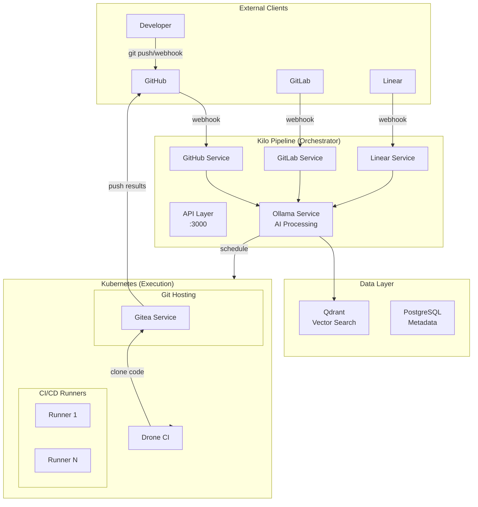

# Dev Workflow Hybrid Architecture

## Overview

This architecture combines **Kilo/pipeline** as the orchestration layer with **K8s** as the execution layer for dev workflows.

## Architecture Diagram



## Hardware-Aware Scaling

| Profile | CPU | RAM | CI Runners | Git Ops | AI Features |
| :--- | :--- | :--- | :--- | :--- | :--- |
| n100_like | 6W | 8GB | 0-1 | ✅ | ✅ |
| nvidia_rtx | 65W | 16GB | 2 | ✅ | ✅ (GPU) |
| high-perf | 65W+ | 32GB+ | 4-6 | ✅ | ✅ (GPU) |

## Component Responsibilities

### Kilo/pipeline (Orchestration)

| Service | Responsibility |
| :--- | :--- |
| `services/github.js` | GitHub API, webhook handling, PR reviews |
| `services/gitlab.js` | GitLab API, merge request handling |
| `services/linear.js` | Linear API, issue sync, status updates |
| `services/ollama.js` | AI: categorize issues, summarize PRs, suggest reviewers |
| `services/scheduler.js` | Route tasks to K8s based on HARDWARE_PROFILE |

### K8s Services (Execution)

| Service | Description | Hardware Notes |
| :--- | :--- | :--- |
| `k8s/services/gitea` | Self-hosted git hosting | All profiles |
| `k8s/services/drone` | CI/CD engine | n100: 1 runner, high-perf: 4 runners |
| `k8s/services/actions-runner` | GitHub Actions runners | Auto-scale based on profile |

## Implementation Phases

### Phase 1: K8s Infrastructure

- [ ] Add Gitea K8s service
- [ ] Add Drone CI K8s service  
- [ ] Configure hardware-specific runner counts per overlay

### Phase 2: Kilo API Services

- [ ] Create `services/github.js` - GitHub API client
- [ ] Create `services/gitlab.js` - GitLab API client
- [ ] Create `services/linear.js` - Linear API client

### Phase 3: AI Integration

- [ ] Add Ollama prompts for PR summarization
- [ ] Add issue categorization using Qdrant similarity search
- [ ] Add auto-reviewer suggestions

## API Endpoints (Kilo)

```http
POST /api/webhook/github     # GitHub webhook receiver
POST /api/webhook/gitlab    # GitLab webhook receiver  
POST /api/webhook/linear    # Linear webhook receiver

GET  /api/dev/prs           # List open PRs across providers
POST /api/dev/summarize     # AI PR summary via Ollama
POST /api/dev/categorize    # AI issue categorization
```

## Data Flow

1. **Developer pushes code** → GitHub/Gitea receives
2. **Webhook triggers** → Kilo/pipeline receives
3. **AI Processing** (optional) → Ollama categorizes/analyzes
4. **Schedule** → Based on HARDWARE_PROFILE, dispatch to K8s runners
5. **Execute CI/CD** → Drone/GitHub Actions runs builds
6. **Store results** → Qdrant (vectors), PostgreSQL (metadata)

## Benefits of Hybrid

1. **Separation of concerns**: Kilo handles API/AI, K8s handles execution
2. **Hardware-aware**: Resource limits defined per hardware profile
3. **Scalable**: Add more runners on powerful hardware
4. **Self-hosted**: All data stays in homelab
5. **AI-powered**: Leverage Ollama for intelligent automation
