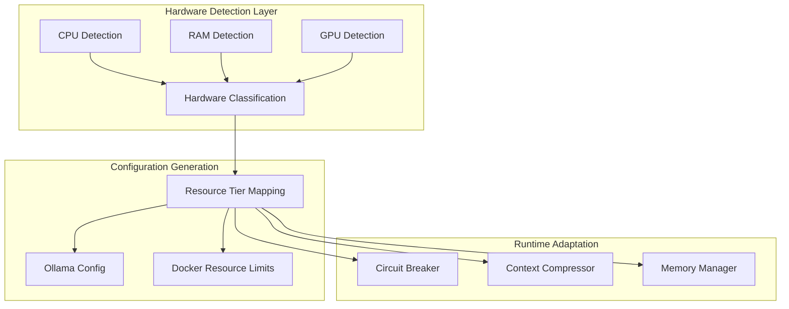

# Oweibo Hardware-Agnostic Refactoring Plan

## Executive Summary

This document outlines a comprehensive refactoring plan to transform the oweibo project from N100-specific to a hardware-agnostic architecture that supports the entire family of low-power Intel processors (N95, N97, N100, N200, etc.) and potentially other x86_64 platforms.

## Current State Analysis

### Files with N100-Specific Code

| File | Line(s) | Issue |
|------|---------|-------|
| [`setup.sh`](setup.sh:3) | 3-6, 203, 298, 682-704 | Hardcoded N100 references, GRUB C-state config |
| [`onboard.sh`](onboard.sh) | Throughout | Hardware tier classification tied to N100 memory profiles |
| [`onboard-hardware.sh`](onboard-hardware.sh:1) | 1-5 | Module header mentions N100 |
| [`onboard-lib.sh`](onboard-lib.sh:1) | 1-5 | Module header mentions N100 |
| [`README.md`](README.md:1) | 1, 5, 15-16, 58, 87-88, 117, 129-152, 229, 625-627, 662, 832, 1407-1408, 1526-1527, 1551 | Multiple N100 references |
| [`kilo/pipeline/src/services/ollama/circuitBreaker.js`](kilo/pipeline/src/services/ollama/circuitBreaker.js:6) | 6, 17 | N100-specific circuit breaker thresholds |
| [`kilo/pipeline/src/services/recovery/compressor.js`](kilo/pipeline/src/services/recovery/compressor.js:5) | 5 | N100 token budget comment |
| [`kilo/pipeline/src/services/embeddings.js`](kilo/pipeline/src/services/embeddings.js:8) | 8 | N100 RAM constraint comment |
| [`kilo/pipeline/src/services/writers/writer5.js`](kilo/pipeline/src/services/writers/writer5.js:61) | 61 | N100 safety comment |
| [`config.env.template`](config.env.template:79) | 79 | N100-specific keep-alive comment |

---

## Architecture Overview



---

## Phase 1: Hardware Detection System

### 1.1 Create CPU Detection Module

**New file**: `scripts/hardware-detect.sh`

```bash
#!/bin/bash
# =============================================================================
# HARDWARE DETECTION MODULE
# Dynamically detects CPU type and capabilities
# =============================================================================

detect_cpu_model() {
    local cpu_model
    cpu_model=$(grep -m1 "model name" /proc/cpuinfo | cut -d: -f2 | sed 's/^ *//')
    echo "$cpu_model"
}

detect_cpu_family() {
    local cpu_model
    cpu_model=$(detect_cpu_model)
    
    # Intel Atom/Alder Lake-N (N-series)
    if echo "$cpu_model" | grep -qiE "(N[0-9]{3}|Alder Lake-N|Celeron.*N)"; then
        echo "INTEL_N_SERIES"
    # Intel Celeron/Pentium
    elif echo "$cpu_model" | grep -qiE "(Celeron|Pentium)"; then
        echo "INTEL_LOW_END"
    # AMD
    elif echo "$cpu_model" | grep -qiE "AMD"; then
        echo "AMD"
    # Intel Core
    elif echo "$cpu_model" | grep -qiE "Core.*i[3579]"; then
        echo "INTEL_CORE"
    else
        echo "UNKNOWN"
    fi
}

detect_cpu_capabilities() {
    local cpu_family
    cpu_family=$(detect_cpu_family)
    
    local has_quicksync=0
    local has_avx2=0
    local tdp_watts=6
    
    # Check QuickSync
    if lspci 2>/dev/null | grep -qi "vga.*intel"; then
        has_quicksync=1
    fi
    
    # Check AVX2
    if grep -q "avx2" /proc/cpuinfo 2>/dev/null; then
        has_avx2=1
    fi
    
    # Estimate TDP based on family
    case $cpu_family in
        INTEL_N_SERIES)
            tdp_watts=6  # N100 = 6W TDP
            ;;
        INTEL_LOW_END)
            tdp_watts=15
            ;;
        AMD)
            tdp_watts=15
            ;;
        INTEL_CORE)
            tdp_watts=28
            ;;
    esac
    
    echo "$has_quicksync $has_avx2 $tdp_watts"
}
```

### 1.2 Update Hardware Classification

**Modify**: [`onboard.sh`](onboard.sh:165) - `classify_hardware()` function

- Add CPU family detection
- Create hardware profile based on detected capabilities
- Map profiles to resource tiers (MINIMAL, LOW, MID, HIGH, ULTRA)

**Hardware Profile Structure**:

```bash
HARDWARE_PROFILE="n100_like" | "celeron" | "core_i3" | "core_i5" | "amd_low" | "amd_mid"
```

---

## Phase 2: Power Management Generalization

### 2.1 Make C-State Configuration Dynamic

**Modify**: [`setup.sh`](setup.sh:682) - GRUB C-state section

```bash
# Determine if C-state optimization is needed
detect_cpu_needs_cstate_fix() {
    local cpu_family
    cpu_family=$(detect_cpu_family)
    
    # N-series and Celeron often need this fix
    case $cpu_family in
        INTEL_N_SERIES|INTEL_LOW_END)
            return 0  # Needs fix
            ;;
        *)
            return 1  # May not need
            ;;
    esac
}

# Apply C-state config conditionally
if detect_cpu_needs_cstate_fix; then
    FLAGS="intel_idle.max_cstate=2 processor.max_cstate=2"
    # Apply GRUB changes
fi
```

### 2.2 Create Power Profile System

**New file**: `scripts/power-profiles.sh`

| Profile | Use Case | C-state | Governor |
|---------|----------|---------|----------|
| `performance` | High performance | Default | performance |
| `balanced` | Normal oweibo | Default | powersave |
| `power-saver` | Always-on, low power | C6/C7 | powersave |
| `n-series` | N100/N95 stability | C2 | performance |

---

## Phase 3: AI Pipeline Generalization

### 3.1 Make Circuit Breaker Hardware-Aware

**Modify**: [`kilo/pipeline/src/services/ollama/circuitBreaker.js`](kilo/pipeline/src/services/ollama/circuitBreaker.js:17)

```javascript
// Read hardware profile from environment
const hardwareProfile = process.env.HARDWARE_PROFILE || 'n100_like';

// Profile-based thresholds
const PROFILE_THRESHOLDS = {
    'n100_like': { windowSize: 10, failureThreshold: 0.15, resetTimeout: 300000 },
    'celeron':   { windowSize: 10, failureThreshold: 0.20, resetTimeout: 300000 },
    'core_i3':   { windowSize: 15, failureThreshold: 0.25, resetTimeout: 180000 },
    'core_i5':   { windowSize: 20, failureThreshold: 0.30, resetTimeout: 120000 },
    'amd_low':   { windowSize: 10, failureThreshold: 0.15, resetTimeout: 300000 },
    'amd_mid':   { windowSize: 15, failureThreshold: 0.25, resetTimeout: 180000 },
};

const config = PROFILE_THRESHOLDS[hardwareProfile] || PROFILE_THRESHOLDS['n100_like'];
```

### 3.2 Make Context Compressor Hardware-Aware

**Modify**: [`kilo/pipeline/src/services/recovery/compressor.js`](kilo/pipeline/src/services/recovery/compressor.js:15)

```javascript
const hardwareProfile = process.env.HARDWARE_PROFILE || 'n100_like';

const TOKEN_BUDGETS = {
    'n100_like': 2000,
    'celeron': 2000,
    'core_i3': 4096,
    'core_i5': 8192,
    'amd_low': 2000,
    'amd_mid': 4096,
};

const DEFAULT_BUDGET_TOKENS = TOKEN_BUDGETS[hardwareProfile] || 2000;
```

### 3.3 Add Hardware Profile to Config

**Modify**: [`config.env.template`](config.env.template:36)

```bash
# Hardware profile for pipeline constraints: n100_like, celeron, core_i3, core_i5, amd_low, amd_mid
HARDWARE_PROFILE=
```

---

## Phase 4: Documentation Updates

### 4.1 README.md Refactoring

**Search/Replace** all N100 references with "low-power x86" or "Intel N-series compatible":

| Original | Replacement |
|----------|-------------|
| "Intel N100" | "Intel N-series (N95/N97/N100/N200) or similar low-power x86" |
| "N100 QuickSync" | "QuickSync hardware acceleration" |
| "N100 stability" | "low-power processor stability" |
| "N100 Oweibo" | "Low-Power x86 Oweibo" |
| "N100 drivers" | "optimized drivers" |

### 4.2 Hardware Requirements Section

**Rewrite** [`README.md`](README.md:129) hardware requirements:

```markdown
## Hardware Requirements

### Supported Processors
- **Intel N-series**: N95, N97, N100, N200 (recommended)
- **Intel Celeron/Pentium**: Generations 6-12
- **AMD**: Athlon Silver, Ryzen 3 2000-series+
- **Intel Core**: i3/i5 (8th gen or newer)

### Minimum Requirements
| Component | Minimum | Recommended |
|-----------|---------|-------------|
| CPU | 4 cores | 4-6 cores |
| RAM | 4GB | 8-16GB |
| Storage | 64GB SSD | 256GB NVMe |
| QuickSync | Optional | Required for transcoding |
```

---

## Phase 5: Backward Compatibility

### 5.1 Migration Strategy for Existing Deployments

1. **Detect existing config**:
   - Check for `config.env` with `RESOURCE_TIER` set
   - If old config exists, prompt for hardware profile selection

2. **Auto-migration**:
   - If N100 detected, set `HARDWARE_PROFILE=n100_like`
   - Apply new config alongside existing settings

3. **Config template update**:
   - Add `HARDWARE_PROFILE` with auto-detection fallback
   - Document in [`config.env.template`](config.env.template:36)

### 5.2 Environment Variable Priority

```bash
# Priority (highest to lowest):
# 1. HARDWARE_PROFILE (explicit override)
# 2. RESOURCE_TIER + CPU_FAMILY (legacy detection)
# 3. Auto-detect from lscpu/lspci
```

---

## Implementation Roadmap

### Step 1: Create Hardware Detection Module

- [ ] Create `scripts/hardware-detect.sh`
- [ ] Add CPU family detection
- [ ] Add QuickSync capability detection
- [ ] Add TDP estimation

### Step 2: Update onboard.sh

- [ ] Import hardware-detect.sh
- [ ] Update classify_hardware() to use CPU family
- [ ] Add HARDWARE_PROFILE export
- [ ] Test with mock N100 system

### Step 3: Update setup.sh

- [ ] Import hardware-detect.sh
- [ ] Make C-state config conditional
- [ ] Update banner/comments
- [ ] Test N100 detection

### 4: Update kilo/pipeline

- [ ] Add HARDWARE_PROFILE to config.js
- [ ] Update circuitBreaker.js thresholds
- [ ] Update compressor.js budgets
- [ ] Update config.env.template

### 5: Documentation

- [ ] Update README.md hardware requirements
- [ ] Update architecture diagrams
- [ ] Add hardware profile matrix

### 6: Testing

- [ ] Test on N100 hardware
- [ ] Test on N95/N200 (if available)
- [ ] Test on Celeron system
- [ ] Verify backward compatibility

---

## Files to Modify

| Priority | File | Change Type |
|----------|------|--------------|
| 1 | `scripts/hardware-detect.sh` | New |
| 2 | `onboard.sh` | Modify |
| 3 | `setup.sh` | Modify |
| 4 | `onboard-hardware.sh` | Modify (comments) |
| 5 | `onboard-lib.sh` | Modify (comments) |
| 6 | `kilo/pipeline/src/config.js` | Modify |
| 7 | `kilo/pipeline/src/services/ollama/circuitBreaker.js` | Modify |
| 8 | `kilo/pipeline/src/services/recovery/compressor.js` | Modify |
| 9 | `config.env.template` | Modify |
| 10 | `README.md` | Modify |

---

## Success Criteria

1. **Dynamic Detection**: System correctly identifies CPU family at runtime
2. **Hardware Adaptation**: Ollama/AI pipeline parameters adjust based on detected hardware
3. **Backward Compatibility**: Existing N100 deployments continue to work without changes
4. **Documentation**: README reflects "low-power x86" rather than "N100"
5. **Extensibility**: New processor families can be added by updating hardware-detect.sh
