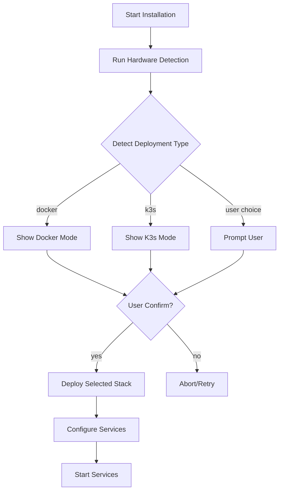

# K3s Layer Detection Logic Plan

## Overview

This plan extends the existing hardware-agnostic architecture to support automatic detection and deployment of either Docker Compose (for resource-constrained hardware) or K3s (for more powerful hardware).

### Dependencies

This plan assumes the following functions already exist in `scripts/hardware-detect.sh` and are **not redefined** here:

- `detect_cpu_model()` — returns the CPU model string from `/proc/cpuinfo`
- `detect_cpu_family()` — returns the CPU family classification (e.g., `INTEL_N_SERIES`, `AMD_HIGH`)
- `get_hardware_profile()` — maps CPU family to a profile string (e.g., `n100_like`, `core_i5`)
- `has_quicksync()`, `has_avx2()`, `has_avx512()` — CPU capability checks
- `get_encoder_type()` — returns the hardware encoder type (e.g., `quicksync`, `nvenc`)

---

## Phase 1: K3s Readiness Detection

### 1.1 GPU Detection Module

**Add to**: `scripts/hardware-detect.sh`

GPU detection is critical for AI workloads. Different GPU vendors require different configurations:

```bash
# Detect GPU vendor and model
# Returns: NVIDIA, AMD, APPLE_SILICON, INTEL, NONE
detect_gpu_vendor() {
    # Check for NVIDIA GPUs
    if command -v nvidia-smi &>/dev/null; then
        if nvidia-smi &>/dev/null; then
            echo "NVIDIA"
            return
        fi
    fi
    
    # Check for AMD GPUs
    if command -v rocm-smi &>/dev/null; then
        if rocm-smi &>/dev/null; then
            echo "AMD"
            return
        fi
    fi
    
    # Check for Apple Silicon (M1/M2/M3)
    local chip_info
    chip_info=$(sysctl -n machdep.cpu.brand_string 2>/dev/null || echo "")
    if [ -z "$chip_info" ] && [ "$(uname -m)" = "arm64" ]; then
        # Check if running on Mac
        if system_profiler SPHardwareDataType 2>/dev/null | grep -qi "apple"; then
            echo "APPLE_SILICON"
            return
        fi
    fi
    
    # Check for Intel integrated graphics
    if lspci 2>/dev/null | grep -qi "vga.*intel"; then
        echo "INTEL"
        return
    fi
    
    echo "NONE"
}

# Get NVIDIA GPU VRAM in GB
# If multiple GPUs are present, returns the VRAM of the largest single GPU.
# Use detect_nvidia_gpu_count() to check for multi-GPU setups.
detect_nvidia_vram_gb() {
    if command -v nvidia-smi &>/dev/null; then
        # Return the max VRAM across all GPUs (handles multi-GPU)
        nvidia-smi --query-gpu=memory.total --format=csv,noheader,nounits 2>/dev/null | \
            awk '{gb=int($1/1024); if(gb>max) max=gb} END {print max+0}'
    else
        echo "0"
    fi
}

# Get the number of NVIDIA GPUs installed
detect_nvidia_gpu_count() {
    if command -v nvidia-smi &>/dev/null; then
        nvidia-smi --query-gpu=name --format=csv,noheader 2>/dev/null | wc -l | tr -d ' '
    else
        echo "0"
    fi
}

# Get total NVIDIA VRAM across all GPUs in GB
# Useful for sizing AI model deployments across multiple GPUs
detect_nvidia_total_vram_gb() {
    if command -v nvidia-smi &>/dev/null; then
        nvidia-smi --query-gpu=memory.total --format=csv,noheader,nounits 2>/dev/null | \
            awk '{sum+=int($1/1024)} END {print sum+0}'
    else
        echo "0"
    fi
}

# Get Apple Silicon memory (unified memory)
detect_apple_unified_memory_gb() {
    if [ "$(uname -m)" = "arm64" ]; then
        sysctl -n hw.memsize 2>/dev/null | awk '{print int($1/1024/1024/1024)}'
    else
        echo "0"
    fi
}

# Get GPU tier for overlay selection
# NOTE: This is separate from get_hardware_profile() which returns CPU-based profiles.
# Use this for selecting GPU-specific Kustomize overlays.
get_gpu_tier() {
    local cpu_profile gpu_vendor nvidia_vram apple_mem
    
    cpu_profile=$(get_hardware_profile)
    gpu_vendor=$(detect_gpu_vendor)
    
    case "$gpu_vendor" in
        NVIDIA)
            nvidia_vram=$(detect_nvidia_vram_gb)
            if [ "$nvidia_vram" -ge 24 ]; then
                echo "nvidia_rtx4090"  # 24GB VRAM
            elif [ "$nvidia_vram" -ge 16 ]; then
                echo "nvidia_rtx4080"  # 16GB VRAM
            elif [ "$nvidia_vram" -ge 12 ]; then
                echo "nvidia_rtx4070"  # 12GB VRAM
            elif [ "$nvidia_vram" -ge 8 ]; then
                echo "nvidia_rtx3060"  # 8-12GB VRAM
            elif [ "$nvidia_vram" -ge 6 ]; then
                echo "nvidia_gtx1660"  # 6GB VRAM
            else
                echo "nvidia_low"      # <6GB - limited AI
            fi
            ;;
        AMD)
            echo "amd_gpu"
            ;;
        APPLE_SILICON)
            apple_mem=$(detect_apple_unified_memory_gb)
            if [ "$apple_mem" -ge 64 ]; then
                echo "apple_ultra"  # 64GB+ unified
            elif [ "$apple_mem" -ge 32 ]; then
                echo "apple_pro"   # 32GB unified
            else
                echo "apple_air"   # 8-24GB unified
            fi
            ;;
        INTEL)
            echo "intel_integrated"
            ;;
        NONE)
            echo "$cpu_profile"
            ;;
    esac
}
```

### 1.2 Storage Detection

**Add to**: `scripts/hardware-detect.sh`

K3s requires adequate storage for etcd and container images:

```bash
# Detect available storage in GB on a given path
# Works on both Linux (df -BG) and macOS (df -g)
detect_storage_gb() {
    local storage_path="${1:-/}"
    local available_gb

    if [ "$(uname -s)" = "Darwin" ]; then
        # macOS uses -g for gigabytes
        available_gb=$(df -g "$storage_path" 2>/dev/null | awk 'NR==2 {print $4}')
    else
        # Linux uses -BG for gigabytes
        available_gb=$(df -BG "$storage_path" 2>/dev/null | awk 'NR==2 {gsub(/G/,""); print $4}')
    fi

    # Validate output is numeric, default to 0
    if [[ "$available_gb" =~ ^[0-9]+$ ]]; then
        echo "$available_gb"
    else
        echo "0"
    fi
}

# Assess storage readiness for K3s deployment
# K3s needs ~20GB minimum for etcd, images, and logs.
# Returns: STORAGE_OK, STORAGE_CRITICAL, STORAGE_INSUFFICIENT
detect_storage_readiness() {
    local available_gb
    available_gb=$(detect_storage_gb "/")

    if [ "$available_gb" -ge 50 ]; then
        echo "STORAGE_OK"           # Comfortable headroom
    elif [ "$available_gb" -ge 20 ]; then
        echo "STORAGE_CRITICAL"     # Meets K3s minimum, but tight
    else
        echo "STORAGE_INSUFFICIENT" # Cannot safely run K3s
    fi
}
```

### 1.3 macOS Detection (for Docker Desktop)

**Add to**: `scripts/hardware-detect.sh`

```bash
# Detect if running on macOS
is_macos() {
    [ "$(uname -s)" = "Darwin" ]
}

# Detect macOS deployment type (Docker Desktop vs Colima)
detect_macos_runtime() {
    if ! is_macos; then
        echo "not_macos"
        return
    fi
    
    # Check if Docker is available
    if docker info &>/dev/null; then
        echo "docker_desktop"
    elif command -v colima &>/dev/null; then
        echo "colima"
    else
        echo "docker_needed"
    fi
}

# Detect if running inside WSL2 (Windows Subsystem for Linux)
# Returns: WSL2, WSL1, NOT_WSL
detect_wsl() {
    if grep -qi "microsoft" /proc/version 2>/dev/null; then
        # Distinguish WSL1 vs WSL2
        if grep -qi "WSL2" /proc/version 2>/dev/null; then
            echo "WSL2"
        else
            echo "WSL1"
        fi
    else
        echo "NOT_WSL"
    fi
}
```

### 1.4 K3s Readiness Detection

```bash
# Check if hardware can run K3s
# Returns: K3S_READY, K3S_OPTIONAL, DOCKER_ONLY
detect_k3s_readiness() {
    local cpu_cores ram_mb
    
    cpu_cores=$(nproc 2>/dev/null || echo "1")
    # Use free -m (megabytes) instead of free -g to avoid rounding errors.
    # free -g rounds down: a 3.9GB system reports 3, missing the 4GB threshold.
    ram_mb=$(free -m 2>/dev/null | awk '/^Mem:/{print $2}' || echo "0")
    
    # K3s minimum requirements (in MB)
    local min_cores=2
    local min_ram_mb=2048    # 2GB
    # K3s recommended for production (in MB)
    local rec_cores=4
    local rec_ram_mb=4096    # 4GB
    
    if [ "$cpu_cores" -ge "$rec_cores" ] && [ "$ram_mb" -ge "$rec_ram_mb" ]; then
        echo "K3S_READY"      # Can run K3s optimally
    elif [ "$cpu_cores" -ge "$min_cores" ] && [ "$ram_mb" -ge "$min_ram_mb" ]; then
        echo "K3S_OPTIONAL"    # Can run K3s but may be slow
    else
        echo "DOCKER_ONLY"     # Should use Docker Compose
    fi
}

# Check if K3s is already installed on the system
# Returns: K3S_INSTALLED, K3S_RUNNING, K3S_NOT_FOUND
detect_k3s_existing() {
    if command -v k3s &>/dev/null; then
        if systemctl is-active --quiet k3s 2>/dev/null; then
            echo "K3S_RUNNING"
        else
            echo "K3S_INSTALLED"
        fi
    else
        echo "K3S_NOT_FOUND"
    fi
}

# Check if K3s API port (6443) is available
# Returns: 0 if free, 1 if occupied
check_k3s_port() {
    if ss -tln 2>/dev/null | grep -q ':6443 '; then
        return 1  # Port occupied
    fi
    return 0      # Port free
}
```

### 1.5 Unified Deployment Type Detection

```bash
# Get deployment type based on hardware, GPU, storage, and OS
get_deployment_type() {
    local hardware_profile gpu_vendor k3s_readiness nvidia_vram
    local user_override storage_readiness is_macos_result k3s_existing
    
    hardware_profile=$(get_hardware_profile)
    gpu_vendor=$(detect_gpu_vendor)
    k3s_readiness=$(detect_k3s_readiness)
    storage_readiness=$(detect_storage_readiness)
    is_macos_result=$(detect_macos_runtime)
    k3s_existing=$(detect_k3s_existing)
    
    # Check for user override
    user_override="${FORCE_DEPLOYMENT:-}"
    
    if [ "$user_override" = "k3s" ]; then
        # Validate forced K3s — warn if hardware is insufficient
        if [ "$k3s_readiness" = "DOCKER_ONLY" ]; then
            log_warn "⚠️  FORCE_DEPLOYMENT=k3s but hardware does not meet K3s minimums."
            log_warn "   CPU cores: $(nproc 2>/dev/null || echo '?'), RAM: $(free -g 2>/dev/null | awk '/^Mem:/{print $2}')GB"
            log_warn "   K3s requires at least 2 cores and 2GB RAM. Expect instability."
        fi
        if [ "$storage_readiness" = "STORAGE_INSUFFICIENT" ]; then
            log_warn "⚠️  FORCE_DEPLOYMENT=k3s but storage is below 20GB minimum."
            log_warn "   Available: $(detect_storage_gb)GB. K3s may fail to start."
        fi
        echo "k3s"
        return
    elif [ "$user_override" = "docker" ]; then
        echo "docker"
        return
    fi
    
    # WSL2: experimental support — warn and default to Docker
    local wsl_status
    wsl_status=$(detect_wsl)
    if [ "$wsl_status" = "WSL2" ]; then
        log_warn "⚠️  WSL2 detected. K3s on WSL2 is EXPERIMENTAL."
        log_warn "   Networking and systemd may behave unexpectedly."
        log_warn "   Defaulting to Docker. Use FORCE_DEPLOYMENT=k3s to override."
        echo "docker"
        return
    elif [ "$wsl_status" = "WSL1" ]; then
        log_warn "⚠️  WSL1 detected. Neither K3s nor Docker run natively on WSL1."
        log_warn "   Please upgrade to WSL2 or use Docker Desktop for Windows."
        echo "docker"
        return
    fi
    
    # macOS always uses Docker Desktop/Colima, not K3s
    if [ "$is_macos_result" != "not_macos" ]; then
        echo "docker"
        return
    fi
    
    # Check storage adequacy first
    if [ "$storage_readiness" = "STORAGE_INSUFFICIENT" ]; then
        echo "docker"
        return
    fi

    # Check if K3s API port is available
    if ! check_k3s_port; then
        # Port 6443 is occupied — if K3s is already running, reuse it
        if [ "$k3s_existing" = "K3S_RUNNING" ]; then
            echo "k3s"
        else
            # Something else holds 6443, fall back to Docker
            echo "docker"
        fi
        return
    fi
    
    # GPU-specific logic
    case "$gpu_vendor" in
        NVIDIA)
            nvidia_vram=$(detect_nvidia_vram_gb)
            # NVIDIA GPUs with 8GB+ VRAM can run K3s efficiently
            if [ "$nvidia_vram" -ge 8 ] && [ "$storage_readiness" != "STORAGE_CRITICAL" ]; then
                echo "k3s"
            else
                echo "docker"
            fi
            ;;
        APPLE_SILICON)
            # Asahi Linux (Linux on Apple Silicon) — K3s can run but is experimental.
            # The macOS early-exit above catches native macOS; this branch handles
            # Asahi Linux or other Linux distros running on Apple hardware.
            if [ "$k3s_readiness" = "K3S_READY" ] && [ "$storage_readiness" != "STORAGE_CRITICAL" ]; then
                log_warn "⚠️  Apple Silicon running Linux (Asahi?) detected."
                log_warn "   K3s support on Apple Silicon Linux is experimental."
                echo "k3s"
            else
                echo "docker"
            fi
            ;;
        AMD)
            # AMD GPUs can run K3s
            if [ "$k3s_readiness" = "K3S_READY" ] && [ "$storage_readiness" != "STORAGE_CRITICAL" ]; then
                echo "k3s"
            else
                echo "docker"
            fi
            ;;
        INTEL|NONE)
            # CPU-only or integrated graphics - use CPU profile
            case "$hardware_profile" in
                n100_like|celeron)
                    echo "docker"
                    ;;
                core_i3|amd_low)
                    echo "docker"
                    ;;
                core_i5|core_i7|core_i9|amd_mid|amd_high|arm64_server)
                    if [ "$k3s_readiness" = "K3S_READY" ] && [ "$storage_readiness" != "STORAGE_CRITICAL" ]; then
                        echo "k3s"
                    else
                        echo "docker"
                    fi
                    ;;
                *)
                    echo "docker"
                    ;;
            esac
            ;;
    esac
}
```

### 1.6 Comprehensive Hardware Detection Matrix

| Hardware Profile | CPU | RAM | GPU | K3s Ready | Docker Only | Notes |
|-----------------|-----|-----|-----|-----------|-------------|-------|
| n100_like | Intel N100 | 8-16GB | Intel UHD | No | ✓ | Low-power oweibo |
| celeron | Celeron N | 4-8GB | Intel HD | No | ✓ | Minimal resources |
| core_i3 | i3-xxxx | 8-16GB | Intel UHD | Optional | ✓ | Light K3s possible |
| core_i5 | i5-xxxx | 16GB+ | Intel UHD/NONE | Yes | - | Good K3s candidate |
| core_i7/i9 | i7/i9-xxxx | 32GB+ | Intel Iris/dGPU | Yes | - | Excellent K3s |
| amd_low | Athlon/R3 | 8GB | Radeon Vega | Optional | ✓ | Limited |
| amd_mid | Ryzen 5 | 16GB | Radeon RX | Yes | - | Good K3s |
| amd_high | Ryzen 7/9 | 32GB+ | Radeon RX 7xxx | Yes | - | Premium K3s |
| nvidia_gtx | Any | 16GB+ | GTX 1660-3060 | Yes | - | GPU-accelerated AI |
| nvidia_rtx | Any | 16GB+ | RTX 3060-4090 | Yes | - | Full AI stack |
| apple_air | M1/M2 Air | 8-24GB | Apple GPU | No | ✓ | macOS → Docker |
| apple_pro | M1/M2 Pro | 32GB+ | Apple GPU | No | ✓ | macOS → Docker |
| apple_ultra | M1/M2 Ultra | 64GB+ | Apple GPU | No | ✓ | macOS → Docker |
| arm64_server | ARM Neoverse | 8GB+ | None/Mali | Yes | - | Cloud-native |
| rpi5 | Raspberry Pi 5 | 8GB | VideoCore | No | ✓ | ARM32/64 Docker |

---

## Phase 2: Dual-Stack Installer Architecture

### 2.1 Modified Setup Flow



### 2.2 Modified setup.sh Structure

**New sections in setup.sh**:

```bash
# Section 0: Deployment Type Detection
detect_deployment_type() {
    source scripts/hardware-detect.sh
    DEPLOYMENT_TYPE=$(get_deployment_type)
    
    log "Detected hardware: $(detect_cpu_model)"
    log "Detected GPU: $(detect_gpu_vendor)"
    log "K3s readiness: $(detect_k3s_readiness)"
    log "Storage readiness: $(detect_storage_readiness)"
    log "GPU tier: $(get_gpu_tier)"
    log "Recommended deployment: $DEPLOYMENT_TYPE"

    # Pre-flight: check for existing K3s
    local k3s_state
    k3s_state=$(detect_k3s_existing)
    if [ "$k3s_state" = "K3S_RUNNING" ]; then
        log_warn "K3s is already running on this system."
        read -p "Reinstall K3s? (yes/no) [no]: " REINSTALL
        if [[ ! "${REINSTALL:-no}" =~ ^[Yy][Ee]?[Ss]?$ ]]; then
            log "Keeping existing K3s installation."
            DEPLOYMENT_TYPE="k3s"
        fi
    fi
}

# Section X: Deployment Mode Selection
select_deployment_mode() {
    local detected="$1"
    local recommended
    
    if [ "$detected" = "k3s" ]; then
        recommended="K3s (Recommended for this hardware)"
    else
        recommended="Docker Compose (Best for this hardware)"
    fi
    
    echo "Detected: $recommended"
    echo ""
    echo "Select deployment mode:"
    echo "1) $recommended"
    echo "2) Alternative option"
    read -p "Choice [1]: " choice
    
    case "$choice" in
        1) echo "$detected" ;;
        2) 
            if [ "$detected" = "k3s" ]; then
                echo "docker"
            else
                echo "k3s"
            fi
            ;;
        *) echo "$detected" ;;
    esac
}
```

### 2.3 Integration with Onboarding Wizard (`onboard.sh`)

The `onboard.sh` script is the interactive entry point. It must be updated to detect the deployment type, allow the user to override it, save the choice to `config.env`, and adjust AI memory calculations to account for K3s overhead.

**Modifications to `onboard.sh`**:

1. **Add Deployment Selection Step**: Insert this before the AI model selection.

```bash
# =============================================================================
# DEPLOYMENT MODE SELECTION (Docker Compose vs K3s)
# =============================================================================
log_step "Determining optimal infrastructure..."

DETECTED_DEPLOY="docker"
if [ "$HARDWARE_PROFILE" != "unknown" ]; then
    DETECTED_DEPLOY=$(get_deployment_type)
fi

echo -e "Based on your hardware, the recommended deployment is: ${CYAN}${DETECTED_DEPLOY^^}${NC}"
if [ "$DETECTED_DEPLOY" = "docker" ]; then
    echo "  → Docker Compose is lightweight and best for resource-constrained systems."
else
    echo "  → K3s Kubernetes offers high availability and enterprise features."
fi
echo ""

read -p "Use recommended deployment ($DETECTED_DEPLOY)? (Y/n) > " use_rec
if [[ "$use_rec" =~ ^[Nn]$ ]]; then
    if [ "$DETECTED_DEPLOY" = "docker" ]; then
        log_warn "Forcing K3s on this hardware may cause instability due to resource limits."
        DEPLOYMENT_TYPE="k3s"
    else
        DEPLOYMENT_TYPE="docker"
    fi
else
    DEPLOYMENT_TYPE="$DETECTED_DEPLOY"
fi

log_success "Deployment mode set to: ${DEPLOYMENT_TYPE^^}"
```

1. **Adjust Memory Calculations**: K3s adds ~1GB of RAM overhead compared to Docker Compose. The RAM available for AI models must be reduced if K3s is selected.

```bash
# In onboard-lib.sh -> calculate_ai_parameters()
local base_os_buffer=2048 # 2GB for OS and core services
if [ "${DEPLOYMENT_TYPE:-docker}" = "k3s" ]; then
    base_os_buffer=3072 # 3GB to account for K3s overhead (etcd, containerd)
fi
```

1. **Save to Config**: Ensure `DEPLOYMENT_TYPE` is written to `config.env`.

```bash
# In generate_config()
echo "DEPLOYMENT_TYPE=$DEPLOYMENT_TYPE" >> "$CONFIG_FILE"
```

---

## Phase 3: K3s Manifests Creation

### 3.1 Directory Structure

```
k8s/
k8s/base/
k8s/base/namespace.yaml
k8s/base/storage.yaml
k8s/overlays/
k8s/overlays/n100/
k8s/overlays/n100/kustomization.yaml
k8s/overlays/n100/resources.yaml
k8s/overlays/high-perf/
k8s/overlays/high-perf/kustomization.yaml
k8s/overlays/high-perf/resources.yaml
k8s/services/
k8s/services/traefik/
k8s/services/traefik/deployment.yaml
k8s/services/traefik/service.yaml
k8s/services/traefik/ingress.yaml
k8s/services/ollama/
k8s/services/qdrant/
k8s/services/kilo-pipeline/
...
```

### 3.2 Example Traefik K8s Manifest

**File**: `k8s/services/traefik/deployment.yaml`

```yaml
apiVersion: apps/v1
kind: Deployment
metadata:
  name: traefik
  namespace: oweibo
spec:
  replicas: 1
  selector:
    matchLabels:
      app: traefik
  template:
    metadata:
      labels:
        app: traefik
    spec:
      containers:
        - name: traefik
          image: traefik:v3.0
          args:
            - "--configFile=/etc/traefik/traefik.yaml"
          ports:
            - name: http
              containerPort: 80
            - name: https
              containerPort: 443
          volumeMounts:
            - name: traefik-config
              mountPath: /etc/traefik
          resources:
            requests:
              cpu: 100m
              memory: 128Mi
            limits:
              cpu: 500m
              memory: 512Mi
      volumes:
        - name: traefik-config
          hostPath:
            path: /home/user/oweibo/traefik
            type: Directory
```

### 3.3 Hardware & GPU-Specific Resource Overlays

**File**: `k8s/overlays/n100/kustomization.yaml`

```yaml
apiVersion: kustomize.config.k8s.io/v1beta1
kind: Kustomization
patches:
  - patch: |-
      - op: replace
        path: /spec/template/spec/containers/0/resources/limits/memory
        value: "512Mi"
    target:
      kind: Deployment
      name: ollama
  - patch: |-
      - op: replace
        path: /spec/replicas
        value: 1
    target:
      kind: Deployment
      name: kilo-pipeline
```

**File**: `k8s/overlays/nvidia_rtx4080/kustomization.yaml` (GPU-Accelerated)

```yaml
apiVersion: kustomize.config.k8s.io/v1beta1
kind: Kustomization
patches:
  - patch: |-
      - op: replace
        path: /spec/template/spec/containers/0/resources/limits/memory
        value: "16Gi"
      - op: add
        path: /spec/template/spec/containers/0/resources/limits/nvidia.com~1gpu
        value: "1"
    target:
      kind: Deployment
      name: ollama
  - patch: |-
      - op: replace
        path: /spec/replicas
        value: 2
    target:
      kind: Deployment
      name: kilo-pipeline
```

> [!NOTE]
> JSON Pointer uses `~1` to escape `/` in key names. The NVIDIA resource
> `nvidia.com/gpu` must be written as `nvidia.com~1gpu` in the patch path.

**File**: `k8s/overlays/apple_silicon/kustomization.yaml`

```yaml
apiVersion: kustomize.config.k8s.io/v1beta1
kind: Kustomization
patches:
  - patch: |-
      - op: replace
        path: /spec/template/spec/containers/0/resources/limits/memory
        value: "32Gi"
    target:
      kind: Deployment
      name: ollama
  - patch: |-
      - op: replace
        path: /spec/replicas
        value: 2
    target:
      kind: Deployment
      name: kilo-pipeline
```

### 3.4 Overlay Selection Logic

The K3s install script must map the detection output to an overlay directory:

```bash
# Resolve the correct Kustomize overlay directory
# Uses get_gpu_tier() for GPU-specific overlays, falls back to get_hardware_profile()
get_k8s_overlay() {
    local gpu_tier hardware_profile overlay_dir

    gpu_tier=$(get_gpu_tier)
    hardware_profile=$(get_hardware_profile)

    # Prefer GPU-specific overlay if it exists
    if [ -d "k8s/overlays/$gpu_tier" ]; then
        echo "$gpu_tier"
    elif [ -d "k8s/overlays/$hardware_profile" ]; then
        echo "$hardware_profile"
    else
        # Default to high-perf as a safe fallback (K3s implies capable hardware)
        echo "high-perf"
    fi
}
```

### 3.5 NVIDIA GPU Runtime Configuration

For K3s with NVIDIA GPUs, the NVIDIA Container Toolkit must be installed:

```bash
# In k3s-install.sh - Add NVIDIA support
# Pin the NVIDIA device plugin version for reproducible deployments
NVIDIA_DEVICE_PLUGIN_VERSION="${NVIDIA_DEVICE_PLUGIN_VERSION:-v0.16.2}"

install_nvidia_k3s_runtime() {
    local gpu_vendor
    gpu_vendor=$(detect_gpu_vendor)
    
    if [ "$gpu_vendor" != "NVIDIA" ]; then
        return
    fi

    log "NVIDIA GPU detected - installing NVIDIA Container Toolkit..."
    
    # Step 1: Install NVIDIA drivers via ubuntu-drivers (safe, version-managed)
    if ! command -v nvidia-smi &>/dev/null; then
        log "Installing NVIDIA drivers..."
        apt-get install -y ubuntu-drivers-common
        ubuntu-drivers install --gpgpu
    fi

    # Step 2: Install NVIDIA Container Toolkit (replaces nvidia-container-runtime)
    # Reference: https://docs.nvidia.com/datacenter/cloud-native/container-toolkit/latest/install-guide.html
    local distribution
    distribution=$(. /etc/os-release; echo "${ID}${VERSION_ID}")

    curl -fsSL https://nvidia.github.io/libnvidia-container/gpgkey | \
        gpg --dearmor -o /usr/share/keyrings/nvidia-container-toolkit-keyring.gpg
    curl -s -L "https://nvidia.github.io/libnvidia-container/${distribution}/libnvidia-container.list" | \
        sed 's#deb https://#deb [signed-by=/usr/share/keyrings/nvidia-container-toolkit-keyring.gpg] https://#g' | \
        tee /etc/apt/sources.list.d/nvidia-container-toolkit.list > /dev/null

    apt-get update
    apt-get install -y nvidia-container-toolkit

    # Step 3: Configure K3s's EMBEDDED containerd (not the system containerd)
    # K3s uses its own containerd at /var/lib/rancher/k3s/agent/etc/containerd/.
    # DO NOT use `nvidia-ctk runtime configure --runtime=containerd` — that
    # modifies /etc/containerd/config.toml which K3s ignores.
    # Instead, create a containerd config template that K3s will merge on startup.
    local k3s_containerd_dir="/var/lib/rancher/k3s/agent/etc/containerd"
    mkdir -p "$k3s_containerd_dir"

    cat > "${k3s_containerd_dir}/config.toml.tmpl" << 'CONTAINERD_EOF'
version = 2

[plugins."io.containerd.grpc.v1.cri".containerd.runtimes.runc]
  runtime_type = "io.containerd.runc.v2"

[plugins."io.containerd.grpc.v1.cri".containerd.runtimes.runc.options]
  SystemdCgroup = true

[plugins."io.containerd.grpc.v1.cri".containerd.runtimes.nvidia]
  runtime_type = "io.containerd.runc.v2"
  privileged_without_host_devices = false

[plugins."io.containerd.grpc.v1.cri".containerd.runtimes.nvidia.options]
  BinaryName = "/usr/bin/nvidia-container-runtime"
  SystemdCgroup = true
CONTAINERD_EOF

    log "K3s containerd template written to ${k3s_containerd_dir}/config.toml.tmpl"

    # Restart K3s to pick up the new containerd template
    # This is safe because K3s regenerates its containerd config from the template on start.
    systemctl restart k3s
    log "K3s restarted to load NVIDIA containerd runtime."

    # Step 4: Install NVIDIA K8s Device Plugin
    log "Installing NVIDIA K8s Device Plugin ${NVIDIA_DEVICE_PLUGIN_VERSION}..."
    kubectl apply -f "https://raw.githubusercontent.com/NVIDIA/k8s-device-plugin/${NVIDIA_DEVICE_PLUGIN_VERSION}/deployments/static/nvidia-device-plugin.yml"

    log_success "NVIDIA Container Toolkit installed and configured for K3s."
}
```

### 3.6 Apple Silicon Configuration

For Apple Silicon (M1/M2/M3), use Docker Desktop or Colima:

```bash
# Apple Silicon always uses Docker on macOS (not K3s).
# This function ensures the correct ARM64 platform flags are set.
configure_apple_silicon() {
    local gpu_vendor
    gpu_vendor=$(detect_gpu_vendor)
    
    if [ "$gpu_vendor" = "APPLE_SILICON" ]; then
        log "Apple Silicon detected - configuring for ARM64 Docker..."
        
        # K3s is NOT supported on macOS. Use Docker Desktop or Colima.
        # Ollama uses native Apple Silicon builds.
        
        # Set platform in config
        echo "PLATFORM=arm64" >> config.env
    fi
}
```

---

## Phase 4: K3s Installation Script

### 4.1 k3s-install.sh

**New file**: `scripts/k3s-install.sh`

```bash
#!/bin/bash
set -euo pipefail

source scripts/hardware-detect.sh

# Pre-flight checks for K3s installation
preflight_k3s() {
    log "Running K3s pre-flight checks..."

    # Check root
    if [ "$EUID" -ne 0 ]; then
        log_error "K3s installation requires root. Run with sudo."
        exit 1
    fi

    # Check port 6443
    if ! check_k3s_port; then
        log_error "Port 6443 is already in use. K3s API server cannot bind."
        log_error "Check: ss -tln | grep 6443"
        exit 1
    fi

    # Check network connectivity (K3s install requires internet)
    log "Checking network connectivity..."
    if ! curl -sfL --max-time 10 https://get.k3s.io > /dev/null 2>&1; then
        log_error "Cannot reach https://get.k3s.io — network is unavailable."
        log_error "K3s installation requires internet access."
        log_error "For air-gapped installs, see: https://docs.k3s.io/installation/airgap"
        exit 1
    fi

    # Check RAM (use MB for precision — free -g rounds 3.9GB down to 3)
    local ram_mb
    ram_mb=$(free -m 2>/dev/null | awk '/^Mem:/{print $2}' || echo "0")
    if [ "$ram_mb" -lt 2048 ]; then
        log_error "K3s requires at least 2GB RAM. Detected: $((ram_mb / 1024))GB (${ram_mb}MB)."
        exit 1
    fi

    # Check storage
    local storage
    storage=$(detect_storage_readiness)
    if [ "$storage" = "STORAGE_INSUFFICIENT" ]; then
        log_error "K3s requires at least 20GB free disk space."
        exit 1
    fi
    if [ "$storage" = "STORAGE_CRITICAL" ]; then
        log_warn "Disk space is tight. K3s may encounter issues under load."
    fi

    log_success "K3s pre-flight checks passed."
}

install_helm() {
    if command -v helm &>/dev/null; then
        log "Helm already installed: $(helm version --short)"
        return
    fi

    log "Installing Helm..."
    curl -fsSL https://raw.githubusercontent.com/helm/helm/main/scripts/get-helm-3 | bash
    log_success "Helm installed: $(helm version --short)"
}

install_k3s() {
    # Use stable channel instead of pinning an old version
    local k3s_channel="${K3S_CHANNEL:-stable}"
    
    log "Installing K3s (channel: $k3s_channel)..."
    
    # CRITICAL: --disable traefik prevents K3s from installing its bundled
    # Traefik v2, which would conflict with our custom Traefik v3.0 deployment.
    curl -sfL https://get.k3s.io | INSTALL_K3S_CHANNEL="$k3s_channel" \
        INSTALL_K3S_EXEC="--disable traefik" sh -
    
    # Wait for K3s to be ready (with progress feedback)
    log "Waiting for K3s node to become Ready..."
    sleep 10
    local waited=0
    local max_wait=120
    while [ $waited -lt $max_wait ]; do
        if kubectl get nodes 2>/dev/null | grep -q ' Ready'; then
            log_success "K3s node is Ready! (waited ${waited}s)"
            break
        fi
        printf '\r  ⏳ Waiting for K3s... %ds/%ds' "$waited" "$max_wait"
        sleep 5
        waited=$((waited + 5))
    done
    printf '\n'  # Clear the spinner line
    if [ $waited -ge $max_wait ]; then
        log_error "K3s node did not become Ready within ${max_wait}s."
        log_error "Debug: kubectl get nodes"
        log_error "Debug: journalctl -u k3s --no-pager -n 50"
        exit 1
    fi
    
    # Install Helm (required for Traefik chart)
    install_helm

    # Install our custom Traefik v3.0 via Helm
    helm repo add traefik https://traefik.github.io/charts
    helm repo update
    helm install traefik traefik/traefik \
        --namespace oweibo --create-namespace \
        --set image.tag=v3.0 \
        --set ports.websecure.tls.enabled=true

    # Install NVIDIA runtime if applicable
    install_nvidia_k3s_runtime

    # Resolve the correct overlay
    local overlay
    overlay=$(get_k8s_overlay)
    
    # Apply base manifests
    kubectl apply -k k8s/base
    kubectl apply -k "k8s/overlays/$overlay"
    
    log_success "K3s installation complete! Overlay: $overlay"
}

uninstall_k3s() {
    log "Uninstalling K3s..."
    if [ -f /usr/local/bin/k3s-uninstall.sh ]; then
        /usr/local/bin/k3s-uninstall.sh
        log_success "K3s uninstall complete!"
    else
        log_error "K3s uninstall script not found. Is K3s installed?"
        exit 1
    fi
}

# Entry point
case "${1:-install}" in
    install)
        preflight_k3s
        install_k3s
        ;;
    uninstall)
        uninstall_k3s
        ;;
    preflight)
        preflight_k3s
        ;;
    *)
        echo "Usage: $0 {install|uninstall|preflight}"
        exit 1
        ;;
esac
```

---

## Phase 5: Unified CLI Interface

### 5.1 Modified Commands

| Command | Docker Mode | K3s Mode |
|---------|-------------|----------|
| `./setup.sh` | Detects hardware → runs Docker | Detects hardware → installs K3s |
| `./update.sh` | `docker compose pull` | `kubectl apply -k` + `helm upgrade` |
| `./backup-oweibo.sh` | `docker commit` volumes | `kubectl get pv -o yaml` + volume snapshots |

### 5.2 Deployment Type Persistence

The detected deployment type should be saved for future operations:

```bash
# Save to config
echo "DEPLOYMENT_TYPE=$DEPLOYMENT_TYPE" >> config.env

# Load in other scripts
if [ -f config.env ]; then
    source config.env
fi
```

---

## Implementation Order

1. **Phase 1**: Extend `scripts/hardware-detect.sh` with GPU, storage, macOS, and K3s existing detection
2. **Phase 1**: Add validation functions (`detect_k3s_existing`, `check_k3s_port`, `detect_storage_readiness`)
3. **Phase 2**: Modify `setup.sh` with hardware detection report and validation
4. **Phase 3**: Create K8s manifests with StorageClass and overlay resolution logic
5. **Phase 3**: Create GPU-specific overlays (nvidia_rtx, apple_silicon)
6. **Phase 4**: Create `scripts/k3s-install.sh` with `--disable traefik`, Helm, NVIDIA toolkit
7. **Phase 5**: Update other scripts to handle both deployment types

---

## Backward Compatibility

- Existing Docker Compose users can continue using it unchanged
- K3s installation is opt-in (auto-detected but requires user confirmation)
- Migration path: Docker → K3s requires manual reconfiguration

---

## Appendix A: Docker to K3s Migration Guide

### Pre-Migration Checklist

| Step | Task | Command |
|------|------|---------|
| 1 | Backup all data | `./backup-oweibo.sh` |
| 2 | Export Docker volumes | `docker run --rm -v volume_name:/data -v $(pwd):/backup ubuntu tar czf /backup/volume_name.tar.gz /data` |
| 3 | Document current services | `docker compose ps` |
| 4 | Note environment variables | `grep -E "^[A-Z_]+=" .env \| sort` |

### Migration Steps

1. **Install K3s**: Run `./scripts/k3s-install.sh`
2. **Apply base manifests**: `kubectl apply -k k8s/base`
3. **Apply hardware overlay**: `kubectl apply -k "k8s/overlays/$(get_k8s_overlay)"`
4. **Migrate persistent data**: Restore volume data to Kubernetes PVs
5. **Verify services**: `kubectl get pods -n oweibo`
6. **Finalize**: Run `./scripts/k3s-install.sh finalize` to mark migration complete

### Migration State Tracking

A `migration-state.json` file is written during migration to prevent partial-migration
confusion and allow safe resume if the process is interrupted:

```bash
# Written to /var/kilo/migration-state.json during Docker→K3s migration
write_migration_state() {
    local state_file="/var/kilo/migration-state.json"
    mkdir -p "$(dirname "$state_file")"

    cat > "$state_file" << EOF
{
  "source": "docker",
  "target": "k3s",
  "started_at": "$(date -u +%Y-%m-%dT%H:%M:%SZ)",
  "status": "${1:-in_progress}",
  "phase": "${2:-unknown}",
  "volumes_migrated": ${3:-[]},
  "services_running": ${4:-[]},
  "overlay": "$(get_k8s_overlay)",
  "gpu_tier": "$(get_gpu_tier)",
  "gpu_count": "$(detect_nvidia_gpu_count)",
  "errors": []
}
EOF
    log "Migration state updated: $1 ($2)"
}

# Check migration state before operations
check_migration_state() {
    local state_file="/var/kilo/migration-state.json"
    if [ -f "$state_file" ]; then
        local status
        status=$(grep '"status"' "$state_file" | sed 's/.*: "\(.*\)".*/\1/')
        if [ "$status" = "in_progress" ]; then
            log_warn "⚠️  A previous migration was interrupted."
            log_warn "   State file: $state_file"
            read -p "Resume migration? (yes/no) [yes]: " RESUME
            if [[ "${RESUME:-yes}" =~ ^[Nn] ]]; then
                log "Migration aborted by user."
                exit 0
            fi
        fi
    fi
}
```

The state file tracks:
- **Which volumes** have been migrated (prevents double-copy)
- **Which services** are running on K3s vs. still on Docker
- **Current phase** so a crashed migration can resume from the right step
- **GPU count** for multi-GPU aware overlay selection

---

## Appendix B: StorageClass Configuration

For single-node K3s, use the local-path-provisioner (bundled with K3s by default):

```yaml
# k8s/base/local-storage.yaml
apiVersion: v1
kind: Namespace
metadata:
  name: local-path-storage
---
apiVersion: v1
kind: ConfigMap
metadata:
  name: local-path-config
  namespace: local-path-storage
data:
  config.json: |-
    {
      "nodePathMap":[{"node":"DEFAULT_PATH_FOR_NON_LISTED_NODES","paths":["/var/lib/rancher/k3s/storage"]}]
    }
```

Example PersistentVolumeClaim:

```yaml
apiVersion: v1
kind: PersistentVolumeClaim
metadata:
  name: qdrant-data
  namespace: oweibo
spec:
  storageClassName: local-path
  accessModes: ["ReadWriteOnce"]
  resources:
    requests:
      storage: 10Gi
```

---

## Appendix C: Error Handling & Validation Checklist

### Hardware Detection Error Handling

All detection functions should handle errors gracefully:

```bash
detect_something() {
    # Use subshell with redirection to suppress errors
    local result
    result=$(some_command 2>/dev/null) || result="unknown"
    echo "${result:-default}"
}
```

### Pre-flight Validation Checklist

| Check | Command | Min Requirement | Action on Fail |
|-------|---------|-----------------|----------------|
| Root | `id -u` | 0 | Exit |
| CPU cores | `nproc` | 2 (K3s) | Warn |
| RAM | `free -m` | 2048MB | Exit |
| Disk | `df /` | 20GB (K3s) / 10GB (Docker) | Exit |
| OS | `uname` | Linux (K3s) / Any (Docker) | Warn |
| K3s: port 6443 | `ss -tln` | Free | Exit |
| K3s: existing | `which k3s` | Not installed or stopped | Warn |
| Docker (if needed) | `docker --version` | Latest | Exit |
| Helm (if K3s) | `helm version` | Auto-installed | Auto-install |

---

## Appendix D: Known Edge Cases

| Scenario | Current Handling | Recommendation |
|----------|------------------|----------------|
| WSL2 on Windows | Detected via `detect_wsl()`, defaults to Docker with warning | ✅ Fixed |
| Nested virtualization | No detection | Add `kvm-ok` check |
| ARM32 (Pi Zero) | Falls through to ARM64 | Add ARM32 profile |
| Limited RAM (<1GB) | Returns DOCKER_ONLY | Good |
| 4GB RAM rounding | Uses `free -m` (MB) to avoid `free -g` rounding 3.9→3 | ✅ Fixed |
| No network | Pre-flight checks `curl https://get.k3s.io` | ✅ Fixed |
| Air-gapped | Pre-flight fails with link to K3s airgap docs | ✅ Fixed |
| K3s already installed | Now detected via `detect_k3s_existing()` | ✅ Fixed |
| Port 6443 occupied | Now checked via `check_k3s_port()` | ✅ Fixed |
| macOS (any hardware) | Forces Docker via early exit | ✅ Fixed |
| Multi-GPU (2+ NVIDIA) | `detect_nvidia_gpu_count()` + `detect_nvidia_total_vram_gb()` | ✅ Fixed |
| Interrupted migration | `migration-state.json` tracks phase and allows resume | ✅ Fixed |

---

## Appendix E: Rollback Strategy

### Docker Rollback

```bash
# If Docker deployment fails
./setup.sh --force docker
docker compose down
docker compose up -d --remove-orphans
```

### K3s Rollback

```bash
# If K3s deployment fails, uninstall and fall back to Docker
/usr/local/bin/k3s-uninstall.sh
FORCE_DEPLOYMENT=docker ./setup.sh
```
