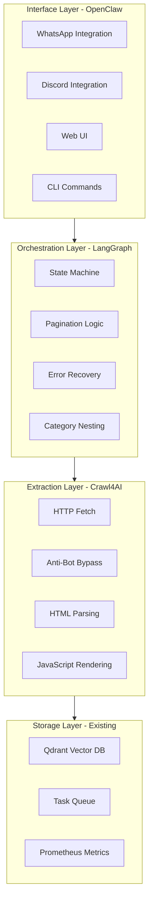
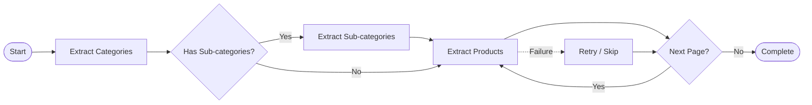
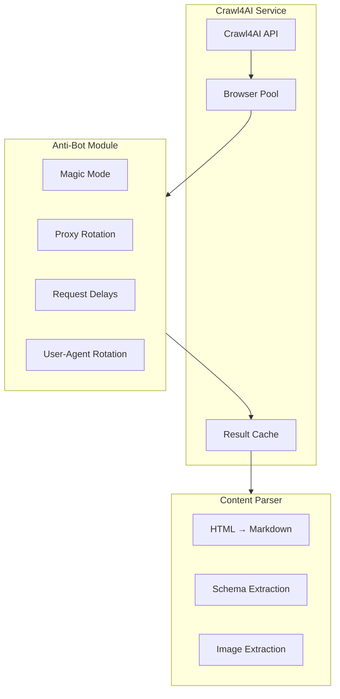
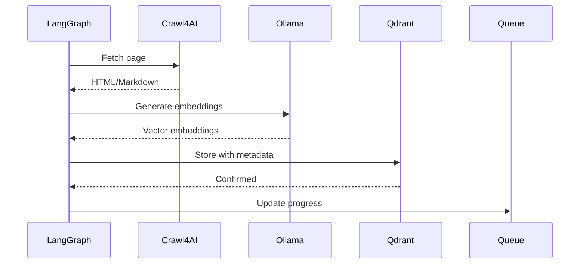

# OpenClaw + LangGraph + Crawl4AI Implementation Plan

## Executive Summary

This document outlines a detailed implementation plan for integrating advanced web scraping capabilities into the homelab project using OpenClaw, LangGraph, and Crawl4AI.

**Note**: Your title mentions "Langchain" but the description details "LangGraph" functionality. This plan uses **LangGraph** as it matches your described use case for state machine orchestration.

---

## 1. Architecture Overview

### 1.1 Component Responsibilities



### 1.2 Integration with Existing Project

| Existing Component | Integration Point | Role |
|-------------------|-------------------|------|
| OpenClaw | `openclaw/openclaw.json` | Trigger/monitor scrape tasks |
| kilo-pipeline | New `/scrape` routes | LangGraph state machine execution |
| Ollama | Existing service | AI-powered extraction decisions |
| Qdrant | Existing service | Store scraped content embeddings |
| Prometheus | Existing service | Scrape job metrics |
| Traefik | Existing service | Route to scrape UI |

---

## 2. LangGraph State Machine Design

### 2.1 Graph Nodes



### 2.2 State Definition

```typescript
interface ScrapeState {
    // URL tracking
    current_url: string;
    visited_urls: Set<string>;
    failed_urls: Map<string, Error>;
    
    // Pagination
    page_number: number;
    has_next_page: boolean;
    next_page_selector: string | null;
    
    // Extraction
    categories: Category[];
    products: Product[];
    extracted_count: number;
    
    // Error handling
    consecutive_failures: number;
    max_retries: number;
    error_log: Error[];
    
    // Configuration
    target_domain: string;
    extraction_schema: ExtractionSchema;
    anti_bot_mode: 'standard' | 'magic' | 'stealth';
}
```

### 2.3 Node Functions

| Node | Function | Description |
|------|----------|-------------|
| `fetch_page` | [`langgraph/nodes/fetch.js`](kilo/pipeline/src/services/scraper/langgraph/nodes/fetch.js) | Call Crawl4AI to fetch URL |
| `extract_categories` | [`langgraph/nodes/categories.js`](kilo/pipeline/src/services/scraper/langgraph/nodes/categories.js) | Parse category links |
| `extract_products` | [`langgraph/nodes/products.js`](kilo/pipeline/src/services/scraper/langgraph/nodes/products.js) | Parse product listings |
| `check_pagination` | [`langgraph/nodes/pagination.js`](kilo/pipeline/src/services/scraper/langgraph/nodes/pagination.js) | Determine if more pages exist |
| `handle_error` | [`langgraph/nodes/error.js`](kilo/pipeline/src/services/scraper/langgraph/nodes/error.js) | Retry or skip failed URLs |
| `store_results` | [`langgraph/nodes/storage.js`](kilo/pipeline/src/services/scraper/langgraph/nodes/storage.js) | Save to Qdrant/queue |

---

## 3. Crawl4AI Integration Layer

### 3.1 Service Architecture



### 3.2 Crawl4AI Configuration Options

```javascript
// kilo/pipeline/src/services/scraper/crawl4ai/config.js
module.exports = {
    // Connection pool settings
    pool: {
        max_pages_per_minute: 30,      // Rate limit per domain
        max_concurrent: 5,             // Parallel requests
        timeout_ms: 30000,             // Page timeout
    },
    
    // Anti-bot settings
    anti_bot: {
        mode: process.env.CRAWL4AI_MODE || 'magic', // standard | magic | stealth
        magic_config: {
            simulate_human_clicks: true,
            random_mouse_movements: true,
            scroll_behavior: 'natural',
        },
        proxy_rotation: {
            enabled: false,  // Enable if you have proxy list
            proxies: [],     // Add proxy URLs
        },
        user_agent_rotation: true,
    },
    
    // JavaScript rendering
    js_render: {
        wait_for_selector: null,       // CSS selector to wait for
        wait_for_network_idle: true,
        execute_js: true,
    },
    
    // Output format
    output: {
        format: 'markdown',             // markdown | html | json
        extract_schema: null,           // Optional JSON schema
        include_images: false,
        remove_selectors: ['script', 'style', 'nav', 'footer'],
    },
};
```

### 3.3 Integration with Ollama for Smart Extraction

```javascript
// Use Ollama to determine what to extract from page
async function smartExtract(html, instruction, ollamaClient) {
    const prompt = `
    Given this HTML content, ${instruction}
    
    Return the extracted data as JSON matching this schema:
    ${JSON.stringify(extractionSchema)}
    
    HTML:
    ${html.substring(0, 5000)}...
    `;
    
    const response = await ollamaClient.chat({
        model: 'qwen2.5-coder:3b',
        messages: [{ role: 'user', content: prompt }],
    });
    
    return JSON.parse(response.message.content);
}
```

---

## 4. OpenClaw Skill Extension

### 4.1 New `web_scraper` Skill

Add to [`openclaw/openclaw.json`](openclaw/openclaw.json):

```json
{
  "skills": {
    "existing...": "...",
    "web_scraper": {
      "enabled": true,
      "description": "Execute autonomous web scraping operations with LangGraph orchestration",
      "endpoints": {
        "scrape_start": "http://kilo-pipeline:3100/scrape/start",
        "scrape_status": "http://kilo-pipeline:3100/scrape/status/{job_id}",
        "scrape_stop": "http://kilo-pipeline:3100/scrape/stop/{job_id}"
      },
      "task_schema": {
        "id": "uuid-generated-by-openclaw",
        "target_url": "https://example.com/products",
        "extraction_type": "category|product|multi",
        "pagination": {
          "enabled": true,
          "max_pages": 100,
          "selector": ".pagination .next"
        },
        "anti_bot": "standard|magic|stealth",
        "output_collection": "qdrant_collection_name",
        "priority": "normal|high|low"
      },
      "handle_directly": [
        "Start a new scrape job",
        "Check scrape job status",
        "Stop a running scrape job",
        "List recent scrape jobs"
      ]
    }
  }
}
```

### 4.2 Example Commands

```
User: "Scrape all products from example.com/category/electronics"
OpenClaw → Creates task → LangGraph starts crawl → Results to Qdrant

User: "What's the status of my electronics scrape?"
OpenClaw → Queries status → Returns progress metrics
```

---

## 5. API Endpoints

### 5.1 New Routes

| Method | Endpoint | Description |
|--------|----------|-------------|
| POST | `/scrape/start` | Start new scrape job |
| GET | `/scrape/status/:jobId` | Get job status |
| POST | `/scrape/stop/:jobId` | Stop running job |
| GET | `/scrape/jobs` | List all jobs |
| GET | `/scrape/results/:jobId` | Get extracted results |

### 5.2 Request/Response Examples

```bash
# Start scrape
POST /scrape/start
{
  "target_url": "https://example.com/products",
  "extraction_type": "multi",
  "pagination": { "enabled": true, "max_pages": 50 },
  "anti_bot": "magic"
}

# Response
{
  "job_id": "scrape-abc123",
  "status": "started",
  "started_at": "2026-03-01T08:00:00Z",
  "estimated_pages": 50
}

# Check status
GET /scrape/status/scrape-abc123

# Response
{
  "job_id": "scrape-abc123",
  "status": "running",
  "progress": { "pages_crawled": 23, "products_extracted": 456 },
  "current_url": "https://example.com/products?page=3"
}
```

---

## 6. Integration with Qdrant

### 6.1 Collection Schema

```javascript
// Create collection for scraped content
const collectionConfig = {
    name: "scraped_content",
    vector_size: 384,  // matches embedding model
    distance: "Cosine",
    fields: [
        { name: "url", type: "keyword" },
        { name: "title", type: "text" },
        { name: "content", type: "text" },
        { name: "job_id", type: "keyword" },
        { name: "extracted_at", type: "datetime" },
        { name: "metadata", type: "json" }
    ]
};
```

### 6.2 Storage Flow



---

## 7. Hardware-Aware Resource Allocation

### 7.1 Resource Profiles

Following the existing hardware-agnostic pattern in [`config.js`](kilo/pipeline/src/config.js):

```javascript
// kilo/pipeline/src/services/scraper/config.js
const SCRAPE_PROFILES = {
    'n100_like': {
        max_concurrent: 2,
        max_pages_per_minute: 10,
        browser_instances: 1,
        memory_limit: '512m'
    },
    'core_i3': {
        max_concurrent: 3,
        max_pages_per_minute: 20,
        browser_instances: 2,
        memory_limit: '1g'
    },
    'core_i5': {
        max_concurrent: 5,
        max_pages_per_minute: 30,
        browser_instances: 3,
        memory_limit: '2g'
    },
    'nvidia_small': {
        max_concurrent: 8,
        max_pages_per_minute: 50,
        browser_instances: 4,
        memory_limit: '4g'
    }
};
```

---

## 8. Docker Compose Integration

### 8.1 New Services

Add to [`docker-compose.yml`](docker-compose.yml):

```yaml
services:
  # ... existing services ...

  crawl4ai:
    image: public.ecr.aws/crawl4ai/crawl4ai:latest
    container_name: crawl4ai
    restart: unless-stopped
    networks:
      - homelab
    ports:
      - "8000:8000"
    environment:
      - CRAWL4AI_API_TOKEN=${CRAWL4AI_API_TOKEN:-}
      - CRAWL4AI_MAX_CONCURRENT=${CRAWL4AI_MAX_CONCURRENT:-5}
      - CRAWL4AI_TIMEOUT=${CRAWL4AI_TIMEOUT:-30000}
      - TZ=${TZ}
    volumes:
      - crawl4ai_data:/app/data
    mem_limit: 2g
    healthcheck:
      test: ["CMD", "curl", "-f", "http://localhost:8000/health"]
      interval: 30s
      timeout: 10s
      retries: 3

  # Update kilo-pipeline to include scraper module
  kilo-pipeline:
    # ... existing config ...
    volumes:
      - /var/kilo:/var/kilo
      - ./kilo/.kilo:/app/.kilo
      - ./kilo/pipeline/src/services/scraper:/app/src/services/scraper
```

### 8.2 Network Configuration

```yaml
networks:
  homelab:
    driver: bridge
  kilo-net:
    driver: bridge
  # crawl4ai needs access to kilo-net for the pipeline to call it
```

---

## 9. File Structure

### 9.1 New Directory Layout

```
kilo/pipeline/src/services/
├── scraper/
│   ├── index.js              # Scraper service entry
│   ├── config.js            # Scraper configuration
│   ├── crawl4ai/
│   │   ├── client.js        # Crawl4AI API client
│   │   └── pool.js          # Browser pool manager
│   └── langgraph/
│       ├── graph.js         # LangGraph definition
│       ├── state.js         # State schema
│       └── nodes/
│           ├── fetch.js
│           ├── categories.js
│           ├── products.js
│           ├── pagination.js
│           ├── error.js
│           └── storage.js
```

---

## 10. Implementation Steps

### Phase 1: Infrastructure Setup

- [ ] Add Crawl4AI service to docker-compose.yml
- [ ] Create scraper configuration module
- [ ] Set up Crawl4AI API client wrapper
- [ ] Configure Traefik routes for Crawl4AI UI

### Phase 2: LangGraph Integration

- [ ] Install langgraph package (check compatibility)
- [ ] Define scrape state schema
- [ ] Implement graph nodes (fetch, extract, paginate)
- [ ] Add error handling and retry logic
- [ ] Connect to Ollama for smart extraction

### Phase 3: Pipeline Integration

- [ ] Add `/scrape` routes to kilo-pipeline
- [ ] Integrate with existing task queue
- [ ] Add scraper metrics to Prometheus
- [ ] Connect to Qdrant for storage

### Phase 4: OpenClaw Integration

- [ ] Add web_scraper skill to openclaw.json
- [ ] Create skill handler functions
- [ ] Add scrape commands to skill

### Phase 5: Testing & Optimization

- [ ] Test with sample e-commerce site
- [ ] Tune anti-bot settings
- [ ] Optimize for hardware profile
- [ ] Add Grafana dashboards

---

## 11. Configuration Reference

### Environment Variables

| Variable | Default | Description |
|----------|---------|-------------|
| `CRAWL4AI_API_TOKEN` | - | API token for Crawl4AI |
| `CRAWL4AI_MODE` | magic | Anti-bot mode |
| `CRAWL4AI_MAX_CONCURRENT` | 5 | Max parallel requests |
| `CRAWL4AI_TIMEOUT` | 30000 | Request timeout (ms) |
| `SCRAPE_HARDWARE_PROFILE` | n100_like | Hardware profile |

---

## 12. Risk Mitigation

| Risk | Mitigation |
|------|------------|
| Crawl4AI memory usage | Hardware-aware limits, browser pooling |
| Rate limiting by target | Configurable rate limits, proxy rotation option |
| Detection by anti-bot | Magic mode, human-like delays |
| Large result sets | Streaming to Qdrant, pagination |
| Long-running jobs | Progress checkpoints, resume capability |

---

## Summary

This integration plan provides:

1. **OpenClaw** as the interface for triggering and monitoring scrapes
2. **LangGraph** as the orchestration brain managing pagination, retries, and nested extraction
3. **Crawl4AI** as the extraction worker with anti-bot bypass
4. **Existing Qdrant** for vector storage of scraped content
5. **Existing Ollama** for AI-powered extraction decisions
6. **Hardware-aware** resource allocation following project patterns

The implementation follows the existing project architecture and can be executed in phases.
