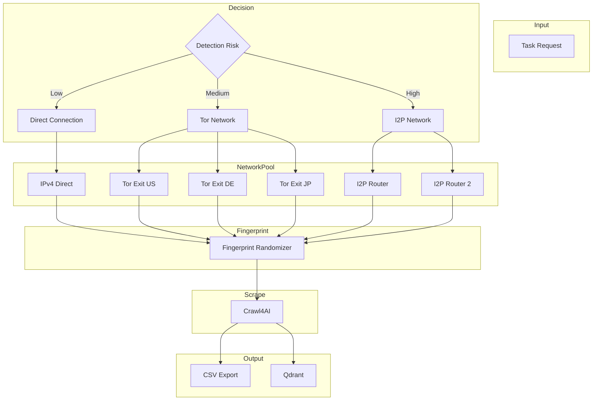
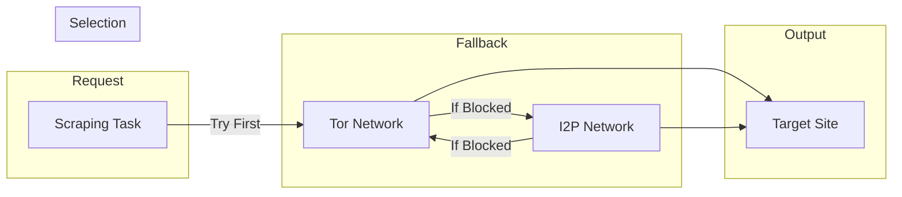

# Homelab Scraping Enhancement: Free Local Anti-Detection

## Executive Summary

This plan outlines a **100% free, local-only** anti-detection solution using Tor + I2P network combo, browser fingerprint randomization, and IPv6 support. No external APIs required.

## Architecture Overview



---

## Optimization 1: Browser Fingerprint Randomization

### Why It Matters

Even with different IPs, websites can fingerprint you via:
- User-Agent string
- Screen resolution
- Timezone
- Canvas/WebGL signatures
- Font list
- Hardware concurrency

### Implementation

```javascript
// kilo/pipeline/src/services/scraper/fingerprintManager.js

class FingerprintManager {
    constructor() {
        this.fingerprints = this.generatePool(10);
        this.currentIndex = 0;
    }

    generatePool(count) {
        const fingerprints = [];
        const userAgents = [
            'Mozilla/5.0 (Windows NT 10.0; Win64; x64) AppleWebKit/537.36',
            'Mozilla/5.0 (Macintosh; Intel Mac OS X 10_15_7) AppleWebKit/537.36',
            'Mozilla/5.0 (X11; Linux x86_64) AppleWebKit/537.36',
            'Mozilla/5.0 (Windows NT 10.0; Win64; x64; rv:109.0)',
        ];
        
        const resolutions = [
            { w: 1920, h: 1080 },
            { w: 1366, h: 768 },
            { w: 1536, h: 864 },
            { w: 1440, h: 900 },
        ];
        
        const timezones = ['America/New_York', 'Europe/London', 'Asia/Tokyo', 'UTC'];
        
        for (let i = 0; i < count; i++) {
            fingerprints.push({
                userAgent: userAgents[i % userAgents.length],
                resolution: resolutions[i % resolutions.length],
                timezone: timezones[i % timezones.length],
                language: 'en-US,en;q=0.9',
                platform: 'Win32',
                hardwareConcurrency: Math.floor(Math.random() * 8) + 2,
                deviceMemory: [4, 8, 16][Math.floor(Math.random() * 3)],
                doNotTrack: '1',
            });
        }
        return fingerprints;
    }

    getNext() {
        const fp = this.fingerprints[this.currentIndex];
        this.currentIndex = (this.currentIndex + 1) % this.fingerprints.length;
        return fp;
    }
    
    // Randomize per-request
    getRandom() {
        return this.fingerprints[Math.floor(Math.random() * this.fingerprints.length)];
    }
}
```

### Usage with Crawl4AI

```javascript
const fpManager = new FingerprintManager();

async function crawlWithFingerprint(url, options = {}) {
    const fp = fpManager.getRandom();
    
    return await crawl4ai.crawl(url, {
        ...options,
        headers: {
            'User-Agent': fp.userAgent,
            'Accept-Language': fp.language,
            'Accept-Encoding': 'gzip, deflate, br',
            'DNT': fp.doNotTrack,
        },
        viewport: fp.resolution,
        timezone: fp.timezone,
    });
}
```

---

## Optimization 2: Dynamic IPv6 Integration

### Why IPv6 Matters

- Many sites only block IPv4 Tor exits
- IPv6 addresses are largely unmonitored
- Some sites serve different content on IPv6

### Implementation

```javascript
// kilo/pipeline/src/services/scraper/ipv6Manager.js

class IPv6Manager {
    constructor() {
        this.enabled = process.env.ENABLE_IPV6 === 'true';
        this.preferred = process.env.IP_PREFERENCE || 'ipv4'; // ipv4, ipv6, auto
    }

    async getIPStrategy(targetSite) {
        if (!this.enabled) {
            return { type: 'ipv4', priority: 1 };
        }
        
        // Check site compatibility
        const history = await this.getSiteHistory(targetSite);
        
        if (history?.ipv6Blocked) {
            return { type: 'ipv4', priority: 1 };
        }
        
        if (history?.ipv4Blocked) {
            return { type: 'ipv6', priority: 1 };
        }
        
        // Default: try IPv4 first, fallback to IPv6
        return { 
            type: this.preferred, 
            fallback: this.preferred === 'ipv4' ? 'ipv6' : 'ipv4',
            priority: 1 
        };
    }

    async checkConnectivity(ipVersion) {
        try {
            const testUrl = ipVersion === 'ipv6' 
                ? 'http://[::1]:8000/health'
                : 'http://localhost:8000/health';
            const response = await fetch(testUrl);
            return response.ok;
        } catch {
            return false;
        }
    }
}
```

### Docker IPv6 Support

```yaml
# docker-compose.yml
services:
    crawl4ai:
        # Enable IPv6 in Docker
        sysctls:
            - net.ipv6.conf.all.disable_ipv6=0
            - net.ipv6.conf.default.disable_ipv6=0
        environment:
            - ENABLE_IPV6=true
            - IP_PREFERENCE=auto
```

---

## Optimization 3: Tor + I2P Hybrid Combo

### Why Both Networks

| Network | Pros | Cons |
|---------|------|------|
| Tor | Large network, well-known | Heavily blocked by major sites |
| I2P | Less blocked, anonymous | Smaller network, slower |

### Architecture



### Docker Setup

```yaml
# docker-compose.yml
services:
    # Tor Network
    tor-1:
        image: dperson/torproxy:latest
        ports:
            - "9050:9050"
    
    tor-2:
        image: dperson/torproxy:latest
        ports:
            - "9051:9050"
    
    tor-3:
        image: dperson/torproxy:latest
        ports:
            - "9052:9050"

    # I2P Network
    i2p:
        image: i2pd/i2pd:latest
        ports:
            - "4444:4444"  # HTTP proxy
            - "6668:6668"  # SOCKS proxy
        volumes:
            - i2p_data:/var/lib/i2pd
        environment:
            - I2P_NETWORK=1
```

### Hybrid Rotation Logic

```javascript
// kilo/pipeline/src/services/scraper/hybridNetworkManager.js

class HybridNetworkManager {
    constructor() {
        this.networks = {
            tor: {
                instances: [
                    { host: 'tor-1', port: 9050 },
                    { host: 'tor-2', port: 9051 },
                    { host: 'tor-3', port: 9052 },
                ],
                currentIndex: 0,
                type: 'socks5'
            },
            i2p: {
                instances: [
                    { host: 'i2p', port: 4444 },
                    { host: 'i2p', port: 6668 },  // SOCKS
                ],
                currentIndex: 0,
                type: 'http'
            }
        };
        this.primary = 'tor';  // Start with Tor
        this.fallbackChain = ['tor', 'i2p', 'direct'];
    }

    async getProxy(networkType = null) {
        const network = networkType || this.primary;
        const instance = this.networks[network].instances[this.networks[network].currentIndex];
        
        const proxyUrl = network === 'i2p' 
            ? `http://${instance.host}:${instance.port}`
            : `socks5://${instance.host}:${instance.port}`;
            
        return { url: proxyUrl, type: network };
    }

    async rotate() {
        // Rotate within current network
        const network = this.networks[this.primary];
        network.currentIndex = (network.currentIndex + 1) % network.instances.length;
        
        // If exhausted, try fallback
        if (network.currentIndex === 0) {
            await this.switchToNextNetwork();
        }
    }

    async switchToNextNetwork() {
        const currentIndex = this.fallbackChain.indexOf(this.primary);
        const nextIndex = (currentIndex + 1) % this.fallbackChain.length;
        this.primary = this.fallbackChain[nextIndex];
    }

    async handleBlock(networkType) {
        // Mark this network as blocked for target
        await this.markNetworkBlocked(networkType);
        
        // Switch to next in fallback chain
        await this.switchToNextNetwork();
    }
}
```

---

## Optimization 4: Public WiFi Rotation

### Why It Works

- Completely different IP ranges from home/Tor
- No correlation to your identity
- Works for heavily blocked sites

### Implementation Options

#### Option A: USB Tethering (Manual)

```bash
# Script to switch network interface
#!/bin/bash
# toggle-tethering.sh

INTERFACE="usb_rndis0"

# Check if tethered
if ip link show $INTERFACE &>/dev/null; then
    echo "Using tethered connection"
    # Configure routing through tether
    ip route add default via $(ip route | grep $INTERFACE | awk '/default/ {print $3}')
else
    echo "Not tethered, using default"
fi
```

#### Option B: WiFi Auto-Switch (Advanced)

Requires:
- Multiple WiFi adapters OR
- Scheduled network switching

```javascript
// Network rotation manager
class WiFiRotationManager {
    constructor() {
        this.interfaces = ['wlan0', 'wlan1'];  // Multiple adapters
        this.currentInterface = 0;
    }

    async switchNetwork() {
        const iface = this.interfaces[this.currentInterface];
        this.currentInterface = (this.currentInterface + 1) % this.interfaces.length;
        
        // Configure this interface as primary
        await exec(`ip route add default via ${gateway} dev ${iface}`);
        
        return iface;
    }

    async getAvailableNetworks() {
        // Scan for open WiFi networks
        const networks = await exec('iwlist scan | grep ESSID');
        return networks;
    }
}
```

#### Option C: VPN Mesh (Self-Hosted)

Run WireGuard on multiple Raspberry Pis:

```yaml
# docker-compose.yml
wireguard-1:
    image: linuxserver/wireguard
    ports:
        - "51820:51820/udp"
    environment:
        - PEERS=5

wireguard-2:
    image: linuxserver/wireguard
    ports:
        - "51821:51820/udp"
```

---

## Complete Fallback Chain

```javascript
// Ultimate fallback chain
const FALLBACK_CHAIN = [
    { type: 'direct', priority: 1, cost: 'free' },
    { type: 'ipv6', priority: 2, cost: 'free' },
    { type: 'tor', priority: 3, cost: 'free' },
    { type: 'i2p', priority: 4, cost: 'free' },
    { type: 'tether', priority: 5, cost: 'free' },  // Manual
    { type: 'wifi', priority: 6, cost: 'free' },     // Manual
];

async function crawlWithFallback(url, options = {}) {
    let lastError = null;
    
    for (const method of FALLBACK_CHAIN) {
        try {
            const result = await attemptCrawl(url, method, options);
            return result;  // Success
        } catch (error) {
            lastError = error;
            console.log(`Failed with ${method.type}: ${error.message}`);
            // Continue to next method
        }
    }
    
    throw new Error(`All methods exhausted. Last error: ${lastError.message}`);
}
```

---

## File Changes Required

### New Files

1. `kilo/pipeline/src/services/scraper/fingerprintManager.js`
2. `kilo/pipeline/src/services/scraper/ipv6Manager.js`
3. `kilo/pipeline/src/services/scraper/hybridNetworkManager.js`
4. `kilo/pipeline/src/services/scraper/wifiRotationManager.js`
5. `kilo/pipeline/src/services/scraper/ultimateFallback.js`

### Modified Files

1. `docker-compose.yml` - Add Tor + I2P containers
2. `kilo/pipeline/src/services/scraper/config.js` - Add network settings
3. `kilo/pipeline/src/services/scraper/index.js` - Integrate all managers

---

## Environment Variables

```bash
# Network Configuration
ENABLE_IPV6=true
IP_PREFERENCE=auto

# Tor + I2P
TOR_INSTANCE_COUNT=3
I2P_ENABLED=true
PRIMARY_NETWORK=tor
FALLBACK_CHAIN=tor,i2p,direct

# Fingerprint
RANDOMIZE_FINGERPRINT=true
FINGERPRINT_POOL_SIZE=10

# WiFi/Tether
WIFI_ROTATION_ENABLED=false
TETHER_INTERFACE=usb_rndis0
```

---

## Hardware Recommendations

| Hardware | Capabilities |
|----------|-------------|
| N100 | Tor only (1 instance) |
| N305 | Tor (2) + I2P (1) |
| High-perf | Full stack + WiFi rotation |

---

## Timeline

- Phase 1 (Fingerprint): 2 days
- Phase 2 (IPv6): 2 days  
- Phase 3 (Tor+I2P): 3 days
- Phase 4 (WiFi/Tether): 2 days
- Testing: 3 days

**Total: ~12 days**
