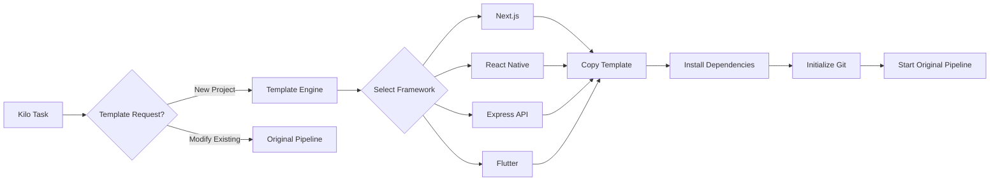
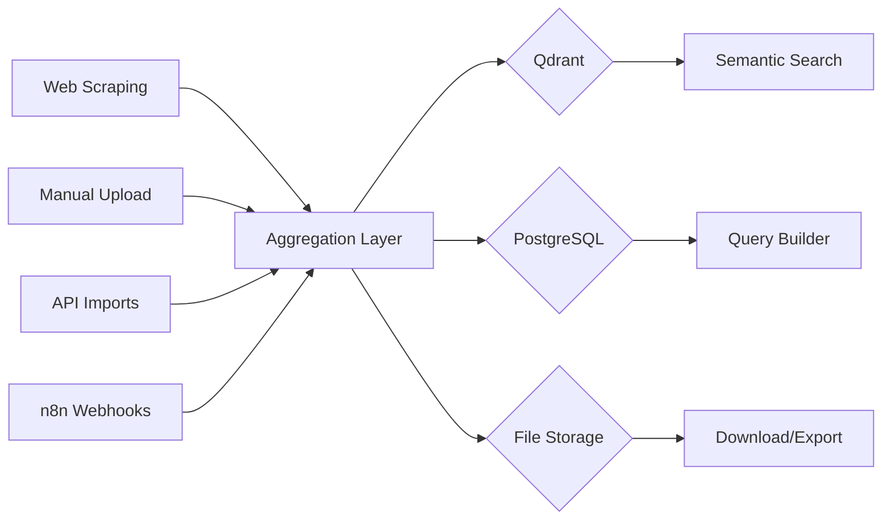

# Homelab Optimization Plan: Web/Mobile Coding & Data Scraping

## Executive Summary

This plan outlines optimizations to transform the homelab from a general AI pipeline into a specialized **Web/Mobile Development & Data Aggregation Platform**. The current architecture has strong foundations but requires enhancements to support:

1. **Web/Mobile Project Scaffolding** - Generate complete project structures
2. **Enhanced Web Scraping** - More data handlers and transformation pipelines
3. **Structured Data Storage** - PostgreSQL for relational data alongside Qdrant

---

## Current Architecture Analysis

### Existing Components

| Component | Purpose | Status |
|-----------|---------|--------|
| Kilo Pipeline | Autonomous coding agent | ✅ Functional |
| Ollama | Local LLM inference | ✅ Running |
| Crawl4AI | Web scraping | ✅ Integrated |
| Qdrant | Vector database | ✅ Storage |
| n8n | Workflow automation | ✅ Available |
| Nextcloud | File storage | ✅ Available |
| Prometheus/Grafana | Monitoring | ✅ Running |

### Identified Gaps

1. **No Project Templates** - Kilo expects existing workspace, cannot scaffold new projects
2. **Limited Sandbox Image** - `node:20-slim` lacks web dev tools (Python, JDK, etc.)
3. **No Project Database** - Qdrant is vector-only, no relational storage
4. **Scraping Outputs Limited** - Only CSV export to Nextcloud, no JSON/API outputs

---

## Part 1: Web/Mobile Project Templates

### 1.1 Template System Architecture



### 1.2 Template Definitions

Create `/var/kilo/templates/` with the following structure:

```
templates/
├── nextjs/
│   ├── app/
│   │   └── page.tsx.template
│   ├── components/
│   ├── lib/
│   ├── package.json
│   ├── tailwind.config.js
│   └── README.md
├── react-native/
│   ├── App.tsx.template
│   ├── screens/
│   ├── components/
│   ├── package.json
│   └── metro.config.js
├── express-api/
│   ├── src/
│   │   ├── routes/
│   │   ├── models/
│   │   └── controllers/
│   ├── package.json
│   └── docker-compose.yml
├── flutter/
│   ├── lib/
│   │   └── main.dart.template
│   ├── pubspec.yaml
│   └── ios/
└── prompt-fragments/
    ├── nextjs-system-prompt.md
    ├── react-native-system-prompt.md
    └── express-system-prompt.md
```

### 1.3 Implementation: Template Service

New file: `kilo/pipeline/src/services/templates/index.js`

```javascript
const TEMPLATES_DIR = process.env.TEMPLATE_DIR || '/var/kilo/templates';

const FRAMEWORKS = {
    'nextjs': {
        name: 'Next.js 14',
        description: 'React framework with App Router',
        requires: ['node', 'npm'],
        prompts: 'nextjs-system-prompt.md'
    },
    'react-native': {
        name: 'React Native',
        description: 'Cross-platform mobile (iOS/Android)',
        requires: ['node', 'npm', 'java', 'android-sdk'],
        prompts: 'react-native-system-prompt.md'
    },
    'express': {
        name: 'Express.js API',
        description: 'REST API with TypeScript',
        requires: ['node', 'npm'],
        prompts: 'express-system-prompt.md'
    },
    'flutter': {
        name: 'Flutter',
        description: 'Cross-platform mobile (single codebase)',
        requires: ['flutter', 'dart'],
        prompts: 'flutter-system-prompt.md'
    }
};

async function scaffoldProject(taskId, framework, projectName, outputPath) {
    const templatePath = path.join(TEMPLATES_DIR, framework);
    // Copy template files, replace {{PROJECT_NAME}}, {{DATE}}, etc.
    // Install dependencies
    // Initialize git
}
```

---

## Part 2: Kilo Prompt Integration

### 2.1 Enhanced Prompt Fragments

Create system prompts that guide the LLM for web/mobile development:

```markdown
# nextjs-system-prompt.md

You are an expert Next.js 14 developer. When generating code:

1. Use App Router (app/ directory)
2. Implement proper SSR/CSR patterns
3. Use TypeScript for type safety
4. Include proper error handling
5. Follow React best practices (hooks, memoization)
6. Use Tailwind CSS for styling
7. Implement proper API routes in app/api/
8. Add loading.tsx and error.tsx for each route
9. Use Server Components by default, Client Components only when needed

Project Structure:
- app/ - Routes and pages
- components/ - Reusable UI components  
- lib/ - Utilities and helpers
- types/ - TypeScript definitions
- hooks/ - Custom React hooks
```

### 2.2 Pipeline Modification

Modify `executor.js` to detect scaffold requests:

```javascript
// In runArchitect()
const isScaffoldRequest = instruction.match(/create (new |a )?(next\.js|react native|express|flutter)/i);

if (isScaffoldRequest) {
    const framework = detectFramework(instruction);
    await templateService.scaffoldProject(taskId, framework, projectName, workspacePath);
    // Skip to gates with scaffolded project
}
```

---

## Part 3: Enhanced Crawl4AI Data Handlers

### 3.1 Current Capabilities

- ✅ Web scraping with Crawl4AI
- ✅ LangGraph orchestration for pagination
- ✅ Vector storage in Qdrant
- ✅ CSV export to Nextcloud (WooCommerce format)

### 3.2 New Data Handlers

| Handler | Purpose | Output |
|---------|---------|--------|
| JSON API | REST API response | `/api/scraped/{job_id}` |
| PostgreSQL | Structured storage | Direct DB insert |
| GraphQL | Flexible queries | GraphQL endpoint |
| Sitemap | SEO analysis | XML sitemap |
| RSS | News feeds | RSS 2.0 feed |
| Excel | Spreadsheet export | .xlsx download |

### 3.3 Architecture

```mermaid
graph TD
    A[Crawl4AI] --> B[Scraper Service]
    B --> C{Qdrant}
    B --> D{Nextcloud CSV}
    B --> E{PostgreSQL} [NEW]
    B --> F{JSON API} [NEW]
    B --> G{RSS Feed} [NEW]
    
    E --> H[Structured Tables]
    F --> I[Expose via n8n/API]
    G --> J[Feed URL]
```

### 3.4 Implementation: PostgreSQL Storage

Add to `docker-compose.yml`:

```yaml
  scraper-db:
    image: postgres:16-alpine
    environment:
      POSTGRES_DB: scraper
      POSTGRES_USER: ${SCRAPER_DB_USER:-scraper}
      POSTGRES_PASSWORD: ${SCRAPER_DB_PASSWORD}
    volumes:
      - scraper_data:/var/lib/postgresql/data
    networks:
      - homelab
```

Create schema:

```sql
CREATE TABLE scraped_pages (
    id SERIAL PRIMARY KEY,
    job_id VARCHAR(100) NOT NULL,
    url TEXT NOT NULL,
    title TEXT,
    content TEXT,
    metadata JSONB,
    extracted_at TIMESTAMP DEFAULT NOW(),
    vector_id UUID
);

CREATE TABLE scraped_products (
    id SERIAL PRIMARY KEY,
    job_id VARCHAR(100) NOT NULL,
    url TEXT NOT NULL,
    name TEXT,
    price DECIMAL(10,2),
    description TEXT,
    images TEXT[],
    category VARCHAR(200),
    metadata JSONB,
    extracted_at TIMESTAMP DEFAULT NOW()
);

CREATE INDEX idx_products_job ON scraped_products(job_id);
CREATE INDEX idx_pages_job ON scraped_pages(job_id);
```

---

## Part 4: Data Aggregation Pipeline

### 4.1 Multi-Source Ingestion



### 4.2 n8n Integration Points

| Trigger | Action | Output |
|---------|--------|--------|
| Scraper Complete | Insert to PostgreSQL | Structured data |
| Scraper Complete | Send webhook | External systems |
| Scheduled | Aggregate reports | PDF/Excel |
| Manual | Transform data | Any format |

---

## Part 5: Sandbox Image Enhancement

### 5.1 Current: `node:20-slim`

Limited to:
- Node.js runtime
- npm package manager

### 5.2 New: Multi-Language Sandbox

```dockerfile
# kilo/pipeline/sandbox/Dockerfile
FROM node:20-slim

# Install system dependencies
RUN apt-get update && apt-get install -y \
    python3 \
    python3-pip \
    python3-venv \
    default-jdk \
    gradle \
    android-sdk \
    flutter \
    && rm -rf /var/lib/apt/lists/*

# Install global Node tools
RUN npm install -g \
    typescript \
    ts-node \
    next \
    express \
    @react-native-community/cli \
    expo \
    nodemon

# Install Python ML tools (optional)
RUN pip3 install --no-cache-dir \
    beautifulsoup4 \
    pandas \
    scrapy

# Default to /workspace
WORKDIR /workspace

CMD ["sh"]
```

### 5.3 Environment Variable

```bash
# In .env
SANDBOX_IMAGE=kilo-sandbox:latest  # Use custom image
```

---

## Implementation Roadmap

### Phase 1: Foundation (Week 1-2)

| Task | Priority | Effort |
|------|----------|--------|
| Create template directory structure | P0 | 1 day |
| Implement Next.js template | P0 | 2 days |
| Add PostgreSQL to docker-compose | P1 | 1 day |
| Create scraper-db schema | P1 | 1 day |

### Phase 2: Templates Expansion (Week 3-4)

| Task | Priority | Effort |
|------|----------|--------|
| Express.js template | P1 | 2 days |
| React Native template | P1 | 3 days |
| Flutter template | P2 | 3 days |
| Prompt fragments for each | P1 | 2 days |

### Phase 3: Data Handlers (Week 5-6)

| Task | Priority | Effort |
|------|----------|--------|
| JSON API endpoint | P1 | 2 days |
| PostgreSQL storage handler | P0 | 3 days |
| RSS feed generator | P2 | 2 days |
| Excel export | P2 | 2 days |

### Phase 4: Integration (Week 7-8)

| Task | Priority | Effort |
|------|----------|--------|
| Build custom sandbox image | P1 | 2 days |
| n8n workflow templates | P1 | 3 days |
| Dashboard enhancements | P2 | 2 days |
| Documentation | P1 | 2 day |

---

## Resource Requirements

### Additional Containers

| Service | RAM | CPU | Storage |
|---------|-----|-----|---------|
| PostgreSQL | 256MB | 0.5 | 10GB |
| Custom Sandbox | 1GB | 1.0 | 5GB |

### Total Additional Resources

- **RAM**: +1.5GB minimum
- **CPU**: +2 cores recommended
- **Storage**: +15GB

---

## Success Metrics

1. **Template Usage**: % of tasks that are scaffold requests
2. **Scraper Efficiency**: Pages scraped per hour, success rate
3. **Data Quality**: % of scraped data successfully structured
4. **Pipeline Speed**: Time from task to deployed code

---

## Risks & Mitigations

| Risk | Impact | Mitigation |
|------|--------|------------|
| Template quality | High | Start with proven templates, iterate |
| Scraping legal | Medium | Add robots.txt compliance, rate limiting |
| Resource exhaustion | High | Set container limits, monitor closely |
| LLM hallucination | Medium | Strong gate validation, human review |

---

*Plan Version: 1.0*  
*Generated: 2026-03-02*  
*Author: Kilo Code Architect*
